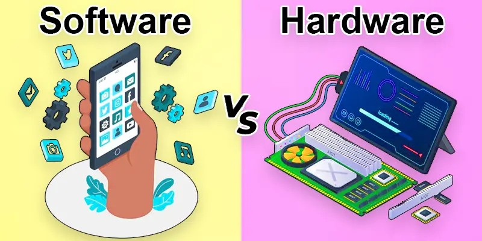
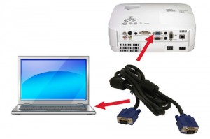
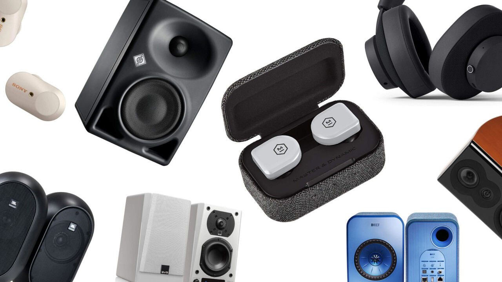
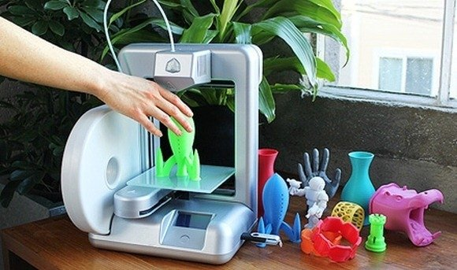
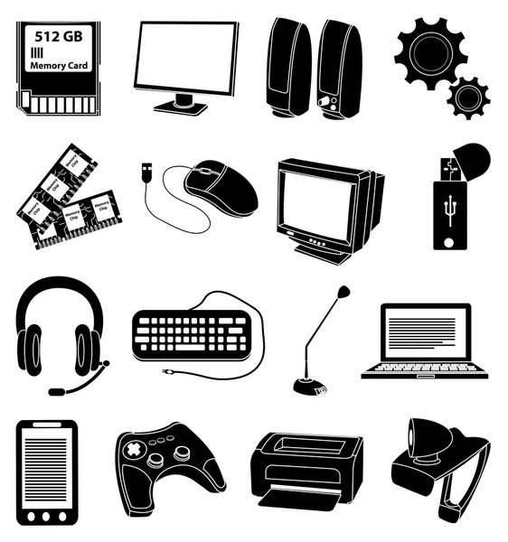
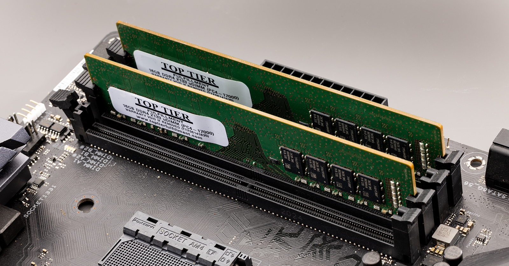
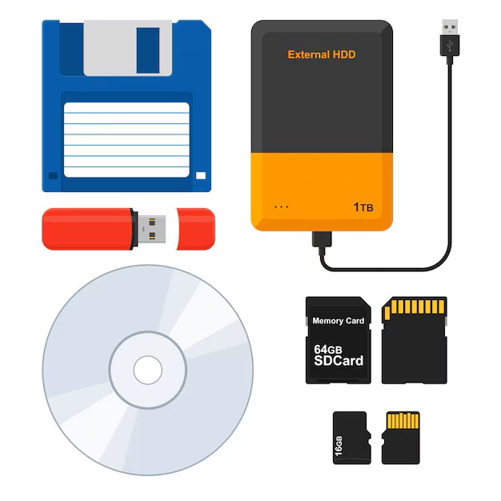
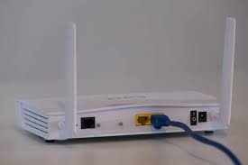
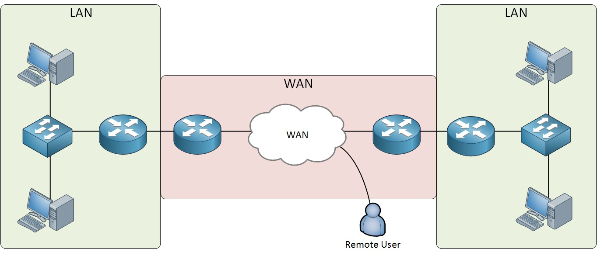
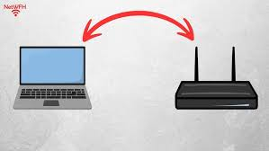

# Computer Organization
{: .no_toc }

## Table of contents
{: .no_toc .text-delta }

1. TOC
{:toc}

---

## What Are the Main Parts of a Computer?

Understanding how computers are organized helps us see how all the pieces work together. Think of a computer like a human body - different parts have different jobs, but they all need to work together for the whole system to function.

## Two Main Categories

Computer parts are divided into two fundamental categories:

**Hardware**
The physical components you can actually touch - the monitor, keyboard, internal circuits, and cables.

**Software** 
The programs that run on the computer - like your web browser, games, or the operating system itself.

## Hardware Sub-Categories

Hardware can be broken down into several specialized categories:
- **Input Devices** - How you give information to your computer
- **Output Devices** - How your computer tells you things
- **Storage Devices** - How your computer remembers information
- **Network Devices** - How your computer communicates with other computers

## Output Devices

Output devices allow your computer to display information, give audio signals, and transform digital information into physical information.

### Display Output Devices

**Monitors**
The screen that displays text, images, and videos from your computer.

**Video Cards**
The internal component that processes graphics and sends them to your monitor.

**Projectors**
Devices that display your computer screen on a large surface like a wall or screen.

### Audio Output Devices

**Speakers**
Convert digital audio signals into sound waves you can hear.

**Sound Cards**
Internal components that process audio data and send it to speakers or headphones.

**Headphones**
Personal audio devices that deliver sound directly to your ears.

### Digital to Physical Conversion

**Laser or Inkjet Printers**
Transform digital documents into physical paper copies.

**3D Printers**
Create three-dimensional physical objects from digital designs.

## Input Devices

Input devices allow you to interact with the computer and turn physical data into digital data.

### Interactive Input Devices

**Mouse and Trackpad**
Point-and-click devices for navigating and selecting items on screen.

**Keyboard**
Allows you to type text and enter commands.

**Touchscreen**
Combines input and output by letting you directly touch what you see on screen.

**Joysticks and Game Controllers**
Specialized input devices for gaming and complex control tasks.

### Digitizing Input Devices

**Scanners**
Convert physical documents and photos into digital files.

**Microphones**
Capture sound waves and convert them into digital audio data.

**Digital Cameras and Webcams**
Capture images and video for digital storage and transmission.

**Sensors**
Gather environmental data like temperature, motion, or location.

**Real-World Example:** In an airplane cockpit, sensors gather information like altitude and direction. The dials are output devices, but they get their information from input devices - the sensors!

## Storage Devices

Storage devices serve as your computer's memory, allowing it to store information to retrieve later and letting users save data.

### Primary Storage

**RAM (Random Access Memory)**
Memory the computer uses to perform its normal activities. This memory is cleared when power is turned off, which is why you need to save your work before shutting down.

### Secondary Storage

**Persistent Storage Examples:**
- **Hard Drives** - Large capacity storage for programs and files
- **USB Drives** - Portable storage for transferring files
- **CDs and DVDs** - Optical storage for music, movies, and data
- **Cloud Storage** - Online storage accessible from anywhere
- **Floppy Disks** - Older, small-capacity portable storage (mostly obsolete)

## Network Devices

Network devices enable your computer to communicate with other computers, though computers usually don't communicate directly.

### How Networks Work

Instead of direct communication, computers send data to a central location, which then passes the information to its destination.

**Router: The Center of the Network**
A router receives and analyzes data from computers, then routes information to where it's supposed to go. It can also receive and analyze data sent from other networks.

### Types of Networks

**Local Area Networks (LAN)**
Connect computers close to each other, like in the same building. Can usually be connected with a single router.

**Wide Area Networks (WAN)**
Connect computers far away from each other. Needs multiple routers and special cables to span large distances.

**Key Concept:** A WAN is usually made up of several LANs connected together. For example, your school's network might be a LAN, but when it connects to other schools or the internet, it becomes part of a WAN.

### Essential Network Components

**Ethernet Ports**
Allow ethernet cables to be attached. Ethernet is one way to physically connect to a network.

**Wireless Internet Cards (WiFi Cards)**
Allow a computer to connect to the internet without cables, using radio waves instead.

*Google search: "computer ethernet cable WiFi wireless connection"*

## Key Takeaways

1. **Hardware and software work together** - Physical components need programs to be useful
2. **Each device type has a specific job** - Input gets data in, output gets information out, storage remembers, networks connect
3. **Modern computers integrate multiple functions** - A smartphone combines input (touchscreen, microphone), output (screen, speakers), storage (memory), and networking (cellular, WiFi)
4. **Understanding organization helps troubleshooting** - When something goes wrong, knowing which category the problem falls into helps find solutions

Understanding computer organization helps you make better decisions about technology and gives you the foundation for more advanced computing concepts.