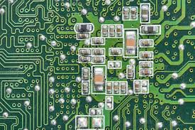
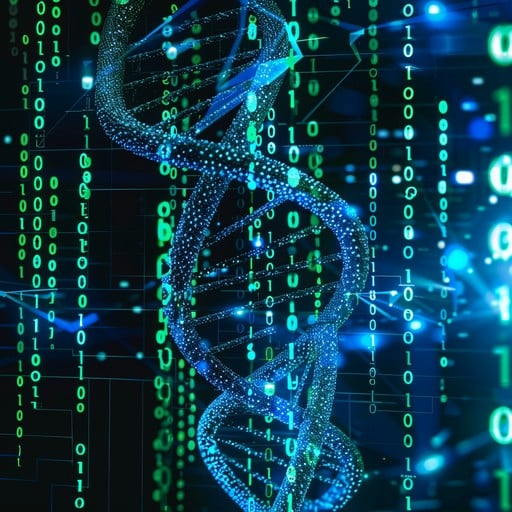
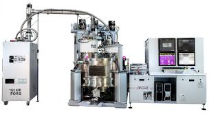
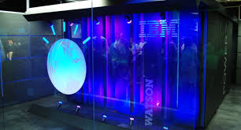
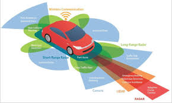
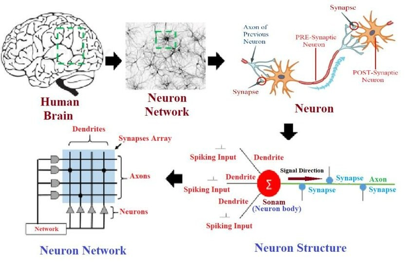
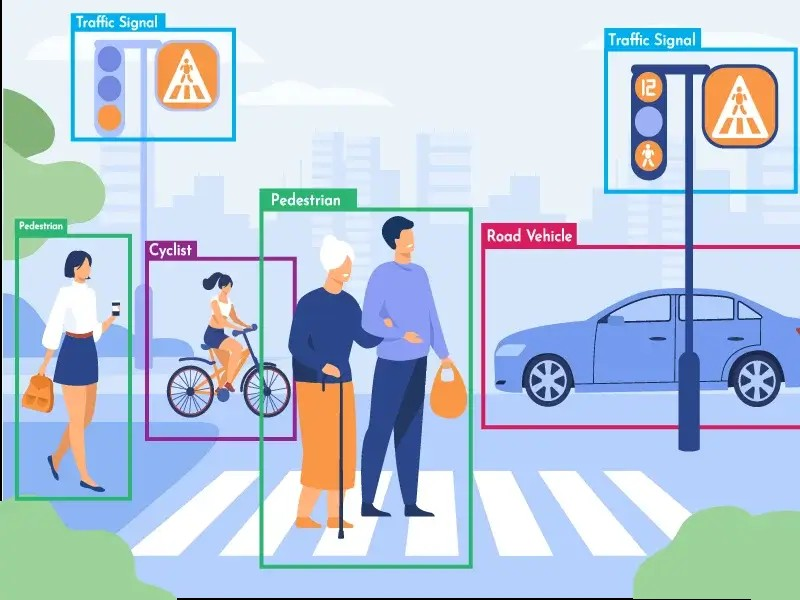
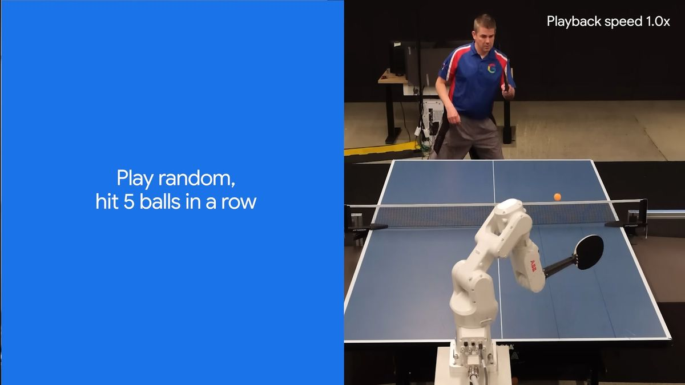

# Future of Computing
{: .no_toc }

## Table of contents
{: .no_toc .text-delta }

1. TOC
{:toc}

---

## Exploring the Limits of Computing

Computing technology continues to evolve rapidly, pushing beyond the traditional boundaries of what we consider possible. While today's computers are incredibly powerful, researchers and engineers are developing entirely new types of computing systems that could revolutionize how we solve problems and interact with technology.

## Traditional Computer Architecture

Before exploring future possibilities, it's important to understand what makes current computers work.

### von Neumann Architecture

Most computers today use **von Neumann architecture**, which has these characteristics:

**Electronic Circuit Boards**
Built using traditional electronic components like transistors and microchips.

**Mechanical Nature**
Despite being electronic, computers are essentially sophisticated machines made of metal and silicon.

**Deterministic Processing**
Bits are clearly defined as either 1 or 0, and the computer follows precise, predictable rules for processing these bits.

This architecture has served us well for decades, but it has limitations that new computing approaches aim to overcome.

## New Computer Architectures

Scientists and engineers are developing revolutionary new types of computers that work fundamentally differently from traditional machines.

### DNA Computers

DNA computers represent a completely different approach to computation, using biological materials instead of electronic circuits.

**Key Facts about DNA Computing:**
- First introduced in 1994 by Leonard Adleman
- Use enzymes and DNA strands to perform specific computations
- Can store billions of times more data than traditional computers
- Perform calculations in true parallel processing

**Incredible Storage Capacity:**
One pound of DNA has the capacity to store more information than all the electronic computers ever built. A teardrop-sized DNA computer could potentially be more powerful than the world's most powerful supercomputer.

**Best Applications:**
DNA computers are most useful for solving complex mathematical problems rather than everyday computing tasks like browsing the web or playing games.

### Quantum Computers

Quantum computers use principles from quantum physics to process information in ways that seem almost magical compared to traditional computing.

**Revolutionary Concepts:**

**Non-Deterministic Processing**
Unlike traditional bits that are either 1 or 0, quantum bits (qubits) can be both 1 and 0 simultaneously, or anywhere in between.

**True Parallelism**
While traditional computers give the illusion of doing multiple things at once, quantum computers can actually perform many calculations simultaneously.

**Incredible Speed**
Quantum computers can potentially perform trillions of mathematical operations per second, compared to billions for traditional computers.

**Current Status:**
Quantum computers are still mostly theoretical and experimental, but companies like IBM, Google, and others are making significant progress in building practical quantum systems.

According to physicist David Deutsch, quantum parallelism allows a quantum computer to work on a million computations at once, while a desktop PC works on one.

## Expanding Uses for Computers

Computers are being applied to solve an ever-increasing range of human challenges and needs.

### Current Revolutionary Applications

**Medical Diagnosis**
IBM's Watson computer system can analyze medical data and help doctors diagnose diseases more accurately than traditional methods.

**Data Analysis**
Computers process enormous amounts of information to find patterns and insights that humans couldn't discover on their own.

**Scientific Modeling**
Researchers use supercomputers to model complex systems like climate change, galaxy formation, and molecular behavior.

**Advanced Gaming and Virtual Reality**
Modern computers create immersive virtual worlds that respond to user actions in real-time.

### Coming Soon: Next-Generation Applications

**Self-Driving Cars**
Vehicles that can navigate roads, respond to traffic, and transport passengers without human drivers.

**Human-Like Robots**
Robots that can understand and express emotions, not just follow programmed instructions. This is particularly challenging because emotions cannot simply be programmed - computers must learn to synthesize context and respond appropriately.

**Automatic Language Translation**
Real-time translation between any languages using deep learning to recognize language patterns, rather than relying on programmed grammar rules.

**Digital Currency**
Cryptocurrencies like Bitcoin that exist entirely as computer data, secured by complex mathematical algorithms.

**Email Lie Detectors**
Systems that analyze writing structure and language patterns to determine if someone is being truthful, similar to reading body language for verbal cues.

**Predictive Security**
Programs that analyze patterns in past events to predict and prevent future security threats or terrorist activities.

**Brain Modeling**
Using neural networks and deep learning to understand and simulate how human brains process information.

## Artificial Intelligence

Artificial intelligence (AI) is no longer science fiction - it's becoming a practical reality that affects our daily lives.

### Defining AI

According to the Merriam-Webster Dictionary, artificial intelligence is:
1. A branch of computer science dealing with the simulation of intelligent behavior in computers
2. The capability of a machine to imitate intelligent human behavior

### What Computers Can Already Do

**Mathematical Excellence**
Computers can perform complex calculations far faster and more accurately than humans.

**Pattern Recognition**
Modern computers can classify pictures, recognize faces, and identify objects in images.

**Game Playing**
AI systems have defeated world champions in chess, Go, and other strategy games.

**Language Processing**
Voice assistants like Siri and Cortana can understand speech and respond appropriately.

### What's Still Challenging for Computers

Despite impressive advances, some human abilities remain difficult for computers:

**Emotional Intelligence**
Understanding and responding to human emotions in context.

**Complex Reasoning**
Making decisions based on subtle contextual clues that humans understand intuitively.

**Social Communication**
Detecting irony, sarcasm, or reading body language accurately.

**Physical Coordination**
Tasks like walking on uneven terrain or manipulating delicate objects still challenge robots.

**Independent Thinking**
Computers still need instructions and algorithms to perform tasks - they cannot yet think truly independently.

### AI Applications Today

**Automation Systems**
- Auto-pilot systems in cars, planes, and ships
- Robotic vacuum cleaners and manufacturing robots
- Customer service phone systems

**Advanced Communication**
- Text-to-speech systems
- Voice recognition software
- Postal service handwriting recognition

**Security and Defense**
- Unmanned drones for surveillance and operations
- Cybersecurity systems that detect and respond to threats

## The Impact on Your Future

Understanding these emerging technologies helps you prepare for a world where:

**Career Opportunities**
New fields like AI development, quantum computing research, and biotechnology will create jobs that don't exist today.

**Daily Life Changes**
Self-driving cars, AI assistants, and smart homes will change how you work, travel, and live.

**Problem-Solving Power**
Future computers will help solve global challenges like climate change, disease, and resource management.

**Learning Adaptability**
Technology will continue evolving rapidly, making adaptability and continuous learning essential skills.

## Key Takeaways

1. **New computing architectures** like DNA and quantum computers could revolutionize how we process information
2. **Computer applications are expanding** into every aspect of human life, from medicine to transportation
3. **Artificial intelligence is becoming practical** but still faces challenges in matching human intuition and creativity
4. **The pace of change is accelerating** - today's impossible becomes tomorrow's everyday technology
5. **Understanding fundamentals prepares you** for participating in and benefiting from technological advances

The future of computing promises to be exciting, challenging, and full of opportunities for those who understand the basics and remain curious about new possibilities. The foundation you're building now in understanding computers will help you navigate and contribute to this rapidly evolving technological landscape.