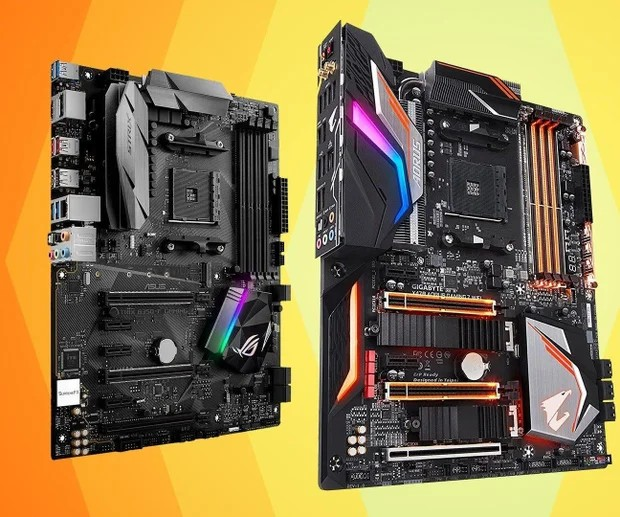
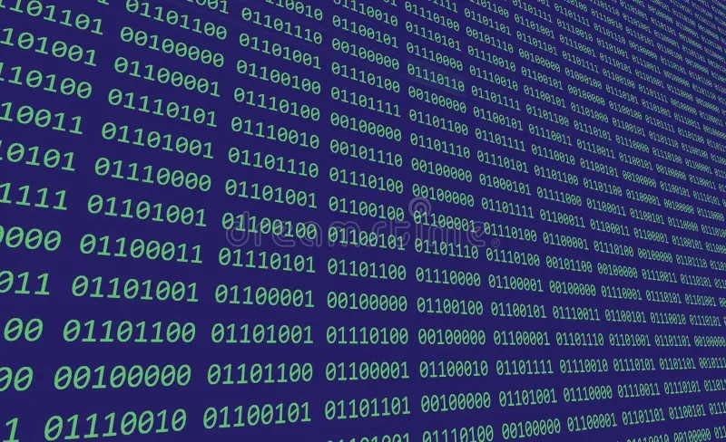
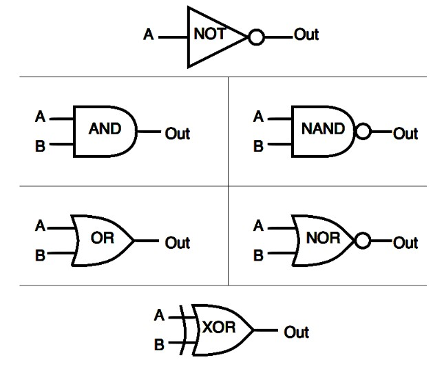
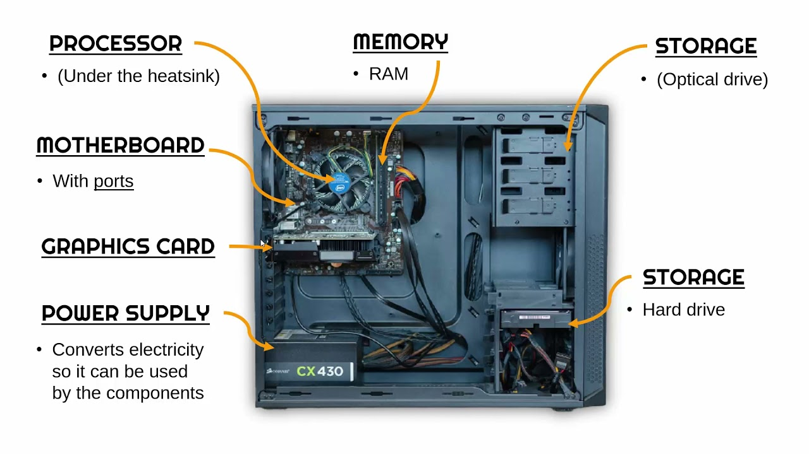
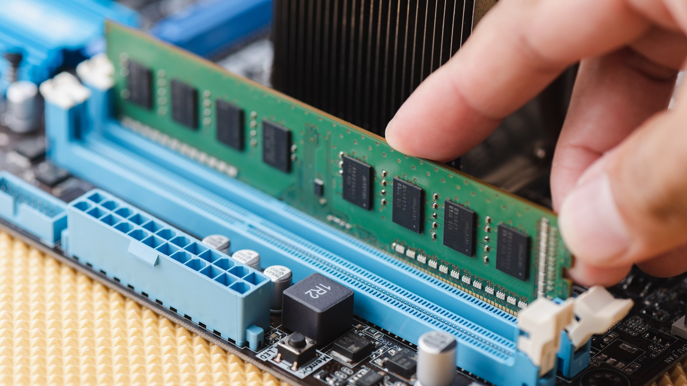
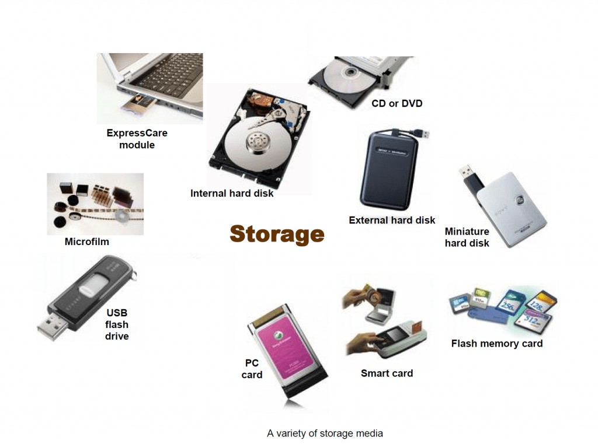
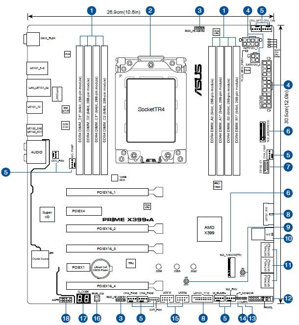
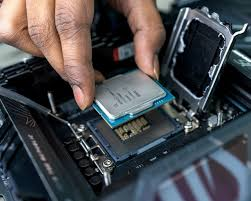
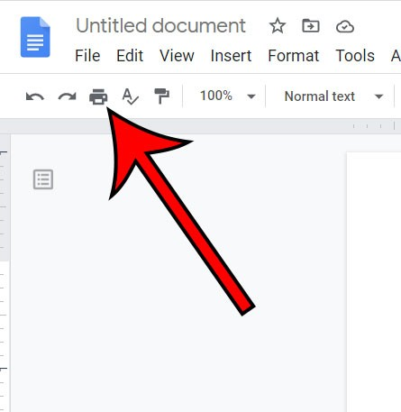
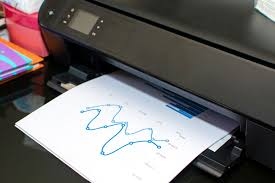

# Computer Hardware
{: .no_toc }

## Table of contents
{: .no_toc .text-delta }

1. TOC
{:toc}

---

## What is Hardware?

Hardware consists of the physical components of your computer - the parts you can actually touch. These components use electrical signals to carry out instructions and make computing possible.

Unlike software (which consists of instructions and programs), hardware is the tangible machinery that does the actual work of computing.

## How Does Hardware Work?

Hardware operates by processing electrical signals that represent information in a special format called binary.

### Binary: The Language of Computers

**Binary** is a number system that uses only two digits: 0 and 1. This might seem limiting, but it's perfect for computers because electrical circuits can easily represent these two states:
- **0** = No electrical signal (off)
- **1** = Electrical signal present (on)

### Bits and Bytes

**Bit (Binary Digit)**
The smallest unit of computer data - a single 0 or 1.

**Byte**
A group of eight bits, such as: 1101 1100

Bytes are useful because they can represent letters, numbers, and other characters that humans understand.

**Real-World Examples:**
- 1 byte = 1 letter or character
- 1 Megabyte = approximately a short song
- 1 Gigabyte = approximately 1,000 songs

### Logic Gates: The Foundation

Hardware is built using **logic gates** - physical components that process incoming binary data and produce electrical signals as output. All computer calculations are performed using these logical operations.

Logic gates take electrical inputs (representing 0s and 1s) and produce outputs based on specific rules, enabling computers to perform everything from simple addition to complex graphics processing.

## Main Hardware Components

Every computer, from smartphones to supercomputers, contains at least these three essential components:

## Memory

Memory is where computers store information, both temporarily and permanently. There are two main categories of memory.

### Main Memory

Main memory stores information that the computer needs right now - the programs currently running and the data they're working with.

**Random Access Memory (RAM)**
- Stores currently executing program instructions
- Holds data the computer needs for immediate work
- Only retains information while power is on
- Operating system gets loaded into RAM at startup
- More RAM allows running more programs simultaneously

**Read Only Memory (ROM)**
- Retains information even when power is off
- Stores essential startup instructions like BIOS
- Contains firmware needed to boot the computer
- Called "read only" but can actually be updated with special procedures

### External Memory

External memory provides long-term storage that persists even when the computer is turned off.

**Examples of External Memory:**
- **Hard Drives**: Large capacity storage for programs and files
- **USB Drives**: Portable storage for transferring files
- **CDs and DVDs**: Optical storage for music, movies, and data
- **Floppy Disks**: Older, small-capacity storage (mostly obsolete)

## Motherboard

The motherboard is the main circuit board that connects all computer components together. Think of it as the "nervous system" of the computer.

**Functions of the Motherboard:**
- Houses the processor and memory
- Connects input devices (keyboard, mouse)
- Connects output devices (monitor, speakers)
- Links storage devices
- Provides power distribution to components
- Generates the clock signal that coordinates CPU operations

## Central Processing Unit (CPU)

The CPU, also called the processor, is the "brain" of the computer. It's responsible for actually carrying out the instructions of programs.

**What the CPU Does:**
- Executes instructions received from computer software
- Performs calculations and logical operations
- Coordinates the activities of other hardware components
- Processes data according to program instructions

**The Clock Cycle:**
Every instruction is executed on a "clock cycle" - each "tick" of the internal clock pushes electricity through the computer to perform computations. Modern CPUs can execute billions of instructions per second.

## How It All Works Together

Understanding how hardware components cooperate helps you appreciate the complexity behind seemingly simple computer tasks.

### Example: Printing a Document

Let's trace what happens when you click "Print" in a text editor:

**Step 1: Input Processing**
You click the "Print" button. Your mouse (input device) sends this signal through the motherboard to the CPU.

**Step 2: CPU Processing**  
The CPU receives the input and performs calculations:
- Retrieves the document file from memory
- Prepares the data for printing (formatting, layout)
- Accesses the printer device driver software
- Sends instructions to make the printer ready

**Step 3: Output Execution**
The printer (output device) receives the processed data and instructions, then prints the physical document.

This entire process involves all major hardware components working together: input devices capture your action, the CPU processes it using instructions from memory, and output devices produce the result.

## Why Hardware Understanding Matters

**Better Technology Decisions**
Knowing hardware basics helps you choose computers and devices that meet your needs and budget.

**Troubleshooting Skills**
Understanding components helps you identify whether problems are hardware-related or software-related.

**Appreciation for Complexity**
Recognizing the intricate coordination required for simple tasks helps you appreciate modern technology.

**Foundation for Future Learning**
Hardware knowledge is essential for advanced topics in programming, networking, and system design.

## Key Takeaways

1. **Hardware uses electrical signals** to process information in binary format (0s and 1s)
2. **Three essential components** - CPU, memory, and motherboard - work together in every computer
3. **Memory serves different purposes** - RAM for immediate needs, ROM for essential startup instructions, external memory for long-term storage
4. **The motherboard connects everything** and coordinates communication between components
5. **The CPU executes instructions** by processing electrical signals at incredible speeds
6. **All components must cooperate** for even simple tasks like printing a document

Understanding computer hardware gives you insight into how the digital devices around you actually work and helps you make informed decisions about technology in your academic and personal life.