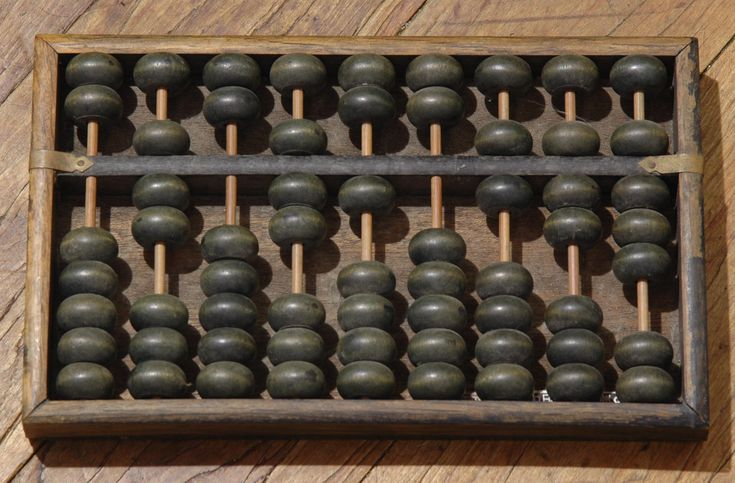
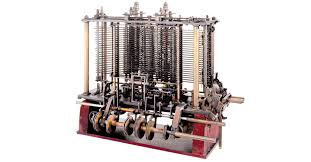
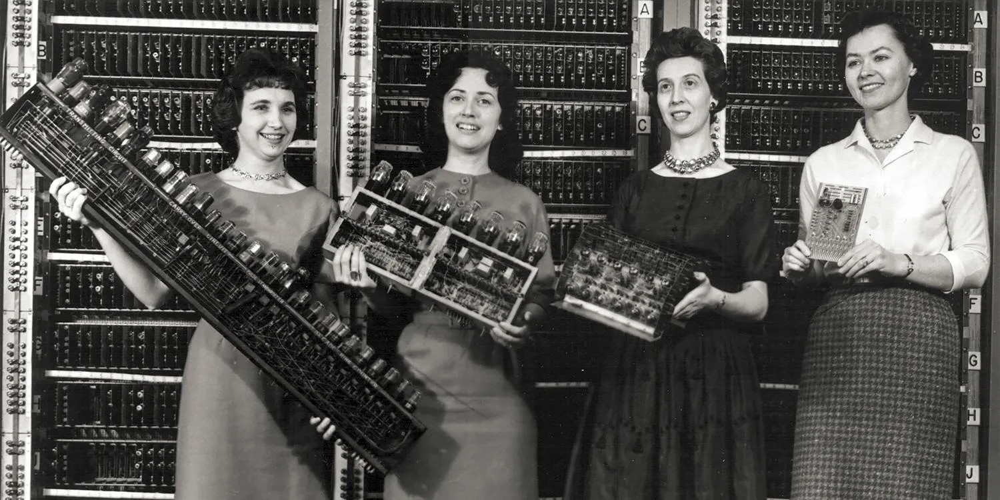
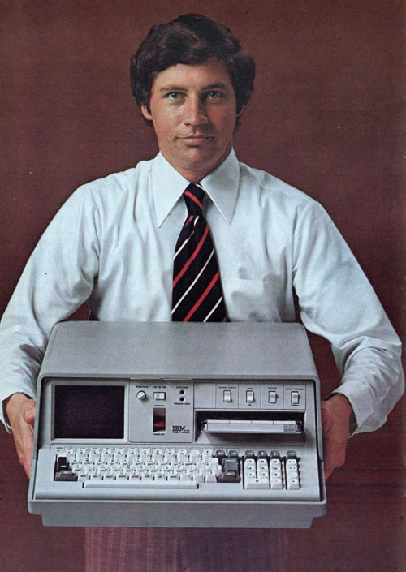
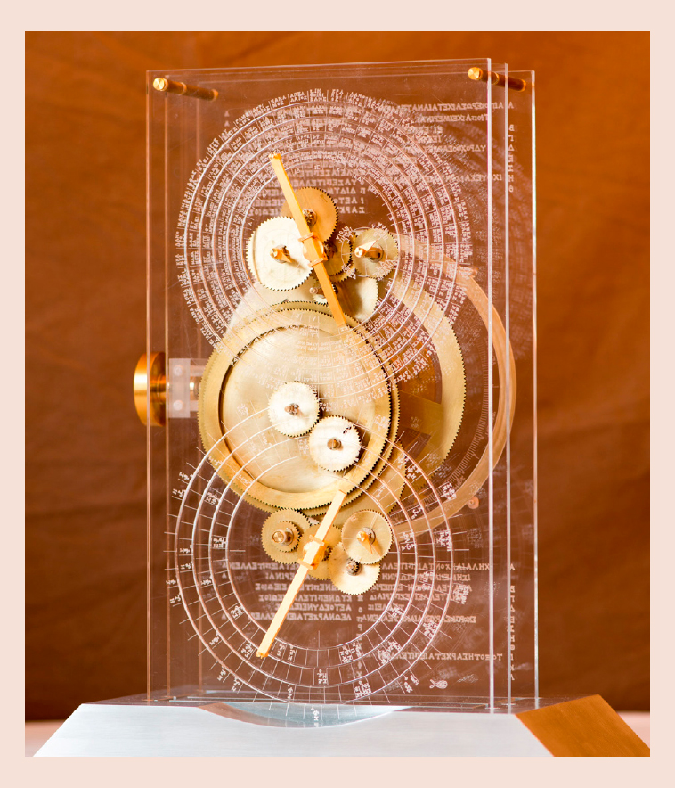
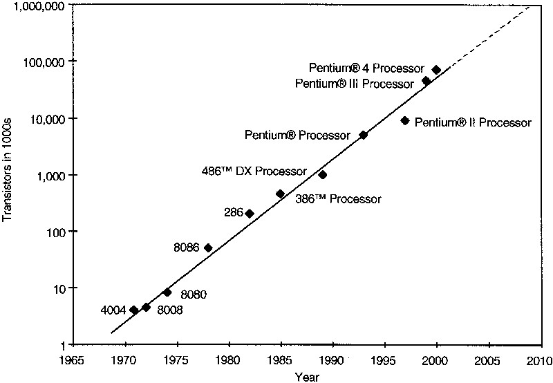
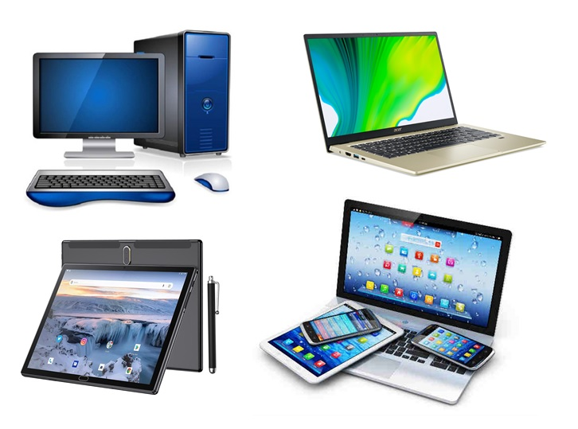
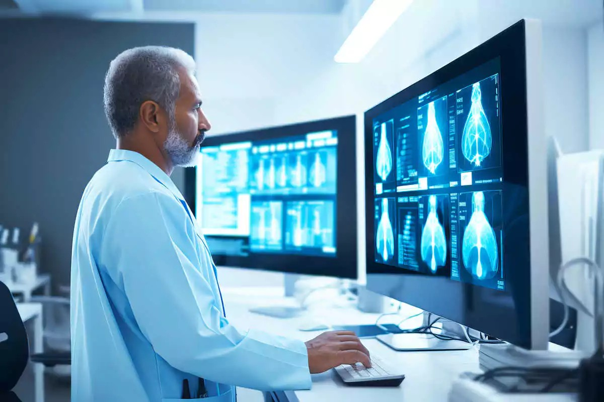
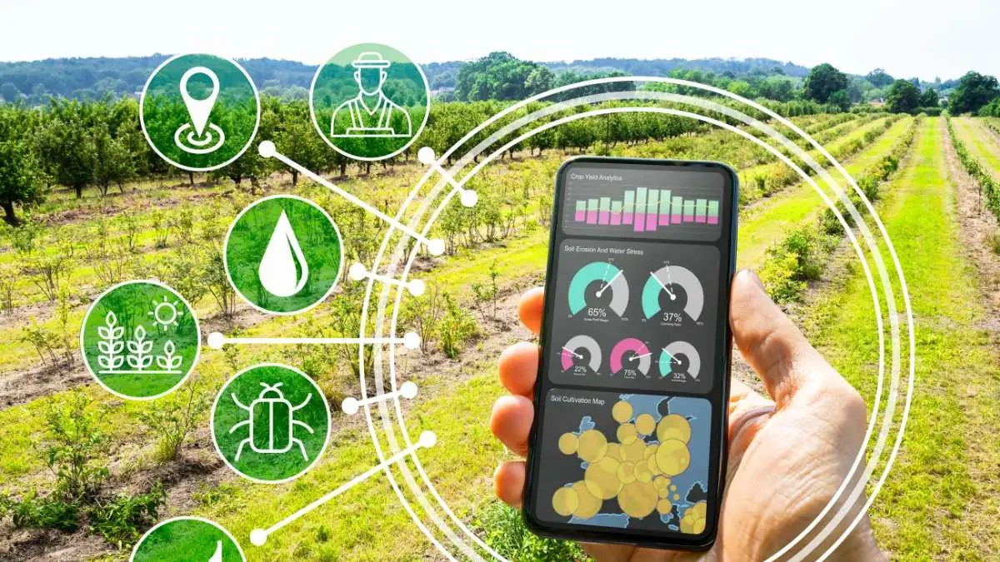

# History of Computers
{: .no_toc }

## Table of contents
{: .no_toc .text-delta }

1. TOC
{:toc}

---

## What is a Computer?

Before we dive into history, let's define what we're actually talking about. A computer is a computing machine that performs calculations according to precise instructions, and it does these operations incredibly fast.

Think about it this way: a computer takes instructions, performs operations, and does exactly as it's told. Even computers that seem to "make decisions" are really just executing programs that people wrote. At its core, a computer only does simple math and logical operations - but it does them very, very, very fast.

**Fun Fact:** In 1613, the word "computer" first appeared - but it referred to a person who performed calculations or computations. Computers were people!

## The Computer Timeline

### Ancient Computing Tools

**2600 BC: Chinese Abacus**
The first computing device was actually the abacus - a simple counting frame that helped people perform calculations faster than using just their fingers.

### Early Mechanical Computers

**1910: Babbage's Analytical Engine**
Henry Babbage constructed part of Charles Babbage's Analytical Engine design. This mechanical device could perform basic mathematical calculations and is considered one of the first programmable computers.

**1936: Two Major Breakthroughs**
- **Konrad Zuse's Z1**: The first binary digital computer
- **Alan Turing's Turing Machine Theory**: Described the first universal computing machine concept

### The Electronic Age

**1946: ENIAC**
The Electronic Numerical Integrator and Computer (ENIAC) was the first electronic general-purpose computer. What made it special? It could be reprogrammed to solve different types of problems.

### Modern Computer Era

**1950: UNIVAC**
Considered the first modern computer, UNIVAC could handle both numerical and text data efficiently.

**1975: IBM's First Portable Computer**
This "portable" machine weighed 55 pounds, had a 5-inch display, and contained 64KB of memory. Compare that to today's smartphones!

## Why Did People Need Computers?

### Original Uses
People first needed computing help for:
- **Keeping counts** of livestock and marketplace goods
- **Summing money** for business transactions
- **Calculating astronomical positions** for navigation and calendars

**Historical Example:** The Greek Antikythera mechanism (around 100 BC) was used for predicting astronomical positions and eclipses - essentially an ancient computer for space calculations.

### Uses That Drove Development

**Mathematical Problem Solving**
- Solve math problems faster than humans
- Handle more complex calculations
- Process large amounts of data (like the 1890 US Census)

**Military Applications**
- Decode encrypted messages during wars
- Calculate proper missile trajectories
- Strategic planning and logistics

**Business Applications**
- Automate production of goods
- Handle accounting and inventory
- Process customer information

## Moore's Law

As computers developed, Intel co-founder Gordon Moore observed that computer processing power roughly doubles every two years. This prediction, called Moore's Law, has held true for decades and explains why your smartphone is more powerful than room-sized computers from the 1940s.

## Modern Computers

### Traditional Forms
Today's computers come in familiar forms:
- **Laptops** for portable productivity
- **Desktops** for power and upgradability  
- **Tablets** for touch-based interaction

### But Computers Are Also...
You might not realize it, but computers are embedded in:
- Smartphones and smart watches
- Cars with GPS and auto-pilot features
- Home appliances like programmable coffee makers
- Toys including robotic pets
- Medical devices like pacemakers and defibrillators

## Modern Applications

**Transportation**
- Auto-pilot systems in planes and cars
- GPS navigation systems
- Traffic management systems

**Healthcare and Medicine**
- Medical imaging and diagnosis
- Robotic surgery assistance
- Drug research and development

**Creative Industries**
- Digital art creation and editing
- Music production and composition
- Movie special effects and animation

**Agriculture**
- Precision farming and crop monitoring
- Automated irrigation systems
- Livestock tracking and health monitoring

**Communication and Connection**
- Social media platforms
- Video calling and messaging
- Global information sharing

## Key Takeaways

1. **Computers solve human problems** - from ancient counting needs to modern global communication
2. **Each breakthrough built on the last** - mechanical calculators led to electronic computers, which led to personal computers
3. **Speed and miniaturization drive progress** - what once filled a room now fits in your pocket
4. **Computers are everywhere** - not just on desks, but embedded in nearly every aspect of modern life

The history of computers shows us that technology develops to meet human needs. Understanding this history helps us appreciate both how far we've come and where we might be heading next.