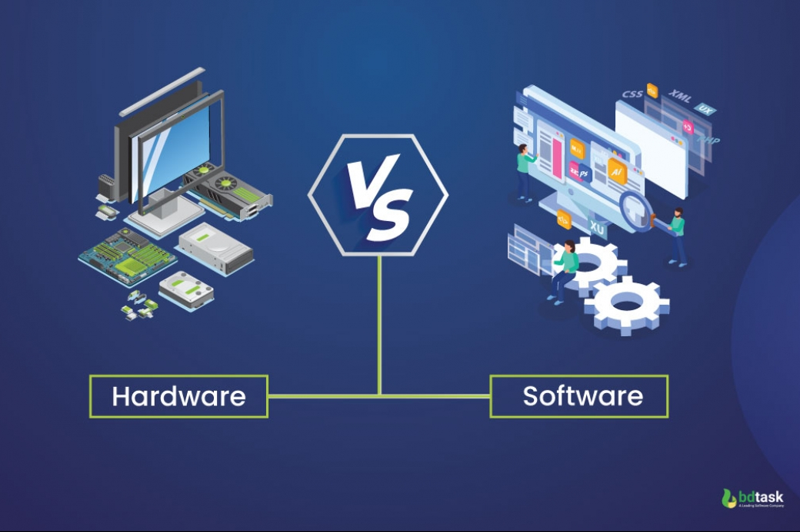
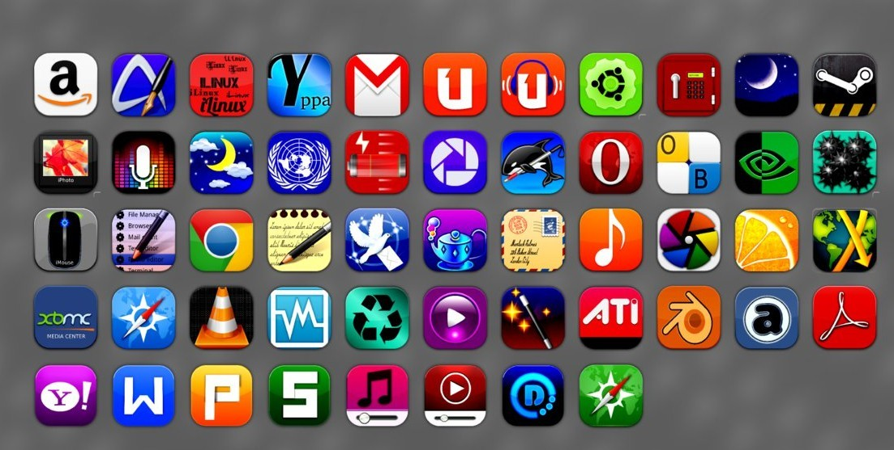
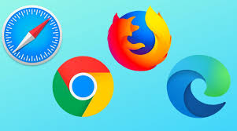
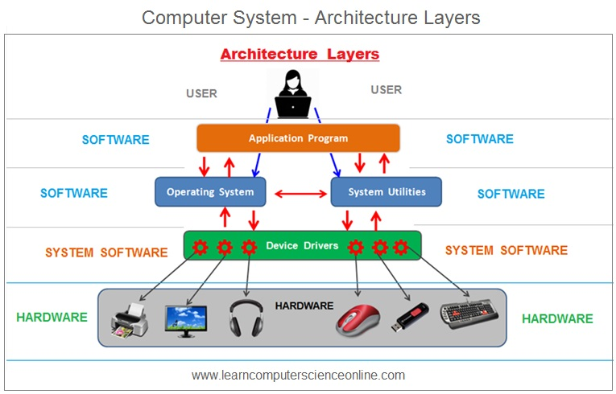
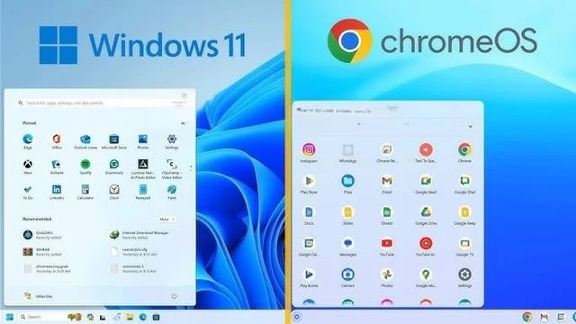
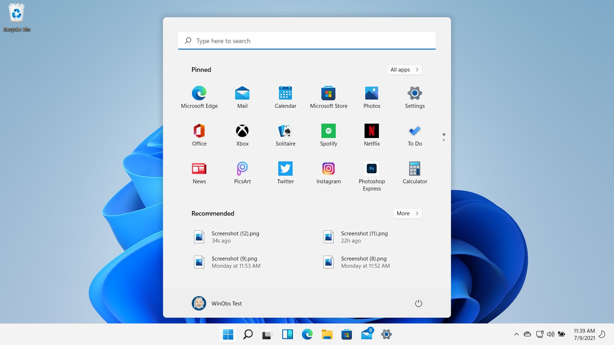
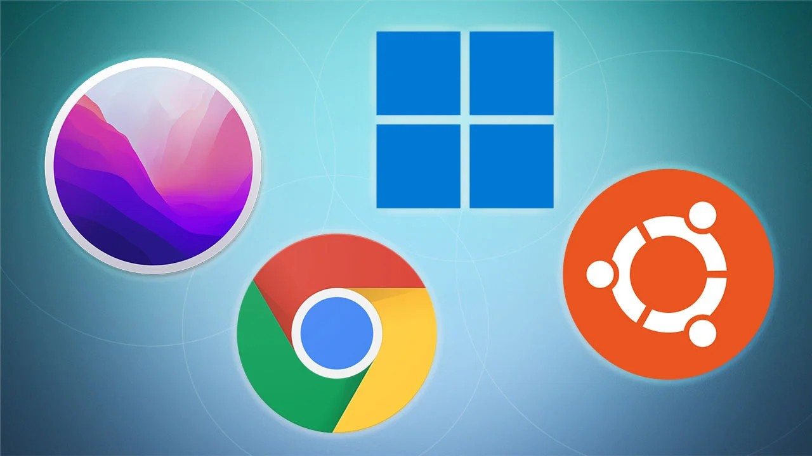
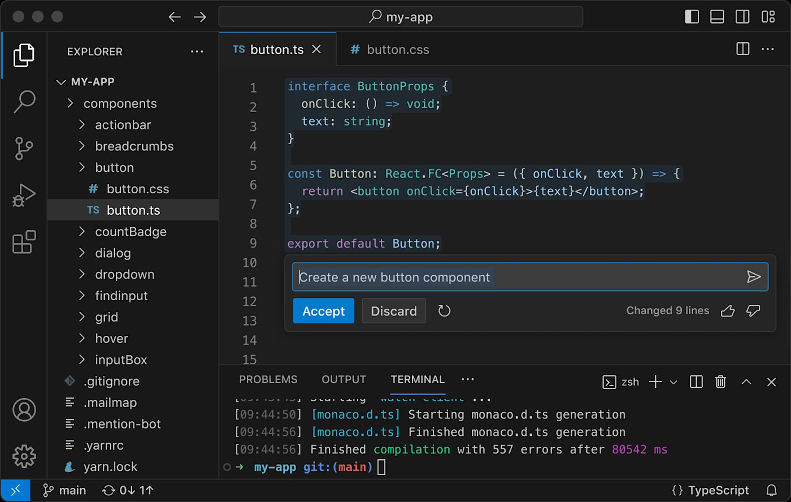

# Software vs Hardware
{: .no_toc }

## Table of contents
{: .no_toc .text-delta }

1. TOC
{:toc}

---

## What is Software?

Software, also called "programs" or "applications," consists of instructions that tell the computer exactly what to do. Without software, even the most powerful computer hardware would be completely useless - it wouldn't have a clue what to do.

Think of it this way: if hardware is like a car's engine, transmission, and wheels, then software is like the driver giving directions on where to go and how to get there.

## The Hardware-Software Relationship

**Hardware** provides the physical capability - the processing power, memory, and input/output devices.

**Software** provides the instructions - telling the hardware what calculations to perform, what to display on screen, and how to respond to user input.

Neither can function without the other. The most advanced hardware is useless without software, and the most sophisticated software cannot run without appropriate hardware.

## Types of Software

### User Application Software

User applications are programs that run on the computer to help users perform specific tasks. These are the programs you interact with directly.

**Characteristics of User Applications:**
- Installed onto your computer by you (the user)
- Enable you to accomplish specific tasks
- Written by programmers but packaged for easy installation
- Designed for direct user interaction

**Common Application Examples:**

**Games**
Entertainment software that provides interactive experiences, from simple puzzle games to complex simulations.

**Office Applications**
- **Word Processors**: Create and edit text documents (like Microsoft Word)
- **Spreadsheet Applications**: Organize data and perform calculations (like Excel)
- **Presentation Software**: Create slideshows and presentations

**Web Browsers**
Programs that allow you to access and navigate the internet, such as Chrome, Firefox, Safari, or Edge.

**File Explorers**
Programs that help you navigate and manage files and folders on your computer.

### System Software

System software consists of programs that help the computer itself perform essential tasks. Unlike user applications, you don't directly interact with most system software.

**Key Characteristics:**
- Creates a layer between user applications and hardware
- Users do not directly interact with it
- Essential for computer operation
- Manages computer resources and basic functions

**Examples of System Software:**

**Boot Program**
The first program that runs when you turn on your computer. It loads the operating system into main memory, essentially "waking up" your computer.

**BIOS (Basic Input/Output System)**
Manages communication between input/output devices (like your keyboard and mouse) and the operating system.

**Device Drivers**
Specialized software that allows the operating system to communicate with specific hardware devices like printers, graphics cards, or webcams.

## Operating Systems

The operating system (OS) is the most important type of system software. It makes your computer usable by managing all other software and hardware resources.

### Where Does the Operating System Live?

The operating system sits between user applications and hardware, acting as a translator and manager for all computer operations.

### What Does the OS Do?

**Application Management**
Controls which programs can run and allocates system resources to each application.

**Memory Allocation**
Decides how much RAM each running program gets and manages memory efficiently.

**Multi-tasking**
Allows multiple programs to appear to run simultaneously by rapidly switching between them.

**Graphical User Interface (GUI)**
Provides the visual desktop environment with windows, icons, and menus that allow you to interact with the computer using a mouse and keyboard rather than typing text commands.

### Common Operating Systems

**Microsoft Windows**
The most widely used operating system for personal computers, known for its user-friendly interface and broad software compatibility.

**Apple Mac OS (macOS)**
Apple's operating system designed specifically for Mac computers, known for its sleek design and integration with other Apple devices.

**Linux**
An open-source operating system popular with developers and servers, known for its stability and customization options.

**Unix**
A powerful operating system primarily used in servers and workstations, known for its reliability and security.

## Other Computer Programs

Beyond commercial software and operating systems, programs can also refer to smaller pieces of code that individual users write.

### User-Written Programs

**Definition:** A set of specific instructions for the computer written by a programmer using a programming language.

**Purpose:** Written to perform a specific task, but not meant to be installed as commercial software on other computers.

**Examples:** A student might write a program to calculate grades, or someone might create a small tool to organize their photo collection.

### Programming Languages

Programming languages provide a human-readable way to write computer instructions. They serve as a bridge between human logic and computer processing.

**Popular Programming Languages:**
- **Java**: Widely used for web applications and enterprise software
- **C and C++**: Powerful languages for system programming and game development  
- **JavaScript**: Essential for web development and interactive websites
- **Python**: Popular for beginners and data science applications
- **C#**: Microsoft's language for Windows applications and web development

## Hardware vs Software: The Complete Picture

Understanding the relationship between hardware and software helps you make better technology decisions:

**When Hardware Matters Most:**
- Gaming and graphics-intensive applications
- Video editing and multimedia creation
- Scientific calculations and data processing
- Running multiple programs simultaneously

**When Software Matters Most:**
- Accomplishing specific tasks efficiently
- User experience and interface design
- Security and data protection
- Compatibility with other systems

## Key Takeaways

1. **Software and hardware are partners** - Neither can function without the other
2. **Different software types serve different purposes** - User applications help you accomplish tasks, while system software keeps the computer running
3. **Operating systems are the foundation** - They make everything else possible by managing resources and providing interfaces
4. **Programming languages enable creation** - They allow people to write new software to solve problems
5. **Understanding both helps decision-making** - Knowing how software and hardware work together helps you choose the right tools for your needs

The distinction between software and hardware is fundamental to understanding how all computing devices work, from smartphones to supercomputers.