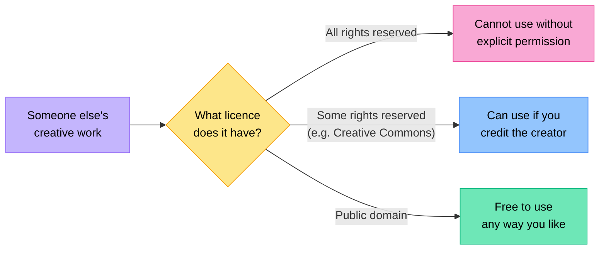

# Creative Credit & Copyright

## Introduction

Increased connectivity has made it easier than ever to share and access movies, music, articles, books, and art. However, it is important that we access and share this content in a way that is both **legal** and **ethical**. Understanding copyright — and how to give credit to creators — is a core part of being a responsible digital citizen.

---

## What Is Copyright?

:::tip Key Term
**Copyright** is a form of legal protection for intellectual property, usually applying to artistic works. Any work of original thought is the legal property of its creator, and this is protected by copyright law.
:::

This means that the owner or creator of a work has the right to decide how their work is used and distributed. Someone else cannot simply take, copy, or share that work without permission.

Copyright applies to many types of creative work, including:
- Written text (books, articles, poems, song lyrics)
- Music and recordings
- Films and videos
- Photographs and artwork
- Websites and their content
- Software and games

---

## Types of Copyright Licences

There are several types of copyright licences, some offering more protection than others. All of them fall into one of three broad categories:

| Category | What It Means |
|---|---|
| **All rights reserved** | The creator reserves all rights. The work cannot be distributed, reused, or modified without their explicit permission. This is the most strict copyright licence. |
| **Some rights reserved** | The creator allows certain uses — such as reuse or modification — as long as they are credited as the original creator. The specific licence spells out exactly what is permitted. |
| **Public domain** | The creator has dedicated the work to the public domain and waived all rights. Anyone is free to reuse or modify the work however they wish. |

:::info Choosing a Licence
When you share your own creative work online, you can choose which type of licence to apply. A "some rights reserved" licence lets you allow others to build on your work while still being credited. The "public domain" option gives up all rights entirely.
:::

---

## Respecting Others' Copyright

It is very important to respect the copyright that belongs to other creators. Here are two common violations you should know about:

:::danger Copyright Violations
1. **Distributing copyrighted materials** — sharing images, movies, music, or albums over file-sharing networks without permission is a clear violation of copyright and is against the law.
2. **Passing off someone else's work as your own** — taking pictures, quotes, or videos from the internet and claiming you made them is also a violation of copyright law.
:::

Just as you would properly reference sources in a research paper at school, when you use pictures, quotes, or videos that somebody else created, you must **give credit to the original author**.

---

## How to Cite Your Sources

Whenever you use someone else's work, you should cite it. A proper citation includes:

:::info What to Include in a Citation
- **Name of the author**, if available
- **Name of the work**, if available
- **Year of the work**, if available
- **Name of the site** you sourced it from
- **A direct link** to the work
:::

There are websites and browser extensions that make it very easy to generate citations in the format you need. These tools are particularly useful when putting together bibliographies for school assignments.

---

## Summary

| Concept | Key Point |
|---|---|
| Copyright | Legal protection for a creator's original work — the creator controls how it is used |
| All rights reserved | No use without the creator's explicit permission |
| Some rights reserved | Certain uses allowed (e.g. with credit); specific licence defines the rules |
| Public domain | All rights waived — anyone can use the work freely |
| Copyright violation | Sharing copyrighted files illegally, or presenting someone else's work as your own |
| Citing sources | Always credit the original author: include author name, work title, year, site name, and direct link |

---

## Check Your Understanding

1. Define copyright in your own words. Why does copyright law exist?
2. Describe the difference between "all rights reserved," "some rights reserved," and "public domain." Give a practical example of each.
3. Why is distributing copyrighted movies or music over file-sharing networks illegal? What law does it violate?
4. A learner finds a photograph on Google Images and uses it in their school project without crediting the photographer. Is this a copyright violation? Explain your answer.
5. What information should you include when citing a source you used from the internet? List all five elements.
6. You want to use a quote from an online article in your class presentation. Describe the steps you should take to use it legally and ethically.
7. A classmate says: "Copyright only matters for movies and music — images on the internet are free to use." Is your classmate correct? Explain why or why not.
8. Why is it important to give credit to the original author, even when the licence allows you to use the work for free?
9. What are citation tools and website extensions useful for? When would you use them?
10. In your own words, explain why respecting copyright is a matter of both legality and ethics — not just one or the other.
