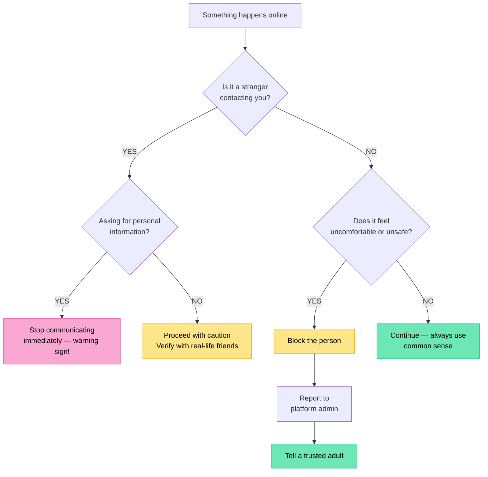

# Internet Safety

## Staying Safe Online

The internet has become a great place to socialise, learn, and connect with others. However, it is important to be aware of the risks that come with online communication. Using **common sense** and following a few key safety guidelines can help you stay safe online.

---

## Core Safety Guidelines

There are four fundamental guidelines that apply to almost every online situation:

:::info Key Safety Guidelines
1. **Be wary when communicating with people you don't know in real life.**
2. **Don't disclose personal information** — even if it doesn't seem important.
3. **Block and report if you are being harassed.**
4. **Ask a trusted adult if you need help.**
:::

Let's look at each of these in more detail.

---

## Be Wary of Strangers Online

If a person reaches out to you online claiming to know you, you should **always proceed with caution**. Someone might claim to go to your school or know a mutual friend — but it is very easy for a person to be dishonest about their identity online.

If someone online claims to know people in your life, check with your real-life friends whether they actually know this person, or whether they are also being contacted by them. Being wary of people you do not know in real life is not rude — it is actually a sensible and smart safety habit.

---

## Do Not Disclose Personal Information

One of the most important rules of internet safety is protecting your personal information. Even details that seem unimportant can be used by someone with bad intentions to find out more about your life than they should.

:::danger Information to Keep Private Online
- Your **full name**
- Your **birthday or age**
- Your **school name or school mascot**
- Your **personal schedule** (when you are home, your daily routine)
:::

Your username is the first thing people see — make sure it does not contain any personal information like your full name, birthday, or age.

Even information that feels harmless — like your school's mascot or your daily schedule — can be pieced together by a predatory person to learn far more about your life than you intended to share.

If someone online keeps asking you for personal information, **stop communicating with them immediately**. This is a warning sign of predatory behaviour, and giving out personal information can put your safety at risk.

---

## Do Not Be Afraid to Block or Report

If any online interaction makes you feel uncomfortable, you have every right to end it immediately. You do not owe anyone online your continued attention or communication.

| Situation | What to Do |
|---|---|
| Interaction feels uncomfortable | Stop communication immediately |
| Feeling unsafe or harassed | Block the person |
| Person continues to contact you after blocking | Report harassment to the website or platform administrator |

Blocking is not overreacting — it is a tool that exists precisely for situations like this. Reporting creates a record of the behaviour and can result in the person being removed from the platform.

---

## Ask for Help

If you are not sure how to handle an online interaction, **talk to a trusted adult**. This might be a parent, teacher, or coach. Adults can help you figure out whether a situation is safe and what steps to take.

You should never feel that you have to deal with an uncomfortable or worrying online situation on your own. Asking for help is always the right choice when you feel unsure or worried.

---

## Use Common Sense

The most important skill in internet safety is good judgment. If a situation online does not feel right, **trust your instincts** — they are usually correct.

:::tip Remember
Common sense is your most powerful tool online. If something feels wrong, it probably is. Don't be afraid to take action or ask for help.
:::

Following these guidelines — being wary of strangers, protecting your personal information, blocking and reporting harassment, asking for help, and trusting your instincts — will help you navigate the internet safely.

---

## Summary

| Guideline | Key Action |
|---|---|
| Strangers online | Proceed with caution; verify with people you know in real life |
| Personal information | Do not share your name, birthday, school name, school mascot, or schedule |
| Harassment | Block the person; report to the platform if contact continues |
| Asking for help | Talk to a trusted adult (parent, teacher, coach) |
| Common sense | Trust your instincts; if something feels wrong, act on it |

---

## Check Your Understanding

1. Why is it important to be careful when communicating with people you do not know in real life, even if they seem friendly?
2. List **four** examples of personal information that should not be shared online. For each one, explain why sharing it could be dangerous.
3. Explain why even information that seems unimportant — like your school mascot or your daily schedule — could be used against you by someone online.
4. What should you do if someone online keeps asking you for personal information? Why is this behaviour a warning sign?
5. Describe the steps you should take if an online interaction makes you feel uncomfortable, in the correct order.
6. What is the difference between blocking someone and reporting someone? Why might you need to do both?
7. Why does the video say that being wary of strangers online is actually "a good thing"?
8. Who are some examples of trusted adults you could go to if you needed help with an unsafe online situation?
9. A classmate says: "I always accept friend requests from strangers because I want lots of followers. It's harmless." Write a response to this using what you have learned in this chapter.
10. Explain what "use common sense" means in the context of internet safety. Give an example of a situation where trusting your instincts could protect you online.
