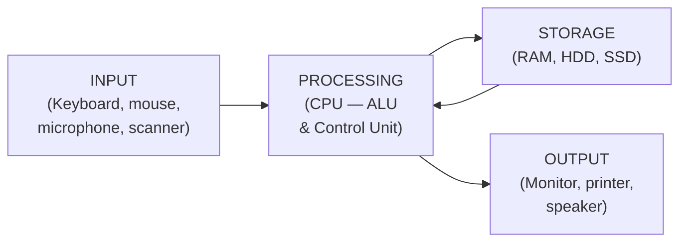
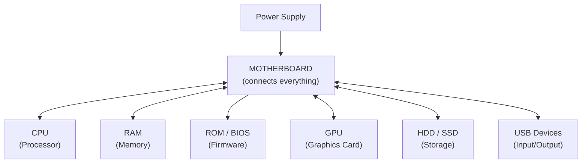
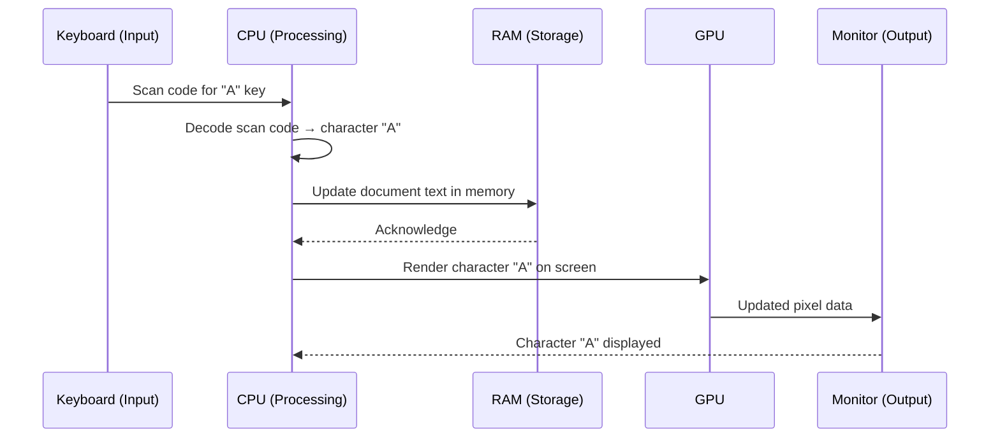
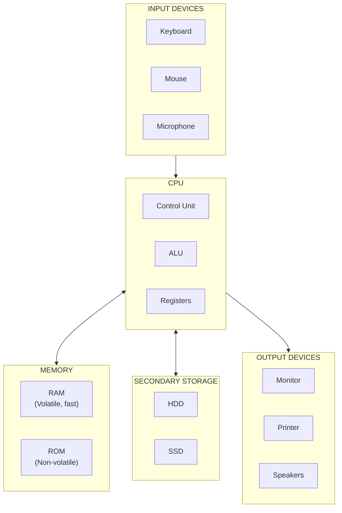

# Topic 2: Computer Organisation

## Introduction

A computer is not one single thing — it is a carefully organised system of components that work together to accept data, process it, store it, and produce useful output. Understanding how these components are organised, and how they communicate, is fundamental to understanding everything else in this course.

In this topic, we explore the internal architecture of a computer from first principles. We start with a simple model — the four operations a computer performs — and then progressively zoom in to examine each component in detail: the CPU, memory, storage, and the connections between them. By the end, you will be able to trace exactly what happens inside a computer when you do something as simple as typing a letter.

---

## 1. The Four Operations: The IPSO Model

Every computer, from the smallest microcontroller in your earbuds to the largest supercomputer in the world, performs four fundamental operations:

1. **Input** — Accept data from the outside world
2. **Processing** — Manipulate or transform that data
3. **Storage** — Save data temporarily or permanently
4. **Output** — Produce results that are useful to humans or other systems

This is sometimes called the **IPSO model** or the **IPO model** (if storage is treated separately).

Notice that storage has a two-way arrow with processing — data flows *to* storage (saving), and data flows *from* storage back to the processor (loading).

### Real Examples of Each Operation

| Operation | Component | Example |
|-----------|-----------|---------|
| Input | Keyboard | You press the "A" key |
| Input | Microphone | You speak a voice command to Siri |
| Input | Camera | A QR code is scanned at a shop |
| Processing | CPU | The computer adds two numbers together |
| Processing | CPU | A word processor checks spelling |
| Storage (temporary) | RAM | The document you are currently editing |
| Storage (permanent) | SSD/HDD | A saved Word document on your hard drive |
| Output | Monitor | The letter "A" appears on screen |
| Output | Printer | A document is printed on paper |
| Output | Speaker | A song plays through your earphones |

:::tip Key Term
**IPSO Model** — the four fundamental operations of any computer system: Input, Processing, Storage, and Output. Every action a computer performs can be understood through this model.
:::

---

## 2. Inside the CPU

The **Central Processing Unit (CPU)** is the component that does the actual processing — it executes instructions, performs calculations, and controls the behaviour of all other components. It is often called the "brain" of the computer, though "engine" might be a better analogy — it is not intelligent, but it is extraordinarily powerful at following instructions very quickly.

Modern CPUs are microprocessors — entire processing units integrated onto a single chip. They are typically about the size of a postage stamp, yet contain billions of transistors.

:::tip Key Term
**CPU (Central Processing Unit)** — the primary component of a computer that executes program instructions. It performs arithmetic, logical operations, and controls the flow of data between components.
:::

### 2.1 The Arithmetic/Logic Unit (ALU)

The **ALU** is the part of the CPU that performs all mathematical and logical operations:

- **Arithmetic operations:** addition, subtraction, multiplication, division
- **Logical operations:** comparisons (is A greater than B? is A equal to B?), and Boolean operations (AND, OR, NOT)

Everything a computer does — even displaying graphics or playing audio — eventually comes down to arithmetic and logic at the hardware level.

:::tip Key Term
**ALU (Arithmetic/Logic Unit)** — the component within the CPU responsible for performing mathematical calculations and logical comparisons.
:::

### 2.2 The Control Unit (CU)

The **Control Unit** is the manager or coordinator of the CPU. It does not perform calculations itself — instead, it:

1. **Fetches** the next instruction from memory
2. **Decodes** the instruction (works out what it means)
3. **Executes** the instruction (tells the ALU or other components what to do)
4. **Stores** the result

This cycle — **Fetch → Decode → Execute → Store** — repeats billions of times per second in a modern CPU. Each repetition is one *instruction cycle* or *machine cycle*.

:::tip Key Term
**Control Unit (CU)** — the part of the CPU that directs the operation of the processor by fetching, decoding, and executing instructions in sequence.
:::

### 2.3 Registers

**Registers** are tiny storage locations *inside* the CPU itself. They are the fastest storage in any computer system — the CPU can read from and write to them in a single clock cycle.

Registers hold:
- The instruction currently being executed
- The data currently being processed
- Memory addresses pointing to data in RAM
- Intermediate results from calculations

Because there are only a small number of registers (typically 16 to 64 in a modern CPU), data moves in and out of registers constantly as the CPU works through instructions.

:::tip Key Term
**Register** — an extremely fast, small storage location inside the CPU used to hold data that is being actively processed.
:::

### 2.4 Clock Speed

The CPU operates on a clock signal — a regular pulse that synchronises all its operations. **Clock speed** is measured in **gigahertz (GHz)** — billions of cycles per second.

- A 3.0 GHz processor completes 3 billion clock cycles per second
- Each clock cycle can execute one or more operations
- Higher clock speed generally means faster processing

However, clock speed is not the only factor. The number of **cores** matters too — a modern CPU might have 4, 8, or even 32 cores, each capable of executing instructions simultaneously. A quad-core CPU running at 3.0 GHz can theoretically do four times the work of a single-core CPU at the same speed.

| CPU Spec | What It Means |
|----------|--------------|
| 3.5 GHz clock speed | Executes up to 3.5 billion cycles per second |
| Quad-core | Has 4 independent processing units (cores) |
| 8 MB cache | Has 8 megabytes of very fast on-chip memory |

---

## 3. Memory: RAM and ROM

"Memory" in computing refers to electronic storage that the CPU can access very quickly — much faster than a hard drive. There are two fundamental types.

### 3.1 RAM — Random Access Memory

**RAM** is the computer's *working memory*. When you open a program, the computer loads it from storage (your hard drive or SSD) into RAM, because RAM is much faster.

Key characteristics of RAM:
- **Fast** — the CPU can read/write RAM in nanoseconds
- **Volatile** — it loses all its data when power is switched off
- **Temporary** — it holds data that is actively in use
- **Large but limited** — modern computers typically have 8–32 GB of RAM

Think of RAM like the surface of a desk. Your desk can hold the books and papers you are currently working with — but when you go home (power off), everything on the desk is put away (lost from RAM). The actual books go back on the bookshelf (storage).

:::tip Key Term
**RAM (Random Access Memory)** — fast, temporary (volatile) memory that the CPU uses to store data and programs that are currently in use. Data in RAM is lost when power is removed.
:::

:::warning Common Misconception
Students often confuse RAM with storage. When you "save a file," you are saving it to the hard drive (permanent storage), not to RAM. RAM only holds data temporarily while the computer is on. This is why you can lose unsaved work if the computer crashes — the unsaved version in RAM disappears.
:::

### 3.2 ROM — Read-Only Memory

**ROM** is memory that is permanently built into the hardware and cannot normally be changed.

Key characteristics of ROM:
- **Non-volatile** — retains data when power is removed
- **Read-only** (or very rarely writable)
- **Small** — typically only a few megabytes
- Contains the **firmware** — the most fundamental software instructions for the device

The most important ROM in a computer is the chip that stores the **BIOS** (Basic Input/Output System) or **UEFI** (Unified Extensible Firmware Interface). When you switch on a computer, the CPU immediately starts reading instructions from ROM. These instructions check that hardware is working (the POST — Power-On Self Test) and then hand control over to the operating system on the hard drive.

:::tip Key Term
**ROM (Read-Only Memory)** — non-volatile memory permanently built into hardware. It retains data when power is removed and typically stores the firmware that starts up the computer.
:::

### 3.3 RAM vs ROM: Comparison

| Feature | RAM | ROM |
|---------|-----|-----|
| Full name | Random Access Memory | Read-Only Memory |
| Volatile? | Yes — data lost when power off | No — data retained permanently |
| Can be written by user? | Yes, continuously | No (or rarely) |
| Speed | Very fast | Fast |
| Typical size | 8–64 GB in modern PCs | A few MB |
| What it stores | Running programs, open files | Firmware, BIOS/UEFI |
| Analogy | The surface of your desk | The instructions printed on a label |

---

## 4. Storage: HDD vs SSD

While RAM is fast but temporary, **secondary storage** is slower but permanent. It holds your data when the computer is switched off.

### 4.1 Hard Disk Drive (HDD)

A **Hard Disk Drive** stores data on spinning magnetic platters. A read/write head moves across the surface of the platter (without touching it) to read or write data — like a record player needle, but never actually touching the disc.

- Data is stored as tiny magnetic spots (North or South pole = 1 or 0)
- The platters spin at 5,400 or 7,200 rpm (revolutions per minute)
- Typical capacity: 500 GB to 20 TB
- Relatively **slow** to access because the head must physically move to the right location
- **Mechanical parts** make HDDs vulnerable to physical damage from drops or shocks
- **Cheaper** per gigabyte than SSDs

:::tip Key Term
**HDD (Hard Disk Drive)** — a storage device that uses spinning magnetic platters and a moving read/write head to store and retrieve data. It is slower than an SSD but typically cheaper per gigabyte.
:::

### 4.2 Solid State Drive (SSD)

A **Solid State Drive** has no moving parts at all. It stores data in **flash memory** — the same type of memory used in USB drives and phones, but in a much faster, more durable form.

- Data is stored electronically in flash memory cells
- No moving parts — much faster access times
- Typical capacity: 256 GB to 4 TB (and growing)
- Access times: 10–100 times faster than HDDs
- More **durable** — resistant to drops and shocks
- **More expensive** per gigabyte than HDDs

:::tip Key Term
**SSD (Solid State Drive)** — a storage device that uses flash memory chips with no moving parts. It is much faster and more durable than an HDD but currently more expensive per gigabyte.
:::

### 4.3 HDD vs SSD Comparison

| Feature | HDD | SSD |
|---------|-----|-----|
| Technology | Spinning magnetic platters | Flash memory chips |
| Moving parts? | Yes (spinning platter, moving head) | No |
| Speed | Slower (80–160 MB/s read) | Much faster (500–7,000 MB/s read) |
| Durability | Fragile — vulnerable to bumps | Robust — handles drops better |
| Noise | Slight whirring sound | Silent |
| Power consumption | Higher | Lower |
| Cost per GB | Cheaper (approx R1–2/GB) | More expensive (approx R3–6/GB) |
| Typical use | Large storage / backup | Main drive in laptops and gaming PCs |

:::info South African Context
In South Africa, many affordable laptops still ship with HDDs to keep costs down. If you are buying or upgrading a laptop, replacing an HDD with an SSD is one of the single most impactful upgrades you can make — boot times can go from 60 seconds to under 10 seconds.
:::

---

## 5. Buses: The Communication Highways

Components inside a computer cannot communicate by shouting — they send electrical signals along groups of wires called **buses**. A bus is a shared communication pathway connecting multiple components.

:::tip Key Term
**Bus** — a set of electrical connections (wires or traces on a circuit board) that carry data signals between components in a computer. Like a bus route that multiple passengers share, multiple components share the same bus.
:::

There are three types of bus:

### 5.1 Data Bus

Carries the actual data — the binary values (0s and 1s) — being transferred between components.

- A 64-bit data bus can transfer 64 bits of data simultaneously
- Wider bus = more data transferred per cycle = faster throughput

### 5.2 Address Bus

Carries memory *addresses* — the locations in RAM where data should be read from or written to. You can think of an address as a house number on a street.

- A 32-bit address bus can address 2³² = 4,294,967,296 memory locations (4 GB)
- A 64-bit address bus can address vastly more — which is why 64-bit systems can use more than 4 GB of RAM

### 5.3 Control Bus

Carries control signals that coordinate the activities of components — for example, signals telling a component whether data is being *read* or *written*, or signals to synchronise operations with the clock.

| Bus Type | What It Carries | Analogy |
|----------|----------------|---------|
| Data bus | The actual data (0s and 1s) | The passengers on the bus |
| Address bus | Memory addresses (where to read/write) | The destination displayed on the bus |
| Control bus | Timing and control signals | The timetable and traffic lights |

---

## 6. The Motherboard

The **motherboard** (also called the mainboard or system board) is the main circuit board of the computer. It is the central hub that physically connects and enables communication between all major components.

:::tip Key Term
**Motherboard** — the main circuit board in a computer. It holds the CPU, RAM slots, ROM chip, expansion slots, and connectors for storage devices, USB ports, and other peripherals. All components connect to or through the motherboard.
:::

Key components on the motherboard:

- **CPU socket** — where the CPU chip is installed
- **RAM slots** — where RAM sticks are inserted (typically 2–4 slots)
- **BIOS/UEFI chip** — the ROM chip with firmware
- **Chipset** — manages data flow between CPU, RAM, and other components
- **PCIe slots** — for adding graphics cards, network cards, etc.
- **SATA connectors** — for connecting HDDs and SSDs
- **USB headers** — for front-panel USB ports
- **Power connectors** — for connecting the power supply

---

## 7. Worked Example: Typing a Letter in a Word Processor

Now let us put it all together. Here is a step-by-step trace of exactly what happens inside your computer when you open a word processor and press the "A" key.

**Scenario:** Your laptop is on. Microsoft Word is open. You press the "A" key on the keyboard.

---

**Step 1 — Input: Keystroke detected**
- The keyboard detects that the "A" key has been pressed.
- The keyboard converts this into a digital signal (a **scan code** — a number identifying which key was pressed).
- This signal travels via USB cable (or wirelessly) to the motherboard.

**Step 2 — Interrupt: CPU notified**
- The keyboard sends an **interrupt signal** to the CPU, saying "I have data for you."
- The CPU pauses its current task briefly, saves its state to registers, and handles the interrupt.

**Step 3 — Processing: Character identified**
- The CPU receives the scan code from the keyboard.
- The keyboard driver (a small software program) translates the scan code into the character "A" (or its ASCII code: 65).
- The CPU passes this information to the word processor program running in RAM.

**Step 4 — Storage: RAM updated**
- The word processor updates the document data in RAM — it adds the character "A" to the text buffer stored in RAM.
- Note: the document has *not yet been saved* to the hard drive — it exists only in RAM at this point.

**Step 5 — Processing: Screen update calculated**
- The CPU tells the graphics subsystem to update the display.
- The GPU (or the CPU's integrated graphics) calculates what pixels need to change on screen to show the letter "A" at the cursor position.

**Step 6 — Output: Display updated**
- The updated image data is sent to the monitor.
- The letter "A" appears on screen at the cursor position.

---

This entire sequence — from keypress to character appearing on screen — happens in **less than 50 milliseconds** (0.05 seconds). In fact, for most of those steps, the delay is measured in *microseconds* (millionths of a second).

---

## 8. Summary: How It All Fits Together

---

## Check Your Understanding

1. What does the acronym IPSO stand for? Give one real-world example of each of the four operations.

2. What is the difference between the ALU and the Control Unit within the CPU? What does each one do?

3. Describe the Fetch–Decode–Execute–Store cycle. What happens at each stage?

4. What does it mean to say RAM is "volatile"? Give a practical consequence of this characteristic that you have probably experienced.

5. What is ROM? Why does a computer need ROM in addition to RAM?

6. Fill in this comparison table from memory:

   | Feature | RAM | ROM |
   |---------|-----|-----|
   | Volatile? | | |
   | Stores currently running programs? | | |
   | Stores firmware/BIOS? | | |
   | Data survives power-off? | | |

7. Explain the difference between a Hard Disk Drive and a Solid State Drive. In what situations might you prefer an HDD? When would an SSD be better?

8. What are the three types of bus in a computer? Describe the purpose of each one in your own words.

9. What is the motherboard, and what is its role in the computer system?

10. Using the worked example in Section 7 as a guide, trace what happens when you click a "Save" button in a word processor. Which components are involved, and in what order?

11. **Extension:** A friend says: "My computer is slow because it only has 256 GB of storage." Explain why this reasoning might be incorrect. What information would you need to properly diagnose the cause of the slowness?
