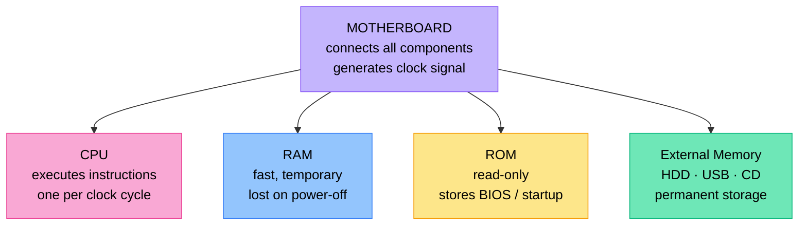

# Topic 4: Hardware

## Introduction

**Hardware** refers to the physical components of your computer — the parts you can actually touch that make up the computing machine. Every device you use, whether a laptop, tablet, smartphone, or desktop, is built from hardware components that work together.

:::tip Key Term
**Hardware** — the physical components of a computer; the parts you can touch, usually made of silicon or metal.
:::

Hardware uses **electrical signals** to carry out the instructions given to it by programs. These electrical signals implement **binary** — the language of the computer.

---

## 1. Binary: The Language of Computers

At the very base level of every computer, everything is represented as a zero or a one. This system is called **binary**.

:::tip Key Term
**Binary** — a numbering system that uses only two digits: 0 and 1. All information inside a computer is ultimately stored and processed in binary.
:::

Binary is simply a different way of representing numbers. The same numbers we use every day — 0, 1, 2, 3, 4, 5, 6, 7, 8, 9 — can all be represented using only zeros and ones.

Electrical signals can implement binary very simply:
- A **high voltage** represents a **1**
- A **low voltage** represents a **0**

This means the hardware only ever needs to distinguish between two states — on or off, high or low — which makes it much simpler to build.

---

## 2. Bits, Bytes, and Digital Data

The smallest unit of digital data is a single binary digit — a single zero or one. This is called a **bit**.

:::tip Key Term
**Bit** — a single binary digit; either a 0 or a 1. The smallest possible unit of digital data.
:::

On its own, one bit cannot store much information. So bits are grouped together into larger units:

| Unit | Size | What it can represent |
|------|------|-----------------------|
| **Bit** | 1 binary digit (0 or 1) | One of two states |
| **Byte** | 8 bits | Enough data to represent a single letter (e.g. A, B, or C) |
| **Megabyte (MB)** | About 1 million bytes | Roughly enough to store a short song |

:::info
Everything stored in a computer is stored in bytes. A single byte — 8 bits, such as `11011110` — is enough information to represent one character of text.
:::

---

## 3. Logic Gates

Computers are able to perform mathematical operations on binary data using physical components called **logic gates**.

:::tip Key Term
**Logic gate** — a physical electronic component that processes incoming binary signals and produces an output signal based on a logical rule.
:::

All hardware is built using logic gates arranged in circuits. A logic gate takes one or more binary inputs and produces a binary output based on a specific rule.

For example, an **AND gate** works like this: if it receives a 1 on both of its inputs, it outputs a 1. Otherwise, it outputs a 0.

| AND Gate Input A | AND Gate Input B | Output |
|-----------------|-----------------|--------|
| 0 | 0 | 0 |
| 0 | 1 | 0 |
| 1 | 0 | 0 |
| 1 | 1 | 1 |

By combining thousands — and eventually billions — of logic gates together, computers are able to simulate addition, subtraction, multiplication, and all the other mathematical operations they perform. At the base of it all, everything a computer does comes down to binary signals passing through logic gates.

---

## 4. The Main Hardware Components

Every computer has at least three core hardware components: **memory**, the **motherboard**, and the **CPU**.

### 4.1 Memory

Memory is how a computer stores the numbers and instructions it needs. There are two types of memory: **main memory** and **external memory**.

#### Main Memory

Main memory stores the currently running program's instructions and the data the computer needs to function in the moment. It is **temporary** — it is very fast, but it only works when the power is on.

There are two kinds of main memory:

**RAM (Random Access Memory)**

:::tip Key Term
**RAM (Random Access Memory)** — fast, temporary memory that only stores data while the power is on. The operating system and currently running applications are all stored here.
:::

- RAM only stores information if the power is turned on — it needs electricity.
- When the computer starts up, the operating system is loaded into RAM.
- RAM stores the currently running applications and the data those applications need.
- It is constantly changing — data comes in and out very quickly.
- It is sometimes called "random access" because any part of it can be accessed directly and instantly.

**ROM (Read-Only Memory)**

:::tip Key Term
**ROM (Read-Only Memory)** — memory that cannot be changed; it keeps its data regardless of whether the power is on or off.
:::

- You cannot write new data to ROM — you can only read from it.
- ROM keeps its information even when the power is off.
- ROM stores important information the computer needs to start up, such as the **BIOS** (Basic Input/Output System).

#### External Memory

External memory is used to store data **long-term**. It holds data whether or not the computer is powered, and it can be physically connected to or removed from the computer.

Examples of external memory:
- CDs
- USB drives
- Hard drives
- Floppy discs

Physical discs like CDs and hard drives literally burn zeros and ones into their surface to store binary data long-term.

| Feature | Main Memory (RAM) | ROM | External Memory |
|---------|------------------|-----|----------------|
| Speed | Very fast | Fast | Slower |
| Keeps data when power off | No | Yes | Yes |
| Can be changed | Yes, constantly | No | Yes |
| Purpose | Active programs and data | Startup information (BIOS) | Long-term storage |
| Examples | RAM chips | BIOS chip | Hard drive, USB drive, CD |

---

### 4.2 The Motherboard

The **motherboard** is where everything lives. It is the main circuit board of the computer.

:::tip Key Term
**Motherboard** — the main circuit board of a computer. It connects all the different parts of the computer together — the CPU, memory, input devices, output devices, and storage all connect to and through the motherboard.
:::

The motherboard is responsible for:
- **Connecting all parts** — the processor, memory, input, output, and storage all connect here.
- **Creating the clock signal** for the CPU — this is critical, because the CPU performs one operation per clock cycle, so the motherboard keeps the clock running to pace the CPU's work.

---

### 4.3 The CPU (Central Processing Unit)

The **CPU** is the heart of the computer. It is responsible for actually carrying out the instructions of a program — this is where all the number crunching happens.

:::tip Key Term
**CPU (Central Processing Unit)** — the main processing component of a computer. It executes the instructions received from software, performing one instruction per clock cycle.
:::

Key facts about the CPU:
- It executes the instructions given to it by the computer's software.
- Each instruction is executed on one **clock cycle** — every tick of the motherboard's clock pushes electricity through the CPU to perform the next round of computations.
- The faster the clock speed, the more instructions the CPU can execute per second.

---

## 5. How It All Works Together: A Worked Example

Let us trace what happens when you click the print icon in a word processor. This brings together all the hardware components discussed above.

**Step 1 — Input**
You use your mouse to click the print icon. The mouse is an input device. Clicking it sends an electrical signal into the CPU.

**Step 2 — Processing**
The CPU receives the signal. Based on the numbers and combinations it sees, it recognises that you clicked the print button in the text editor application. It begins processing: it fetches the file you want to print from memory, and prepares to send it to the printer.

**Step 3 — Accessing the Device Driver**
The CPU gets the printer ready by accessing the printer's **device driver** — the system software that controls how the printer functions.

**Step 4 — Output**
Once everything is prepared, the CPU sends an electrical signal to the printer containing all the information the printer needs to print the document. The printer takes over and prints your document.

:::info
This entire sequence — from clicking the icon to the printer receiving its instructions — happens in a fraction of a second, because the CPU is executing millions of instructions per second on each clock cycle.
:::

---

## 6. Summary of Main Hardware Components

| Component | What It Is | What It Does |
|-----------|-----------|-------------|
| **CPU** | Central Processing Unit | Executes program instructions; one instruction per clock cycle |
| **RAM** | Random Access Memory | Fast, temporary storage for running programs and active data |
| **ROM** | Read-Only Memory | Permanent storage for startup information (BIOS); survives power-off |
| **External memory** | Hard drives, USB drives, CDs | Long-term storage of files; survives power-off |
| **Motherboard** | Main circuit board | Connects all components; generates clock signal for CPU |

---

## Check Your Understanding

1. What is hardware? How is it different from software?

2. Explain how electrical signals are used to represent binary data in hardware.

3. What is a bit? What is a byte? How many bits make up one byte?

4. What is a logic gate? Describe how an AND gate works using the table from this chapter.

5. How do logic gates make it possible for a computer to perform mathematical operations like addition?

6. What is RAM? Why does RAM lose its data when the power is switched off?

7. What is ROM? Give **one** example of important information stored in ROM.

8. How is external memory different from main memory? Give **three** examples of external memory devices.

9. What is the motherboard? List **two** important roles it plays in the computer.

10. What is the CPU? What is the relationship between the clock cycle and the CPU's execution of instructions?

11. Using the worked example in Section 5 as a guide, describe what happens inside a computer when you press a key on the keyboard and a letter appears on the screen. Name each hardware component involved.
