# Topic 1: History of Computers

## Introduction

Every piece of technology you use today — your phone, your laptop, the smart TV in your living room — is the result of thousands of years of human problem-solving. The history of computing is really the history of people trying to answer a simple question: *how can we make calculation and information-processing faster, cheaper, and more reliable?*

In this topic, we trace that journey from the very first counting tools used by ancient civilisations all the way to the AI-powered devices of the 2020s. Along the way, we will meet some extraordinary people, look at the technologies that changed everything, and understand why each breakthrough mattered.

Understanding this history is not just interesting — it helps you make sense of *why* computers are built the way they are. Many design decisions in modern computers go all the way back to ideas from the 1940s.

---

## 1. The Pre-Digital Era: Counting Before Electronics

Long before electricity, humans needed tools to help them calculate. Trade, taxation, astronomy, and engineering all required accurate arithmetic — and human memory alone was not enough.

### The Abacus (circa 2400 BCE)

The abacus is one of the oldest computing tools in the world. It consists of a frame with rods, and beads that can be slid along the rods to represent numbers. Different cultures developed their own versions — the Chinese *suanpan*, the Japanese *soroban*, and the Roman *calculi*.

The abacus does not do arithmetic automatically — it is a memory aid that helps a skilled operator track calculations mentally. Nevertheless, a trained abacus user can perform addition, subtraction, multiplication, and even division at remarkable speed. Abacus competitions are still held today in Japan and China.

:::tip Key Term
**Abacus** — a manual calculating device made of beads on rods, used to perform arithmetic by moving beads into different positions.
:::

### Pascal's Pascaline (1642)

The first mechanical calculator was built by French mathematician and philosopher **Blaise Pascal** at the age of 18. He designed it to help his father, a tax commissioner, add up large columns of numbers. The Pascaline used a series of interlocking gears — when one gear completed a full rotation (representing 9 going to 10), it would automatically turn the next gear by one position. This is called *carry propagation*, and it is the same principle behind how we add numbers by hand.

Pascal built around 50 Pascalines in his lifetime, but they were expensive to make and prone to mechanical errors. Still, the Pascaline proved that arithmetic could be automated by a machine.

### Leibniz's Stepped Reckoner (1673)

German mathematician **Gottfried Wilhelm Leibniz** improved on Pascal's design by creating a machine that could also multiply and divide — not just add and subtract. He used a clever cylinder mechanism called the **stepped drum** (or Leibniz wheel). Leibniz also had a famous vision: he believed it should one day be possible to build a machine that could reason logically, not just calculate numbers. This idea was centuries ahead of its time.

### Babbage's Difference Engine and Analytical Engine (1820s–1840s)

:::tip Key Term
**Difference Engine** — a mechanical calculator designed by Charles Babbage to automatically compute and print mathematical tables, using the method of finite differences.
:::

**Charles Babbage**, a British mathematician, is often called the "father of the computer." His first major project was the *Difference Engine* — a large mechanical machine designed to calculate and print mathematical tables (like logarithm tables) automatically and without human error. These tables were vital for navigation, engineering, and science, but hand-calculated versions were full of mistakes.

The British government funded the project, but it was never completed in Babbage's lifetime due to engineering limitations and a famously difficult working relationship with his chief engineer.

Babbage's far more ambitious project was the *Analytical Engine*, conceived in the 1830s. This was not just a calculator — it was a *general-purpose* computing machine. It had:
- An input mechanism (punched cards, borrowed from Jacquard's weaving loom)
- A "mill" (what we would today call a processor) to perform operations
- A "store" (what we would call memory) to hold numbers
- An output mechanism to print results
- The ability to branch (make decisions) and loop (repeat operations)

The Analytical Engine was never built — it existed only in drawings and notes. But its design described nearly every fundamental feature of a modern computer.

:::info Did You Know?
Charles Babbage was so frustrated by human errors in mathematical tables that he once said: *"I wish to God these calculations had been executed by steam."* This frustration drove his life's work.
:::

---

## 2. Key Figure: Ada Lovelace — The First Programmer

**Augusta Ada King, Countess of Lovelace** (1815–1852) was the daughter of the poet Lord Byron. She was a gifted mathematician who became Babbage's close collaborator.

In 1843, Ada translated an Italian article about the Analytical Engine written by Luigi Menabrea. She added her own notes — which were three times longer than the original article. These notes contained, among other things, a detailed algorithm (a step-by-step set of instructions) for how the Analytical Engine could calculate **Bernoulli numbers** — a complex mathematical sequence.

This algorithm is recognised as the first published computer program ever written, even though the machine it was written for was never built.

Ada also had a remarkably visionary insight: she suggested that a machine like the Analytical Engine could potentially be used not just for number-crunching, but for composing music or manipulating any kind of symbol according to rules. This is essentially a description of what modern computers do.

:::tip Key Term
**Algorithm** — a precise, step-by-step set of instructions for solving a problem or completing a task. Every program you have ever run is built from algorithms.
:::

---

## 3. Early Electronic Computers (1930s–1940s)

The jump from mechanical gears to electronic components was enormous. Electronics made computers millions of times faster, because electrons travel at near the speed of light, while mechanical gears move at the speed of motors and springs.

### Colossus (1943–1944)

During World War II, Nazi Germany used a sophisticated cipher machine called **Lorenz** to encrypt top-secret military communications. British codebreakers at Bletchley Park needed a way to crack these codes faster than any human team could.

The result was **Colossus** — arguably the world's first programmable electronic computer. It used **vacuum tubes** (electronic switches) instead of mechanical gears. Colossus could read punched paper tape at high speed and perform logical operations to help crack the Lorenz codes.

Colossus was classified as top secret after the war and was kept secret for decades. As a result, it did not receive the credit it deserved at the time.

:::tip Key Term
**Vacuum Tube** — an electronic component sealed inside a glass tube from which air has been removed. When electricity is applied, it can act as a switch (on/off) or an amplifier. Vacuum tubes were the building blocks of the first electronic computers.
:::

### ENIAC (1945)

**ENIAC** (Electronic Numerical Integrator and Computer) was developed at the University of Pennsylvania by engineers John Mauchly and J. Presper Eckert. It was completed in 1945 and is often called the first *general-purpose* electronic computer (because Colossus was classified and purpose-built for one task).

ENIAC was astonishing in scale:
- It weighed **27 tonnes** — roughly the weight of three large elephants
- It occupied a room of **167 square metres** — about the size of a large classroom
- It contained **18,000 vacuum tubes**, thousands of resistors, and hundreds of thousands of other components
- It consumed **150 kilowatts** of power — enough to power a small neighbourhood

Despite its size, ENIAC was incredibly limited by modern standards. It had no stored program (instructions had to be "programmed" by physically rewiring the machine), and a single vacuum tube failure could bring the whole machine down.

ENIAC was nevertheless a landmark. It could perform 5,000 additions per second — far faster than any human or mechanical calculator.

:::warning Common Misconception
Many people say ENIAC was the *first* computer. This is not quite accurate. Earlier electronic computing devices include Colossus (1943) and the ABC (Atanasoff-Berry Computer, 1942). Historians still debate which machine deserves the title. What is certain is that ENIAC was enormously influential in demonstrating what electronic computing could do.
:::

---

## 4. Key Figure: Alan Turing — The Father of Computer Science

**Alan Turing** (1912–1954) was a British mathematician whose ideas underpinned the entire theory of computing.

In 1936 — before any electronic computer existed — Turing published a paper describing an imaginary machine (now called the **Turing Machine**) that could perform any computation by following a set of simple rules. This was not a practical design — it was a mathematical proof that a universal computing machine was *theoretically possible*. Turing proved that any problem that could be expressed as an algorithm could be solved by such a machine. This is the theoretical foundation of all modern computing.

During World War II, Turing worked at Bletchley Park and played a central role in cracking the German **Enigma** cipher, which is credited with shortening the war by years and saving millions of lives.

After the war, Turing worked on early computer designs and proposed the famous **Turing Test**: if a human, communicating by text, cannot tell whether they are talking to a machine or another human, then the machine can be said to be "intelligent." This test is still discussed in artificial intelligence research today.

:::info
Alan Turing was convicted in 1952 under then-existing laws for his personal life. He died in 1954. In 2013, the British government issued a posthumous royal pardon and apology. Turing is now celebrated as a national hero. His face appears on the British £50 note.
:::

---

## 5. The Transistor Era (1950s)

Vacuum tubes worked, but they had serious problems:
- They were large (roughly the size of a light bulb)
- They generated enormous heat
- They were fragile and burned out frequently
- They consumed a lot of power

In 1947, engineers at Bell Laboratories in the USA — **William Shockley**, **John Bardeen**, and **Walter Brattain** — invented the **transistor**. They received the Nobel Prize in Physics for this achievement in 1956.

:::tip Key Term
**Transistor** — a tiny electronic component made of semiconductor material (typically silicon) that can act as a switch or amplifier. Like a vacuum tube, it can be "on" or "off" — representing binary 1 or 0. Unlike a vacuum tube, it is solid, tiny, reliable, cool-running, and cheap to manufacture.
:::

The transistor replaced the vacuum tube in computers during the late 1950s. The result was dramatic:
- Computers became **smaller** — from room-sized to wardrobe-sized
- They became **faster** — transistors switch states much faster than vacuum tubes
- They became **more reliable** — no more burning-out tubes
- They used **much less power**

**Second-generation computers** (transistor-based, roughly 1956–1963) were the first computers used in business and universities on a large scale. Examples include the IBM 7094 and the Honeywell 400.

---

## 6. Integrated Circuits (1960s)

If one transistor is better than one vacuum tube, what about putting *thousands* of transistors on a single small chip?

That idea became reality in 1958–1959 when **Jack Kilby** (at Texas Instruments) and **Robert Noyce** (at Fairchild Semiconductor) independently developed the **integrated circuit** (IC) — also called a **microchip**.

:::tip Key Term
**Integrated Circuit (IC)** — a miniaturised electronic circuit in which transistors, resistors, and other components are etched onto a tiny chip of semiconductor material (usually silicon). A single IC the size of your fingernail can contain millions of components.
:::

The integrated circuit was revolutionary:
- A chip the size of a fingernail could replace thousands of individual components
- Manufacturing was cheaper and more consistent
- Computers shrank again — from wardrobe-sized to desk-sized
- Reliability improved enormously

**Third-generation computers** (1964–1971) used ICs. The IBM System/360, launched in 1964, was a landmark — it was a family of compatible computers ranging from small (for small businesses) to large (for scientific research), all running the same software. The concept of a *compatible family* of computers was radical and hugely influential.

Gordon Moore, co-founder of Intel, made a famous observation in 1965 (now called **Moore's Law**): the number of transistors on an integrated circuit doubles roughly every two years, while the cost per transistor falls. This trend held remarkably well for several decades.

:::info Moore's Law
In 1971, Intel's first commercial processor, the 4004, had 2,300 transistors. By 2023, Apple's M2 chip had approximately 20 *billion* transistors — nearly 10 million times more, in a chip of roughly the same size. Moore's Law in action.
:::

---

## 7. The Microprocessor (1970s)

An integrated circuit combines multiple components onto one chip. A **microprocessor** takes this further: it puts the entire *central processing unit* of a computer onto a single chip.

:::tip Key Term
**Microprocessor** — a complete central processing unit (CPU) integrated onto a single microchip. The microprocessor made personal computers possible.
:::

**Intel** launched the **Intel 4004** in 1971 — the world's first commercially available single-chip microprocessor. It was designed for a Japanese calculator company, but its implications were enormous. For the first time, the "brain" of a computer was not a cabinet full of chips — it was a single chip you could hold in your hand.

This sparked the era of **fourth-generation computers** and, crucially, the **personal computer (PC)**.

### The Birth of the Personal Computer

| Year | Computer | Significance |
|------|----------|-------------|
| 1975 | Altair 8800 | Kit-built hobbyist computer; inspired a generation of engineers |
| 1976 | Apple I | Built by Steve Wozniak; sold as a bare circuit board |
| 1977 | Apple II | First mass-market personal computer with colour graphics |
| 1981 | IBM PC | IBM's entry into personal computing; set the standard architecture used by most PCs today |
| 1984 | Apple Macintosh | First mass-market computer with a graphical user interface and mouse |

:::tip Key Term
**Personal Computer (PC)** — a small, affordable computer designed for individual use. Before the 1970s, computers were so large and expensive that only universities, governments, and large corporations could own them.
:::

---

## 8. Key Figure: Steve Jobs

**Steve Jobs** (1955–2011) co-founded Apple Computer with Steve Wozniak and Ronald Wayne in 1976. Jobs was not primarily a hardware engineer — his genius was in vision, design, and marketing.

Jobs understood something most engineers missed: technology would only change the world if ordinary people wanted to use it. He insisted that Apple's products be not just functional, but beautiful and intuitive.

Key milestones:
- **Apple II (1977)** — Apple's first major commercial success
- **Macintosh (1984)** — brought the mouse and graphical user interface to the mass market
- **iMac (1998)** — revived Apple after nearly going bankrupt
- **iPod (2001)** — transformed the music industry
- **iPhone (2007)** — arguably the most influential consumer product of the 21st century; made smartphones mainstream

Jobs returned to Apple in 1997 after being ousted in 1985. The second era of his leadership transformed Apple from a struggling niche computer company into the most valuable company in the world.

---

## 9. The GUI Revolution and Mass Adoption (1980s)

A **graphical user interface (GUI)** allows users to interact with a computer through visual elements — windows, icons, buttons, and menus — rather than by typing text commands.

:::tip Key Term
**Graphical User Interface (GUI)** — a visual way of interacting with a computer using a mouse, icons, and windows, rather than text commands typed at a prompt.
:::

The idea originated at **Xerox PARC** (Palo Alto Research Center) in the early 1970s, but Xerox failed to commercialise it. Apple saw it during a famous visit to PARC in 1979 and incorporated it into the Apple Lisa (1983) and then the groundbreaking **Apple Macintosh (1984)**.

Microsoft, meanwhile, developed **Windows** as a GUI layer on top of its text-based MS-DOS operating system. Windows 1.0 launched in 1985, and Windows 3.1 (1992) was the first version to achieve widespread commercial success.

The GUI transformed computing. Suddenly, you did not need to memorise complex commands to use a computer. This opened computing to millions of people who were not technically trained.

---

## 10. The Internet Era (1990s)

The **Internet** is a global network connecting billions of devices. It had its origins in **ARPANET**, a US military and research network from the late 1960s. But it was largely invisible to the public until the 1990s.

In 1989, British scientist **Tim Berners-Lee**, working at CERN in Switzerland, invented the **World Wide Web** — a system of documents (web pages) linked together by **hyperlinks** and accessed through a **browser**.

:::tip Key Term
**World Wide Web (WWW)** — a system of web pages and other resources linked together and accessed via the Internet. The Web is *not* the same as the Internet — the Internet is the underlying network; the Web is one service that runs on it.
:::

Key developments of the 1990s:
- **1991** — The World Wide Web opened to the public
- **1993** — Mosaic, the first popular graphical web browser, made the Web accessible to non-technical users
- **1994** — Amazon and Yahoo! founded
- **1995** — Windows 95 released; eBay founded; JavaScript created
- **1997** — Google founded
- **Late 1990s** — Laptop computers became practical and affordable

The dot-com boom of the late 1990s saw enormous investment in internet companies. Many failed spectacularly in the dot-com crash of 2000–2001, but the survivors (Amazon, Google) went on to dominate the 21st century.

---

## 11. Smartphones and Social Media (2000s–2010s)

The 2000s saw two transformations converge: the rise of social media and the rise of the smartphone.

### Social Media
- **2003** — LinkedIn, MySpace
- **2004** — Facebook (initially only for Harvard students)
- **2005** — YouTube
- **2006** — Twitter
- **2010** — Instagram
- **2011** — Snapchat
- **2016** — TikTok (as Douyin in China; globally from 2018)

Social media fundamentally changed how people communicate, consume news, and form identity. In South Africa, platforms like WhatsApp and Facebook are among the most widely used applications.

### Smartphones
In 2007, Apple launched the **iPhone** — the first smartphone with a truly intuitive touchscreen interface, an app ecosystem, and seamless internet connectivity. It was not the first smartphone (Blackberry and Nokia had smart devices earlier), but it defined what a smartphone should be.

Google responded with **Android** (2008), an open-source mobile operating system that became the dominant platform globally. In South Africa, Android devices are particularly prevalent due to their availability at lower price points.

By 2024, there were approximately **6.8 billion smartphones** in use globally — nearly one for every person on Earth.

---

## 12. AI, Cloud Computing, and IoT (2020s)

We are living through the most rapid period of computing development in history.

- **Cloud computing** allows software and storage to be delivered over the Internet rather than from hardware on your desk. Services like Google Drive, Microsoft 365, and Netflix run in the cloud.
- **Artificial Intelligence (AI)** — particularly **deep learning** — has made machines capable of recognising images, understanding spoken language, translating text, and generating realistic writing, images, and video.
- **ChatGPT**, launched in November 2022, brought AI into everyday awareness. Within two months it reached 100 million users — faster than any product in history.
- **The Internet of Things (IoT)** connects everyday objects — fridges, door locks, cars, traffic lights — to the Internet, creating smart homes and smart cities.

These topics are explored in detail in [Topic 5: Future of Computing](./future-of-computing.md).

---

## Full Timeline Diagram

```mermaid
timeline
    title History of Computing
    section Pre-Digital
        2400 BCE : Abacus invented
        1642 : Pascal builds the Pascaline
        1673 : Leibniz builds the Stepped Reckoner
        1837 : Babbage designs the Analytical Engine
        1843 : Ada Lovelace writes the first algorithm
    section Electronic Era
        1936 : Turing publishes theory of computation
        1943 : Colossus built at Bletchley Park
        1945 : ENIAC completed
        1947 : Transistor invented at Bell Labs
    section Miniaturisation
        1958 : Integrated circuit invented
        1964 : IBM System/360 launched
        1971 : Intel 4004 microprocessor launched
        1977 : Apple II — first mass-market PC
        1981 : IBM PC launched
    section Personal Computing
        1984 : Macintosh — first mass-market GUI
        1985 : Windows 1.0 released
        1989 : Tim Berners-Lee invents the World Wide Web
        1993 : Mosaic browser makes the Web accessible
    section Connected World
        1998 : Google founded
        2004 : Facebook founded
        2007 : iPhone launched
        2008 : Android launched
    section AI Age
        2016 : AlphaGo beats world champion at Go
        2022 : ChatGPT reaches 100 million users in 2 months
        2023 onwards : AI integrated into everyday tools
```

---

## Key Figures Summary

| Person | Dates | Contribution |
|--------|-------|-------------|
| Charles Babbage | 1791–1871 | Designed the Difference Engine and Analytical Engine — the conceptual forerunner of the modern computer |
| Ada Lovelace | 1815–1852 | Wrote the first computer algorithm; envisioned computers as general-purpose symbol-manipulation machines |
| Alan Turing | 1912–1954 | Provided the mathematical theory of computation; cracked Enigma; proposed the Turing Test for AI |
| Steve Jobs | 1955–2011 | Pioneered the mass-market personal computer; launched the iPhone; made technology beautiful and accessible |

---

## Check Your Understanding

1. Describe the Pascaline and explain what problem it was designed to solve. What was its main limitation?

2. What was the Analytical Engine, and why is it considered significant even though it was never built?

3. Explain the difference between a vacuum tube and a transistor. In what ways was the transistor superior?

4. What is an integrated circuit? How did its invention change the size and reliability of computers?

5. What is a microprocessor? Why was the Intel 4004 considered a milestone in computing history?

6. Explain why the graphical user interface (GUI) was so important for making computers accessible to ordinary people.

7. Tim Berners-Lee invented the World Wide Web. Explain the difference between the Internet and the World Wide Web.

8. What was Ada Lovelace's main contribution to computing? Why is she described as the world's first programmer when no computers existed in her lifetime?

9. Draw a timeline (you may sketch it by hand) showing at least six major milestones in computing history, in the correct order.

10. The history of computing can be seen as a series of *miniaturisations* — each era made computers smaller, cheaper, and more powerful. Identify three specific examples of this trend from your reading.
