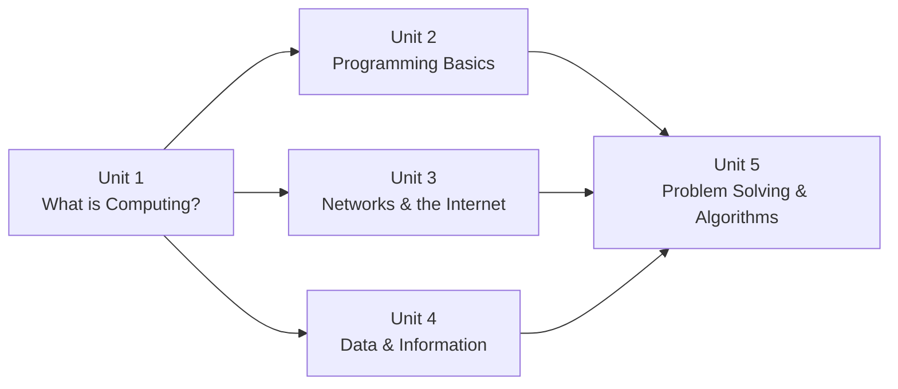

# Unit 1: What is Computing?

Welcome to the first unit of Grade 8 Digital Technology. This unit lays the foundation for everything you will learn throughout the course. Before you can understand how to use technology effectively — or even how to write programs — you need to understand what computing actually is, where it came from, and where it is going.

By the end of this unit, you will have a solid mental model of how computers work, what the different parts do, and why technology looks the way it does today.

---

## What This Unit Covers

This unit is divided into five topics. Each topic builds on the previous one, so it is a good idea to work through them in order.

### Topic 1 — History of Computers
**File:** [history.md](./history.md)

Computers did not appear overnight. They are the result of centuries of human ingenuity. In this topic you will trace the journey from the ancient abacus all the way through to the artificial intelligence systems of the 2020s. You will meet the key figures who shaped computing history — including Ada Lovelace, Alan Turing, and Steve Jobs — and you will see how each generation of technology made computers smaller, faster, and more accessible.

**Key ideas:** vacuum tubes, transistors, integrated circuits, microprocessors, the Internet, smartphones.

---

### Topic 2 — Computer Organisation
**File:** [computer-organisation.md](./computer-organisation.md)

How does a computer actually work on the inside? This topic takes you on a tour of the major components: the CPU, memory, storage, and the buses that connect everything together. You will learn to trace exactly what happens — step by step — when you perform a simple action like typing a letter in a word processor.

**Key ideas:** input–process–storage–output cycle, CPU (ALU and control unit), RAM vs ROM, HDD vs SSD, motherboard, data flow.

---

### Topic 3 — Software
**File:** [software.md](./software.md)

Hardware is just metal and silicon until software tells it what to do. In this topic you will explore the difference between system software and application software, find out how programming languages work, and learn about the different ways software can be licensed and distributed — including open-source software that anyone can use and modify for free.

**Key ideas:** operating systems, device drivers, application software, programming languages, open source vs proprietary, software licences.

---

### Topic 4 — Hardware
**File:** [hardware.md](./hardware.md)

This topic goes deeper into the physical components of a computer system. You will study input devices, output devices, storage devices, and the different types of computers — from a pocket-sized smartphone all the way up to a supercomputer that fills an entire room. A comparison table helps you understand the trade-offs between desktops, laptops, tablets, and smartphones.

**Key ideas:** input/output devices, CPU specifications, storage types, monitor technology, types of computers.

---

### Topic 5 — Future of Computing
**File:** [future-of-computing.md](./future-of-computing.md)

The world of computing is changing faster than ever. In this topic you will look at the technologies that are shaping the near future: artificial intelligence, machine learning, quantum computing, the Internet of Things, augmented and virtual reality, and cloud computing. You will also think critically about the ethical questions these technologies raise — questions about privacy, bias, and the future of work, including in South Africa.

**Key ideas:** AI, machine learning, quantum computing, IoT, AR/VR, cloud computing, digital ethics.

---

## Unit Learning Outcomes

By the end of this unit, you should be able to:

| # | Learning Outcome |
|---|-----------------|
| 1 | Describe the major milestones in the history of computing and explain why each was significant. |
| 2 | Name and explain the contributions of key figures: Babbage, Ada Lovelace, Alan Turing, Steve Jobs. |
| 3 | Explain the Input → Process → Storage → Output model using real-world examples. |
| 4 | Describe the role of the CPU, RAM, ROM, and storage devices in a computer system. |
| 5 | Distinguish between system software and application software, giving examples of each. |
| 6 | Explain the difference between open-source and proprietary software and describe different licence types. |
| 7 | Identify and describe common input, output, and storage devices and their uses. |
| 8 | Compare different types of computers (desktop, laptop, tablet, smartphone) in terms of portability, power, and use case. |
| 9 | Describe emerging technologies such as AI, IoT, AR/VR, and quantum computing. |
| 10 | Discuss the ethical implications of new computing technologies, including in the South African context. |

---

## Key Vocabulary for This Unit

Before you begin, here are some terms you will encounter throughout the unit. Do not worry about memorising them now — they will be explained in full context as you read each topic. This list is here so you can refer back to it.

| Term | Plain-Language Meaning |
|------|------------------------|
| Hardware | Physical parts of a computer you can touch |
| Software | Programs and instructions that run on hardware |
| CPU | Central Processing Unit — the "brain" of the computer |
| RAM | Random Access Memory — fast, temporary working memory |
| ROM | Read-Only Memory — permanent memory built into the hardware |
| Input | Data going *into* the computer |
| Output | Results coming *out* of the computer |
| Operating System | Software that manages all hardware and other software |
| Open Source | Software whose source code is freely available to anyone |
| Algorithm | A step-by-step set of instructions to solve a problem |
| IoT | Internet of Things — everyday objects connected to the internet |
| AI | Artificial Intelligence — computers that simulate intelligent behaviour |

---

## How This Unit Fits Into the Course

Understanding what computing is — its history, its components, and its software — is the essential first step. Every other unit in this course assumes this knowledge.

---

## How to Use This Section

Each topic page is structured as a full textbook chapter:

1. **Introduction** — sets the scene and explains why this topic matters
2. **Main content** — full explanations, examples, diagrams, and tables
3. **Key terms** — defined in callout boxes as you encounter them
4. **Worked examples** — step-by-step demonstrations
5. **Check Your Understanding** — exam-style questions at the end

:::tip Study Tip
Do not just read passively — interact with the material. As you read, write down questions that occur to you. Try to explain each concept in your own words before moving on. The "Check Your Understanding" questions are not just for assessment — they are learning tools.
:::

:::info About CodeHS
This unit is aligned with the CodeHS Digital Literacy and Computer Science curriculum framework. If your teacher has assigned CodeHS exercises alongside this reading, complete the reading first — it will make the online exercises much easier to understand.
:::

---

*Ready to begin? Start with [Topic 1: History of Computers](./history.md).*
