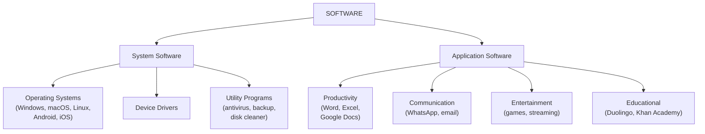
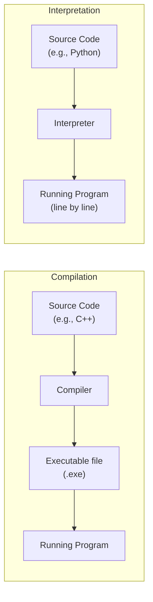
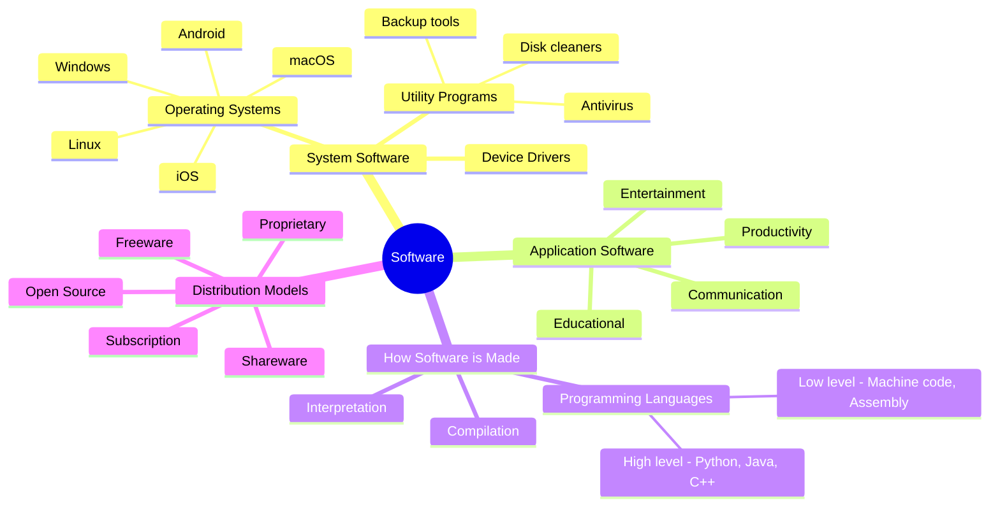

# Topic 3: Software

## Introduction

When you pick up a smartphone, it is just a piece of glass, metal, and silicon. Without software, pressing the power button would do nothing. Software is what transforms inert hardware into something useful — it is the set of instructions that tells the hardware what to do, when to do it, and how to respond to your input.

In this topic, we explore what software is, how it is organised into different categories, how it is created, and how it is distributed and licensed. We will also look at the different types of programming languages and understand how code written by a human gets turned into actions by a machine.

---

## 1. What Is Software?

**Software** is a collection of instructions and data that tell a computer how to operate. Unlike hardware, which you can physically touch, software is abstract — it exists as stored patterns of electrical charges (data) on chips or disks.

:::tip Key Term
**Software** — a set of instructions (programs) that direct a computer's hardware to perform specific tasks. Without software, hardware cannot do anything useful.
:::

Every action your computer takes is driven by software:
- When you see icons on your screen — that is the operating system
- When you type a document — that is a word processor application
- When a webpage loads — that is a browser application and web server software working together
- When your computer scans for viruses — that is utility software

Software can be divided into two major categories: **system software** and **application software**.

---

## 2. System Software

System software manages and controls the hardware and provides a platform on which other software can run. Users rarely interact directly with system software — it works behind the scenes.

### 2.1 Operating Systems

The **operating system (OS)** is the most important piece of system software. It is the first major program that loads when the computer starts, and it stays running the entire time the computer is on.

:::tip Key Term
**Operating System (OS)** — system software that manages all hardware resources and provides services for application programs. It acts as an intermediary between the user, the applications, and the hardware.
:::

The operating system is responsible for:

| Task | What the OS does |
|------|-----------------|
| **Process management** | Decides which program gets CPU time and when |
| **Memory management** | Allocates RAM to different programs; prevents one program from corrupting another's data |
| **File management** | Organises files into folders/directories on storage; handles reading and writing |
| **Device management** | Communicates with hardware through device drivers |
| **User interface** | Provides the desktop, windows, icons, and menus you interact with |
| **Security** | Manages user accounts, passwords, and access permissions |
| **Networking** | Manages network connections — wired and wireless |

**Common operating systems:**

| OS | Platform | Notable Features |
|----|----------|-----------------|
| **Windows 11** | Desktop/laptop (PC) | Most widely used desktop OS; familiar Start menu and taskbar |
| **macOS Sonoma** | Apple Mac computers | Smooth integration with other Apple devices; known for design quality |
| **Linux** (various distributions) | Desktop, servers, embedded | Free, open-source; very popular on servers; Ubuntu is a common desktop version |
| **Android** | Smartphones, tablets | Google's OS; open-source; largest mobile OS market share globally |
| **iOS** | iPhone, iPad | Apple's mobile OS; known for security and smooth performance |
| **ChromeOS** | Chromebooks | Lightweight OS; most functionality requires internet; popular in schools |

:::info South African Context
Android dominates the South African smartphone market, largely because Android phones are available at a much wider range of price points than iPhones. Budget Android smartphones costing under R2,000 are common. iOS, while popular in wealthier demographics, has a smaller overall market share locally. On the desktop, Windows is overwhelmingly dominant in schools and businesses.
:::

### 2.2 Device Drivers

A **device driver** is a specialised piece of software that allows the operating system to communicate with a specific hardware device.

:::tip Key Term
**Device Driver** — a program that acts as a translator between the operating system and a hardware device, allowing the OS to use the device without needing to know its specific technical details.
:::

Think of it this way: your operating system is generic — it needs to work with hundreds of different brands of printer, mouse, graphics card, and webcam. It cannot know the specific commands for every device. So instead, the hardware manufacturer writes a driver that acts as a translator. The OS sends generic commands ("print this document") and the driver translates those commands into the specific instructions that particular printer understands.

When you plug in a new USB device and Windows says "Installing drivers…" — this is what is happening.

:::warning Common Problem
If a hardware device is not working correctly, the problem is very often a missing, outdated, or corrupted device driver — not the hardware itself. Updating drivers is a standard first step in hardware troubleshooting.
:::

### 2.3 Utility Programs

**Utility programs** are system tools that help maintain, optimise, or protect the computer. They are more specialised than the operating system but more "behind the scenes" than typical applications.

| Utility | Purpose | South African Example |
|---------|---------|----------------------|
| **Antivirus / anti-malware** | Detects and removes malicious software | Avast Free Antivirus; Windows Defender (built-in) |
| **Disk cleaner** | Removes temporary files and frees up storage | Windows Disk Cleanup; CCleaner |
| **Backup software** | Creates copies of files to protect against data loss | Windows Backup; Acronis |
| **File compression** | Reduces file sizes for storage or email | WinRAR; 7-Zip |
| **Disk defragmenter** | Reorganises data on an HDD for faster access | Built into Windows; not needed for SSDs |
| **System monitor** | Shows CPU, RAM, and network usage | Task Manager (Windows); Activity Monitor (macOS) |
| **Firewall** | Monitors and controls network traffic | Windows Defender Firewall |

---

## 3. Application Software

**Application software** (or "apps") are programs designed to help users perform specific tasks. Unlike system software, application software interacts directly with the user to accomplish a particular goal.

:::tip Key Term
**Application Software** — programs designed for end users to perform specific tasks. Examples include word processors, web browsers, games, and email clients.
:::

### 3.1 Productivity Software

Productivity software helps users create, edit, organise, and manage documents, spreadsheets, and presentations.

| Software | Purpose | Example Task |
|----------|---------|-------------|
| Word processor | Write and format text documents | Writing an essay, creating a letter |
| Spreadsheet | Organise and analyse numerical data | Tracking a budget, calculating averages |
| Presentation | Create slideshows | Making a class presentation |
| Database | Store and query structured data | Managing a school's learner records |

**Examples:** Microsoft Word, Microsoft Excel, Microsoft PowerPoint (the Office suite), Google Docs, Google Sheets, Google Slides (free, browser-based, popular in South African schools), LibreOffice Writer/Calc/Impress (free, open-source alternative).

:::info
Google Workspace (Docs, Sheets, Slides) is popular in South African schools because it is free for educational institutions and works well even with limited hardware, since the processing happens in the cloud rather than on the device.
:::

### 3.2 Communication Software

Communication software enables users to send messages, make calls, and share information with others.

| Software | Type | Notes |
|----------|------|-------|
| **WhatsApp** | Instant messaging / voice / video | Dominant messaging platform in South Africa |
| **Gmail / Outlook** | Email | Standard professional communication |
| **Microsoft Teams / Google Meet** | Video conferencing | Used for remote meetings and online classes |
| **Zoom** | Video conferencing | Widely used during COVID-19 school closures |
| **Discord** | Chat / gaming community | Popular with gamers and online communities |

### 3.3 Entertainment Software

Entertainment software is designed to provide enjoyment rather than to accomplish a work task.

- **Games:** FIFA, Minecraft, Fortnite, GTA, Candy Crush
- **Media players:** VLC Media Player, Windows Media Player
- **Streaming apps:** Netflix, YouTube, Showmax, DStv Stream, Spotify
- **Photo/video editing:** Adobe Photoshop, CapCut, TikTok editor

### 3.4 Educational Software

Educational software is designed to facilitate learning.

- **Khan Academy** — free lessons on maths, science, and more; popular in South African schools
- **Duolingo** — language learning
- **CodeHS** — the platform used in this course to practise coding
- **Google Classroom** — manages assignments and communication between teachers and learners

---

## 4. Programming Languages

Software does not appear by magic — it is written by humans using **programming languages**. A programming language is a formal notation that programmers use to write instructions that can be translated into machine code for a computer to execute.

:::tip Key Term
**Programming Language** — a formal language with a specific vocabulary and syntax (grammar rules) that programmers use to write software. Examples include Python, Java, JavaScript, C++, and Scratch.
:::

### 4.1 Low-Level Languages

**Low-level languages** are close to the hardware — they work directly with the computer's processor and memory.

- **Machine code** is the lowest level: pure binary (0s and 1s) that the CPU understands directly. It is extremely difficult for humans to write.
- **Assembly language** uses short text codes (like `MOV`, `ADD`, `JMP`) as human-readable substitutes for machine code instructions. Still very difficult and tedious to write.

Low-level languages are fast and efficient, but writing them requires a deep understanding of the specific processor architecture. They are used in situations where performance is critical, such as device drivers and embedded systems.

### 4.2 High-Level Languages

**High-level languages** are much closer to human language. They use familiar words and structures that are easier to read and write.

| Language | Common Uses | Example Code |
|----------|------------|-------------|
| **Python** | AI/ML, data science, scripting, education | `print("Hello, World!")` |
| **JavaScript** | Web development (browser-side) | `console.log("Hello!")` |
| **Java** | Android apps, enterprise software | `System.out.println("Hello!");` |
| **C++** | Games, operating systems, performance apps | `cout << "Hello!" << endl;` |
| **HTML/CSS** | Web page structure and styling | `<h1>Hello World</h1>` |
| **Scratch** | Visual programming for beginners | Block-based; drag and drop |
| **SQL** | Database queries | `SELECT * FROM students;` |

High-level code cannot run directly on a computer — it must first be translated into machine code.

:::warning Common Misconception
HTML and CSS are often called "programming languages" in everyday conversation, but technically they are **markup** and **style sheet** languages — they describe the structure and appearance of content, rather than describing logic or algorithms. Python, JavaScript, and Java are true programming languages.
:::

### 4.3 How Code Becomes a Running Program

There are two main ways to translate high-level code into machine code:

**Compilation:**
1. A programmer writes source code in a high-level language (e.g., C++)
2. A **compiler** reads the entire source code and translates it all into machine code at once
3. The result is an **executable file** (.exe on Windows) that can run without the compiler
4. Running the program is fast, because translation is done beforehand
5. If there are errors, the whole program fails to compile

**Interpretation:**
1. A programmer writes source code (e.g., Python)
2. An **interpreter** reads the code one line at a time and executes each line immediately
3. There is no separate executable file — you always need the interpreter to run the code
4. Easier to test and debug (you can run partial code), but generally slower than compiled code

| Feature | Compiler | Interpreter |
|---------|----------|-------------|
| Translation method | All at once before running | Line by line while running |
| Output | Standalone executable file | No executable — needs interpreter |
| Speed | Faster execution | Slower execution |
| Error detection | Shows all errors before run | Stops at first error |
| Languages | C, C++, Rust, Go | Python, JavaScript (partly), Ruby |

---

## 5. Open Source vs Proprietary Software

### 5.1 Proprietary (Commercial) Software

**Proprietary software** is owned by a company or individual. The **source code** (the human-readable code the software was written in) is kept secret. You can use the software, but you cannot modify it, redistribute it, or see how it works internally.

:::tip Key Term
**Proprietary Software** — software whose source code is owned and kept private by the developer. Users can run it but cannot view, modify, or redistribute the code.
:::

Examples: Microsoft Windows, Microsoft Office, Adobe Photoshop, Apple iOS, most commercial games.

Proprietary software is usually sold (or licensed) for a fee. The company invests in development and expects to recoup that investment through sales or subscriptions.

### 5.2 Open-Source Software

**Open-source software** is software whose source code is made publicly available. Anyone can view it, study it, modify it, and — in most cases — distribute their own modified version.

:::tip Key Term
**Open-Source Software** — software whose source code is freely available for anyone to view, use, modify, and distribute, typically under a specific open-source licence.
:::

Examples:
- **Linux** — the operating system powering most of the world's servers, Android, and many supercomputers
- **Firefox** — the web browser
- **LibreOffice** — a free alternative to Microsoft Office
- **VLC Media Player** — plays almost any video or audio format
- **Python** — the programming language
- **WordPress** — powers about 40% of all websites globally

Open-source software is developed collaboratively — often by thousands of volunteers around the world, sometimes supported by companies or foundations.

### 5.3 Comparison

| Feature | Proprietary Software | Open-Source Software |
|---------|---------------------|---------------------|
| Source code visible? | No | Yes |
| Can you modify it? | No | Usually yes |
| Cost | Often paid | Usually free |
| Support | Official support from vendor | Community forums; some paid support |
| Updates | Developer's schedule | Community-driven |
| Examples | Windows, MS Office, Photoshop | Linux, Firefox, LibreOffice |
| Security | Vulnerabilities found internally | Many eyes → some argue more secure |

:::info
Many of the world's largest technology companies, including Google, Facebook (Meta), and Microsoft, both use open-source software extensively and contribute their own open-source projects. Microsoft, once famously hostile to open source, now hosts millions of open-source projects on GitHub (which it owns).
:::

---

## 6. Software Licences

When you "buy" software, you are almost never buying it outright — you are buying a **licence** to use it under certain conditions. A software licence is a legal agreement between the software developer and the user.

:::tip Key Term
**Software Licence** — a legal document that specifies how software may be used, distributed, and modified. When you install software, you agree to its licence terms.
:::

### Common Types of Software Licences

| Licence Type | Description | Examples |
|-------------|-------------|---------|
| **Freeware** | Free to use at no cost, but source code is not available and you cannot modify it | Skype, Adobe Reader, WhatsApp (mobile) |
| **Shareware** | Free to try for a limited time or with limited features; you pay to unlock full functionality or remove time limits | Many mobile games, WinRAR |
| **Subscription** | Pay a regular fee (monthly or annually) to use the software; stops working if you stop paying | Microsoft 365, Adobe Creative Cloud, Netflix |
| **One-time purchase / Perpetual licence** | Pay once and use forever, but may not receive major updates | Older versions of Office (before 365) |
| **Open-source licence** | Free to use, modify, and distribute under specific conditions set by the licence | Linux (GPL), MIT licence, Apache licence |
| **Educational licence** | Discounted or free licence for students and educational institutions | Microsoft 365 Education (free for schools) |

:::info South African School Context
Many South African schools have access to **Microsoft 365 Education**, which gives learners free access to Word, Excel, PowerPoint, Teams, and OneDrive through their school email address. If your school is on this programme, you may be able to install these apps on your personal device at no cost. Ask your teacher or ICT coordinator.
:::

### The EULA

When you install most software, you are shown an **End User Licence Agreement (EULA)** — a long legal document explaining the terms of use. Most people click "I Agree" without reading it, but the EULA contains important information: what you can and cannot do with the software, whether the company can collect your data, and what happens if the software causes problems.

---

## 7. Summary

---

## Check Your Understanding

1. Define software in your own words. How is software different from hardware?

2. What is an operating system? List three tasks that an operating system performs that most users never think about.

3. Explain the role of a device driver. Why are drivers necessary?

4. Name and describe three types of utility software. For each, explain what problem it solves.

5. Give two examples of productivity software and two examples of communication software. For each, briefly describe what it is used for.

6. Explain the difference between a **compiler** and an **interpreter**. Give one advantage of each approach.

7. What is the difference between high-level and low-level programming languages? Why would a programmer choose to use a high-level language?

8. Explain the difference between open-source and proprietary software. Give two advantages of open-source software and one potential disadvantage.

9. What is a software licence? Explain the difference between **freeware** and **shareware**.

10. **Scenario question:** A learner wants to put together a computer for doing schoolwork. They have a tight budget. Suggest three pieces of software they could use instead of paid alternatives, and explain your choices. (Hint: think about open-source and freeware options.)

11. **Extension:** Explain why it is important to keep software (especially operating systems and antivirus software) up to date. What risks are there in using outdated software?
