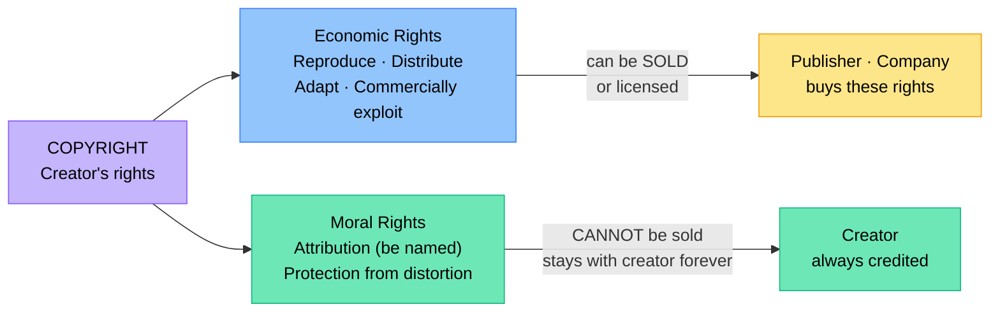

# Creative Credit & Copyright

Grade 8 covered the basics of copyright, Creative Commons, and plagiarism. In Grade 9 we examine South African copyright law in more depth, open source software licences, the economics of copyright, and the ethics of intellectual property in a digital world.

## South African Copyright Law

:::tip Key Term
South Africa's **Copyright Act No. 98 of 1978** (as amended) is the main legislation governing intellectual property in creative works. It is supplemented by the **Copyright Amendment Bill** (passed by Parliament, awaiting Presidential assent) which aims to modernise the law for the digital age.
:::

### What Copyright Protects in South Africa

- Literary works (books, articles, song lyrics, computer programs, databases)
- Musical works
- Artistic works (paintings, sculptures, photographs, architectural plans)
- Cinematograph films
- Sound recordings
- Broadcasts
- Computer programs

### Moral Rights vs Economic Rights

Copyright actually contains two types of rights:

| Type | Description | Can it be sold or transferred? |
|------|-------------|-------------------------------|
| **Economic rights** | The right to reproduce, distribute, adapt, and commercially exploit the work | Yes — the creator can sell or licence these to publishers, companies, etc. |
| **Moral rights** | The right to be identified as the author (attribution); the right not to have work treated in a way that harms reputation | No — these remain with the creator always |

This is why even if a company owns the rights to a song, the original songwriter's name must still be credited (moral rights cannot be waived).

### Duration of Copyright

In South Africa:
- Literary, musical, and artistic works: **life of the author + 50 years**
- Computer programs: **50 years from creation/publication**
- Photographs: **50 years from when taken**
- Sound recordings: **50 years from creation/publication**

After this period, works enter the **public domain** and can be used by anyone freely.

## Derivative Works and Transformative Use

:::tip Key Term
A **derivative work** is a new creative work based on an existing copyrighted work — such as a film adaptation of a novel, a translation, a remix, or a parody.
:::

Creating a derivative work normally requires **permission** from the copyright holder.

**Transformative use** is when you take copyrighted material and add new meaning, message, or expression — transforming it rather than simply reproducing it. Courts consider whether a use is transformative when deciding fair use/dealing cases.

Examples of potentially transformative use:
- A parody that comments on the original work
- A critical analysis including quotations
- A documentary using clips to discuss the subject

:::warning
Remixing a song without permission from the copyright holder, even for non-commercial use, is technically copyright infringement unless it qualifies as fair dealing or the remix licence permits it. Always check the original work's licence.
:::

## Music Sampling and Copyright

**Music sampling** is using a portion (sample) of an existing song in a new track. Historically, artists have sampled without permission; courts have increasingly required clearance.

**To legally sample a song you need licences from:**
1. The **publisher/composer** — for the underlying musical composition
2. The **record label** — for the actual sound recording

Failure to obtain these licences can result in lawsuits worth millions. South African artists are increasingly aware of this as the music industry matures.

## Digital Rights Management (DRM)

:::tip Key Term
**Digital Rights Management (DRM)** is technology used by copyright holders to control how digital content (music, movies, eBooks, software) is accessed and used.
:::

Examples:
- An eBook that can only be read on the platform's app and can't be copied
- A streaming service that limits downloads to specific devices
- Software that requires online activation

**Criticism of DRM:**
- Restricts legitimate uses (e.g. making a personal backup)
- Makes content inaccessible if the company shuts down
- Inconvenient for legitimate buyers while determined pirates bypass it easily

## Open Source Software Licences

Open source software provides the source code and allows anyone to view, use, modify, and distribute it — under certain conditions depending on the licence.

| Licence | Key conditions |
|---------|---------------|
| **MIT** | Do anything, just include the copyright notice. Very permissive. |
| **Apache 2.0** | Like MIT, but also grants patent rights. Must include notices of changes. |
| **GNU GPL (General Public License)** | Use and modify freely, but if you distribute your version it must also be GPL (copyleft) |
| **GNU LGPL** | Like GPL but allows linking from non-GPL software |
| **Creative Commons (for content)** | Various conditions — see Grade 8 content |

### Copyleft

:::tip Key Term
**Copyleft** is a licensing approach that requires any derivative work to be licensed under the same terms as the original. It uses copyright law to ensure that freely shared software remains freely shared.
:::

The GPL is the most famous copyleft licence. Linux (the operating system underlying Android) uses the GPL.

## DMCA Takedowns

The **Digital Millennium Copyright Act (DMCA)** is a US law, but because most major platforms (Google, YouTube, Instagram) are US companies, it affects South Africans too.

When a copyright holder believes their content has been posted without permission, they can file a **DMCA takedown notice** with the platform. The platform must remove the content unless the uploader disputes it.

You may have seen "Video removed due to copyright claim" on YouTube — this is the DMCA in action.

## Intellectual Property in Technology Careers

Understanding IP law matters in technology careers:
- **Developers** must know what licences they can use in commercial products
- **Designers** must understand image and font licences
- **Content creators** need to understand what content they can use
- **Entrepreneurs** need to protect their own IP through patents, trademarks, and copyright

:::info
In South Africa, the **Companies and Intellectual Property Commission (CIPC)** handles registration of trademarks, patents, and designs (though copyright is automatic and doesn't need registration).
:::

## Check Your Understanding

1. Explain the difference between economic rights and moral rights in copyright. Give an example where moral rights still apply even after economic rights have been transferred.
2. A music producer samples 4 seconds from an old South African song without permission. From whom does the producer need to obtain licences, and why?
3. Explain what the GNU GPL licence requires. Why is this called a "copyleft" licence?
4. A developer wants to use an MIT-licensed library in their commercial app. What must they include, and are there any restrictions on using it commercially?
5. What is DRM? Give one argument in favour of DRM and one argument against it.
6. Under the South African Copyright Act, how long does copyright last for a novel written by an author who died in 2010? In what year would it enter the public domain?
7. A South African YouTuber uploads a video using a 10-second clip from a film to critique it. The film studio files a DMCA takedown. The YouTuber believes this is fair dealing. What can the YouTuber do, and what factors would determine whether their use qualifies as fair dealing?
