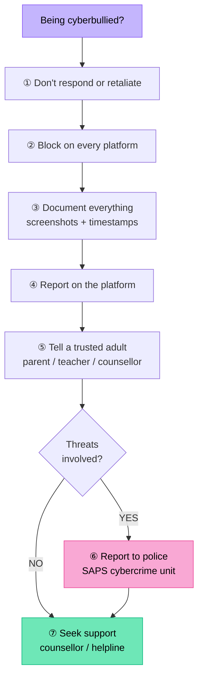

# Cyberbullying

You covered the basics of cyberbullying in Grade 8. In Grade 9 we go deeper — examining the legal consequences, the psychological research, how platforms handle it, and what the law says.

## Recap: What Is Cyberbullying?

:::tip Key Term
**Cyberbullying** is the use of digital technology — social media, messaging apps, gaming platforms, or email — to bully, harass, intimidate, threaten, humiliate, or harm another person.
:::

Unlike traditional bullying, cyberbullying:
- Can happen 24/7, not just at school
- Reaches a potentially massive audience
- Is often anonymous
- Leaves a permanent digital record
- Follows the victim into their home — there is no safe space

## Types of Cyberbullying (Extended)

| Type | Description | Example |
|------|-------------|---------|
| **Harassment** | Repeatedly sending offensive, threatening messages | Flood of abusive DMs after an argument |
| **Cyberstalking** | Monitoring and following someone online obsessively | Tracking someone's every post and showing up at places they mention |
| **Impersonation / Fraping** | Creating fake accounts or accessing someone's account to post as them | Creating a fake Instagram as someone to post embarrassing content |
| **Outing** | Publicly sharing someone's private information or secrets | Exposing someone's sexuality without their consent |
| **Exclusion / Ostracism** | Deliberately leaving someone out of online groups | Removing someone from a class WhatsApp group to isolate them |
| **Troll attacks** | Coordinating groups to attack a target | Mass reporting someone's account, or flooding their posts with abuse |
| **Catfishing** | Creating a fake identity to manipulate someone emotionally | Fake romantic relationship to gather private information or humiliate |
| **Sexting coercion** | Pressuring someone to send intimate images; sharing them without consent | "Sextortion" — threatening to share images unless victim pays |

## Psychological Impact: What the Research Shows

Research consistently shows cyberbullying causes serious harm:

- Higher rates of **anxiety and depression** than in-person bullying victims
- Increased risk of **self-harm and suicidal ideation**
- **Sleep disturbances** from checking devices late at night
- **Academic decline** — difficulty concentrating
- **Social withdrawal** — avoiding school, friends, online spaces
- **PTSD-like symptoms** in severe cases

:::warning
Cyberbullying is a **mental health crisis**, not just bad behaviour. If you or someone you know is being cyberbullied, this is serious and adult intervention is needed.
:::

## Legal Framework in South Africa

### The Cybercrimes Act No. 19 of 2020

South Africa's Cybercrimes Act specifically addresses online harassment and related conduct.

**Relevant provisions:**

**Section 14 — Cyberbullying (electronic communications)**  
It is an offence to send a message that:
- Is threatening or intimidating in character
- Is sent with the intent to cause harm or to harass, threaten, or intimidate

**Section 16 — Unlawful and intentional interference with data**  
Accessing or manipulating someone's accounts without permission is a criminal offence.

**Section 19 — Malicious communications**  
Sending communications designed to cause psychological harm, including disclosing private sexual images without consent, is an offence.

:::danger
**Non-consensual sharing of intimate images** (revenge porn) is a specific offence under the Cybercrimes Act. Conviction can result in **up to 3 years imprisonment or a fine** for a first offence. If the victim is under 18, the offence is more serious.
:::

### Films and Publications Amendment Act

Sharing sexual content involving a person under 18 (even if the image was originally sent willingly) is classified as child pornography and carries severe penalties.

### Protection from Harassment Act (No. 17 of 2011)

Victims of harassment (including cyberbullying) can apply to court for a **Protection Order** — a legal order preventing the bully from contacting or approaching the victim. Violating a protection order is a criminal offence.

## What to Do: A Step-by-Step Response

**If you are being cyberbullied:**

1. **Don't respond or retaliate** — responding often escalates the situation and gives the bully the reaction they want
2. **Block the bully** — on every platform they are using to reach you
3. **Document everything** — take screenshots with dates and timestamps before blocking
4. **Report on the platform** — use the reporting tools available on each social media platform
5. **Tell a trusted adult** — a parent, teacher, or school counsellor; you do not have to deal with this alone
6. **Report to police** — if threats are involved, a criminal complaint can be laid at the nearest SAPS station or cybercrime unit
7. **Seek support** — speak to a counsellor about the emotional impact

**Helplines in South Africa:**
- Childline SA: 116 (free, 24 hours)
- SADAG (South African Depression and Anxiety Group): 0800 456 789
- Lifeline: 0861 322 322

## The Role of Bystanders

Research shows that in most cyberbullying incidents, there are bystanders — people who see it happening but do not directly participate.

**Bystander roles:**

| Role | Description |
|------|-------------|
| **Reinforcer** | Likes or shares bullying content, encouraging the bully |
| **Passive bystander** | Sees it but does nothing (this still normalises the behaviour) |
| **Defender** | Actively supports the victim — tells the bully to stop, reports, or reaches out to the victim |
| **Outsider** | Avoids the situation entirely |

Becoming a **defender** — an upstander — is the most effective way bystanders can reduce cyberbullying. Studies show that bystander intervention stops bullying in many cases.

## How Platforms Handle Cyberbullying

All major platforms have policies against harassment and tools to report it:

| Platform | Tools available |
|----------|----------------|
| Instagram | Block, restrict, report, comment filters, hidden words |
| WhatsApp | Block, report, leave group, admin group settings |
| TikTok | Block, report, comment filtering, "Family Pairing" |
| YouTube | Block, report, comment holds |
| Facebook | Block, report, privacy controls |

:::info
Reporting on a platform removes content and may result in the bully's account being banned. This is separate from — and does not replace — reporting to the police for serious criminal threats.
:::

## School Responsibilities

South African schools have a **duty of care** for learners. Even if cyberbullying happens outside school hours, schools can and should intervene if it:
- Involves learners at the school
- Affects the school environment or a learner's ability to attend

Schools can:
- Discipline learners for cyberbullying conduct
- Implement anti-bullying policies
- Facilitate restorative justice processes (bringing bully and victim together with a mediator)

## Check Your Understanding

1. Explain **two** reasons why cyberbullying can be more harmful than face-to-face bullying.
2. Describe the offence created by Section 14 of the Cybercrimes Act 2020. What must be proven for someone to be charged?
3. A classmate shares intimate photos of an ex-partner in the class WhatsApp group. Under which law(s) could this be prosecuted? What are the possible consequences?
4. Distinguish between a **passive bystander** and a **defender** in a cyberbullying situation. Why does the bystander's choice matter?
5. A learner is receiving threatening messages from an unknown number and is afraid to go to school. Write a step-by-step response plan for this learner.
6. Why can't a school simply say "what happens online is not our problem"?
7. Research question: What support structures exist in your school or community for learners who are being cyberbullied?
