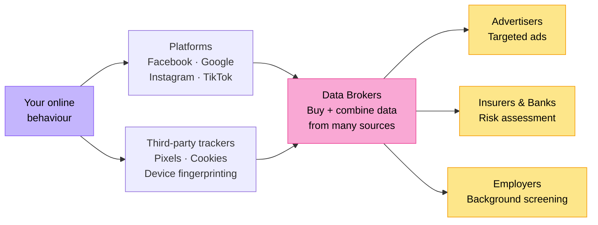

# Digital Footprint & Reputation (Grade 9)

## Recap: What You Already Know

In Grade 8, you learned that a **digital footprint** is the trail of data you leave behind when you use the internet. You distinguished between:

- **Active footprints** — things you deliberately post, like status updates and comments
- **Passive footprints** — data collected without your direct input, like websites tracking your browsing

You also learned that your digital footprint can affect how people perceive you. Grade 9 goes further: it asks *who* collects that data, *how* it is used, *what the law says* about it, and *how you can take control* of your digital identity.

---

## 1. The Data Economy: Who Profits From Your Footprint?

### How the Internet Is Funded

Most online services you use for free — social media, search engines, email — are not actually free. You pay with your **data**. Advertisers pay platforms enormous sums to reach specific audiences, and your data is what makes those audiences valuable.

:::info The Business Model
If you are not paying for the product, **you are the product**. Your browsing habits, location history, purchase patterns, and social connections are valuable commodities traded in a multi-billion rand industry.
:::

### How Companies Profile You

Every interaction you have online is tracked. Consider what Facebook (Meta) knows about you:

- Every post you have liked, shared, or commented on
- Every ad you clicked on or ignored
- How long you paused on a specific type of content
- Your location (if location services are on)
- Your browsing history on other websites (via the Meta Pixel tracker)
- Who you communicate with and how often

This data is fed into algorithms that produce a **behavioural profile** — a detailed model of your personality, beliefs, emotional state, and likely future actions. Advertisers use this to show you highly targeted content.

:::warning Cambridge Analytica
In 2018, it was revealed that the political consulting firm Cambridge Analytica harvested the data of 87 million Facebook users without proper consent. This data was used to create psychological profiles and deliver targeted political advertising in elections in the USA, UK, and several African countries. South Africa was included. This scandal triggered global conversations about data regulation and ultimately accelerated the introduction of data protection laws like South Africa's POPI Act.
:::

### The Tracking Ecosystem



Your data does not stay within one platform. It is shared across a vast ecosystem:

| Tracker Type | What It Does | Example |
|---|---|---|
| First-party cookies | Tracks you on one specific website | Your login staying active on a shopping site |
| Third-party cookies | Tracks you across multiple websites | A Google ad tracker following you from site to site |
| Pixel trackers | Invisible 1x1 image that records you visited a page | Facebook Pixel, Google Analytics |
| Device fingerprinting | Identifies your device by its unique configuration | Browser type + screen size + fonts = unique ID |
| Location tracking | Records your physical movement | Google Maps location history |

---

## 2. Data Brokers: The Companies You've Never Heard Of

### What Is a Data Broker?

A **data broker** (also called an information broker) is a company that collects personal information about people from many sources and sells it to third parties. You have almost certainly never interacted with a data broker directly — but they know a great deal about you.

Data brokers compile information from:
- Public records (voter rolls, property records, court records)
- Social media profiles
- Purchase history from loyalty cards and online shopping
- Website tracking data they buy from other companies
- Location data purchased from apps
- Surveys and competitions you may have entered

They combine all of this into detailed **personal profiles** which they sell to:
- Insurance companies (assessing risk)
- Banks and lenders (credit assessment)
- Marketers (targeted advertising)
- Employers and recruiters
- Law enforcement (in some cases)
- Political campaigns

### Major Data Brokers

While most major data brokers operate from the USA, their data extends globally:

| Company | What They Sell |
|---|---|
| Acxiom | Detailed consumer profiles (5,000+ data points per person) |
| Experian | Credit data, marketing data |
| TransUnion | Credit reports, fraud detection data |
| LexisNexis | Personal background information |
| Clearview AI | Facial recognition database (controversial) |

:::danger Why This Is Concerning
In 2023, a US data broker exposed 3 billion personal records in a single breach. This included names, addresses, social security numbers, and family relationships — for people who never knowingly gave this company their data. You have no direct relationship with data brokers, which makes it very difficult to correct errors or request deletion of your information.
:::

### South Africa and Data Brokers

In South Africa, data brokering is legal but increasingly regulated. Companies must comply with the **POPI Act** (discussed in Section 4), which places obligations on how personal data is collected and used. However, enforcement is still developing.

---

## 3. Personal Branding and Professional Digital Identity

### What Is Personal Branding?

A **personal brand** is the image and impression you intentionally project about yourself — online and offline. For young people, it is increasingly important because:

- University admissions tutors may search your name
- Bursary providers and scholarship committees check social media
- Employers routinely search candidates online before interviews
- Colleagues and professional contacts will form opinions based on your online presence

Personal branding is not about being fake. It is about being **intentional** — making sure that what is publicly visible about you reflects who you are at your best.

### The Professional Digital Identity Framework

Think of your online presence as having three layers:

```
Layer 1: What you publish (posts, profiles, portfolios)
Layer 2: What others say about you (tags, mentions, reviews)
Layer 3: What data systems infer about you (algorithmic profiles)
```

You have direct control over Layer 1, limited influence over Layer 2, and almost no control over Layer 3 — which is why Layers 1 and 2 matter so much.

### Platforms and Audiences

Different platforms serve different purposes. Part of managing your professional digital identity is understanding which audiences see which content:

| Platform | Primary Audience | Professional Value |
|---|---|---|
| LinkedIn | Recruiters, professionals, academics | Very high — keep it professional |
| Instagram | Peers, followers | Medium — be mindful of public posts |
| TikTok | General public | Medium — viral content can define you |
| Twitter/X | Wide public | Medium-high — opinions are visible |
| Facebook | Friends, family, possibly employers | Medium — check privacy settings |
| GitHub | Developers, employers in tech | Very high for tech careers |
| Personal website/portfolio | Anyone who searches your name | Very high — you control it completely |

### Practical Steps: Building a Positive Online Presence

1. **Use your real name consistently** across professional platforms
2. **Professional photograph** — a clear, well-lit image of your face (no party photos, no filters)
3. **Consistent biography** — who you are, what you are studying or interested in
4. **Showcase your work** — projects, achievements, awards
5. **Share valuable content** — articles, ideas, and perspectives that demonstrate intellectual engagement
6. **Engage thoughtfully** — comment with substance, not just reactions
7. **Google yourself regularly** — see what others see

:::tip Professional LinkedIn at 15?
Yes. Many students in Grade 9-12 set up LinkedIn profiles and use them to document extracurricular achievements, sports, community work, and academic awards. When you apply to universities or bursaries at 17-18, you will have a two-year track record to show.
:::

---

## 4. Social Media Auditing

### What Is a Social Media Audit?

A **social media audit** is a systematic review of your online presence to assess what it says about you, identify problems, and make improvements. Professional organisations do this for brands; you should do it for yourself periodically.

### How to Conduct a Personal Social Media Audit

**Step 1: Search yourself**
- Open a browser in incognito/private mode (this shows results without personalisation)
- Search your full name, name + school, name + town
- Note everything that appears — images, posts, tagged photos

**Step 2: Audit each platform**
For each account you have:
- Who can see your posts? (Check privacy settings)
- What do your most recent 20 posts look like to a stranger?
- Are there old posts from when you were younger that no longer represent you?
- Are there photos you are tagged in that you would not want an employer to see?

**Step 3: Take action**
- Delete or archive posts that reflect poorly on you
- Untag yourself from unflattering photos
- Adjust privacy settings on personal accounts
- Update bios and profile photos

**Step 4: Build**
- Create or improve professional profiles
- Post something that adds value

:::info Do Not Erase History — Build Over It
You cannot always delete everything. And a completely empty online presence is also suspicious. The goal is not to have no past — it is to ensure that what is visible is positive and that positive content outweighs anything negative.
:::

---

## 5. The POPI Act: South Africa's Data Protection Law

### What Is the POPI Act?

The **Protection of Personal Information Act 4 of 2013** (commonly called the **POPI Act** or **POPIA**) is South Africa's primary privacy law. It came into full effect on **1 July 2021**. It is South Africa's equivalent of the European Union's GDPR (General Data Protection Regulation).

The POPI Act regulates how **responsible parties** (organisations that collect and process your data) must handle **personal information** (any information that identifies you or makes you identifiable).

### The Eight Processing Conditions

The POPI Act sets out **eight conditions** that all organisations must follow when processing personal information:

| Condition | What It Means |
|---|---|
| **Accountability** | The organisation is responsible for complying with the Act |
| **Processing limitation** | Data may only be collected for a specific, lawful purpose |
| **Purpose specification** | The purpose must be clearly defined before collection |
| **Further processing limitation** | Data may not be used for a new purpose incompatible with the original |
| **Information quality** | Data must be accurate, complete, and up to date |
| **Openness** | You must be told when your data is collected and why |
| **Security safeguards** | Organisations must protect data from loss, theft, or unauthorised access |
| **Data subject participation** | You have the right to access and correct your own data |

### Your Rights Under the POPI Act

As a **data subject** (a person whose data is being processed), you have the following rights:

1. **Right to be notified** — you must be told when your personal information is collected
2. **Right to access** — you can request to see what information an organisation holds about you
3. **Right to correction** — you can request that incorrect data be corrected
4. **Right to deletion** — in some circumstances, you can request that your data be deleted
5. **Right to object** — you can object to your data being used for direct marketing
6. **Right to complain** — you can report violations to the **Information Regulator of South Africa**

### The Information Regulator

The **Information Regulator of South Africa** is the independent body that enforces the POPI Act. They:
- Receive and investigate complaints from the public
- Issue enforcement notices
- Can impose fines of up to **R10 million**
- Can refer cases for criminal prosecution (up to **10 years imprisonment** for serious violations)

**Contact:** https://www.justice.gov.za/inforeg/

:::warning POPI Act and Schools
Schools are also required to comply with the POPI Act. When your school collects your personal information (home address, medical conditions, parent contact details), they must have a lawful reason, keep it secure, and not share it without proper grounds. If your school had a data breach that exposed your personal information, they would be required to notify you and the Information Regulator.
:::

---

## 6. The Right to Be Forgotten

### What Is the Right to Be Forgotten?

The **right to be forgotten** (formally called the **right to erasure**) is the right of an individual to request that a search engine or website remove links to or copies of information about them. The rationale is that people should not be permanently defined by past mistakes.

This right was established in a landmark European court case — **Google Spain SL v Agencia Española de Protección de Datos (2014)** — and is now embedded in the GDPR. South Africa's POPI Act includes a similar but less extensive right.

### When Does the Right Apply?

Under POPI, you can request deletion of your personal information when:
- The data is no longer necessary for the purpose it was collected for
- You withdraw consent (and there is no other lawful ground for processing)
- The data was collected unlawfully
- You successfully object to the processing

### Limitations of the Right

The right to be forgotten is **not absolute**. It can be overridden by:
- Freedom of expression and the right to information
- Public interest (e.g., journalism, historical research)
- Legal obligations (e.g., a court order requiring data to be kept)
- Archiving for public interest purposes

### Case Study: A South African Example

> Suppose a news website published an article in 2018 about a person who was arrested but never charged. The article still appears prominently in Google search results for that person's name. Under the POPI Act, the person could argue that continuing to display this information is no longer necessary and causes ongoing harm. They could approach both the website and Google to request removal. If refused, they could complain to the Information Regulator.

This illustrates a genuine tension: the public's right to know versus an individual's right to move on from past events.

---

## 7. Case Studies

### Case Study 1: The Employer Background Check

Priya is a 22-year-old university graduate applying for a job at a financial services company. Before her interview, the HR manager Googles her name. They find:
- A LinkedIn profile showing her degree and internship experience (good)
- A TikTok account with several videos of her at parties, including one where she makes a racially insensitive "joke" that was popular when she was 16 (very bad)
- An Instagram account locked to friends only (neutral)
- A school news article about her winning a science competition (good)

Despite being qualified, Priya is not called for a second interview.

**Discussion:** Was this fair? What could Priya have done differently? Does the company have a right to use this information in their hiring decision?

---

### Case Study 2: The Data Broker Discovery

Marcus is 17 and uses a popular smartphone app for tracking his exercise. The app's terms of service (which he did not read carefully) state that his location data can be shared with "affiliated partners." A data broker purchases this data and packages it as part of a profile on Marcus — including his daily routine, the gym he attends, his school, and his home address. This profile is sold to an insurance company, which uses it to model his likely health behaviour and set premiums.

Marcus never consented to this specific use. He does not know it happened.

**Discussion:** What are the ethical problems here? Does the POPI Act protect Marcus? What would he need to do to find out if this has happened to him?

---

## Check Your Understanding

### Knowledge Questions
1. Define the term "data broker" and explain two ways they obtain personal information.
2. List the eight processing conditions of the POPI Act.
3. What is the role of the Information Regulator of South Africa?

### Application Questions
4. You want to apply for a competitive bursary in Grade 11. Using the three-layer personal digital identity framework, describe three specific actions you should take in Grade 9 to prepare your online presence.
5. A classmate insists that they have nothing to worry about with their digital footprint because they have set all their social media profiles to private. Identify and explain **two limitations** of this approach.

### Analysis Questions
6. Analyse the Cambridge Analytica scandal. Identify at least three specific failures: one by Facebook, one by Cambridge Analytica, and one by users themselves. For each failure, explain which POPI Act processing condition would have prevented it (had POPI been in force at the time).
7. Compare the right to be forgotten with freedom of expression. In what circumstances should one outweigh the other? Construct an argument for each side.

### Evaluation Questions
8. "Social media platforms should be legally required to delete all data about users who are under 18." Do you agree or disagree? Argue your position with reference to at least two specific pieces of evidence or examples.
9. A company offers a free service that requires you to share your entire contact list, browsing history, and location data in real time. Evaluate this offer using the POPI Act's processing conditions. What questions should you ask before agreeing?
