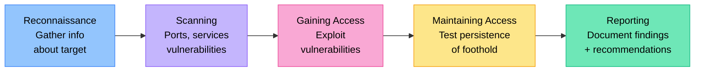

# Hacking Ethics

In Grade 8 you learned the basics of white/black/grey hat hacking and common threats. In Grade 9 we examine the Cybercrimes Act in detail, cybersecurity as a career path, responsible disclosure, and the ethics of surveillance and state-sponsored hacking.

## The Cybercrimes Act No. 19 of 2020 — In Detail

South Africa's Cybercrimes Act came into full operation on **1 December 2021**. It replaced a patchwork of outdated laws and for the first time created a comprehensive framework for cyber offences.

### Key Offences and Penalties

| Section | Offence | Maximum penalty |
|---------|---------|----------------|
| **S2** | Unauthorised access to a computer system | R10 million fine / 3 years imprisonment |
| **S3** | Unauthorised interception of data | R10 million fine / 5 years imprisonment |
| **S4** | Unauthorised interference with data | R10 million fine / 5 years imprisonment |
| **S5** | Unauthorised interference with a computer system | R10 million fine / 10 years imprisonment |
| **S6** | Unlawful acquisition of a password/access code | R10 million fine / 3 years imprisonment |
| **S9** | Ransomware and malicious code | R10 million fine / 10–15 years imprisonment |
| **S14** | Cyberbullying / online harassment/threats | R5 000 fine / 1 year imprisonment (first offence) |
| **S16** | Non-consensual sharing of intimate images | Fine / 3 years imprisonment (escalating) |

:::danger
"I was just curious" and "I didn't cause any harm" are not defences under the Cybercrimes Act. Accessing a system without authorisation is a criminal offence regardless of intent.
:::

### Duties on Service Providers

The Act also requires internet service providers and financial institutions to:
- **Preserve evidence** of cybercrimes
- **Report** certain cybercrimes to the South African Police Service (SAPS)
- Co-operate with law enforcement investigations

### Jurisdiction

The Act applies if:
- The offence was committed in South Africa
- The offender is a South African citizen or resident
- The computer or data affected is located in South Africa

This means South African school learners who hack overseas websites can be prosecuted in South Africa.

## Penetration Testing Methodology

Ethical hackers use a structured methodology to test security systems:

| Phase | What happens |
|-------|-------------|
| **Reconnaissance** | Gather information about the target (passive: open-source research; active: probing) |
| **Scanning** | Identify open ports, running services, vulnerabilities |
| **Gaining access** | Attempt to exploit identified vulnerabilities |
| **Maintaining access** | Test whether attackers could establish persistent access |
| **Reporting** | Document all findings, vulnerabilities, and recommended fixes |

**Key principle**: Every stage requires explicit written authorisation from the system owner. Without a **scope of engagement** document, all of the above is illegal.

## Cybersecurity Careers and Certifications

Cybersecurity is a major career field with global skills shortages. South Africa has increasing demand for cybersecurity professionals.

**Entry-level certifications:**
- **CompTIA Security+**: Widely recognised foundation certification
- **CompTIA A+**: Hardware and networking fundamentals
- **Google Cybersecurity Certificate**: Free/low-cost online certificate

**Intermediate certifications:**
- **CEH (Certified Ethical Hacker)**: Offensive security skills
- **OSCP (Offensive Security Certified Professional)**: Hands-on penetration testing
- **CompTIA CySA+**: Cybersecurity analyst

**Advanced certifications:**
- **CISSP (Certified Information Systems Security Professional)**: Management level
- **CISM (Certified Information Security Manager)**

**Career paths in cybersecurity:**
- Penetration tester / red team
- Security analyst / blue team
- Incident responder / forensics
- Cloud security engineer
- Application security engineer
- Security operations centre (SOC) analyst

:::info
Many cybersecurity professionals are self-taught — platforms like TryHackMe, HackTheBox, and Cybrary offer free or affordable ethical hacking practice in legal lab environments.
:::

## Responsible Disclosure

:::tip Key Term
**Responsible disclosure** (also called **coordinated vulnerability disclosure**) is the practice of privately reporting a security vulnerability to the affected organisation and giving them a reasonable time (usually 90 days) to fix it before publicly disclosing it.
:::

**Why it matters:**
- Public disclosure before a fix allows malicious attackers to exploit the vulnerability
- But secret disclosure forever means users are never warned and companies may not act
- Responsible disclosure balances: private first, then public if not fixed

**Bug bounty programmes**: Companies like Google, Microsoft, Apple, Facebook/Meta, and increasingly South African banks, pay researchers who responsibly disclose vulnerabilities. Google's bug bounty has paid out hundreds of millions of dollars. This formalises the relationship between ethical hackers and companies.

## Social Engineering Case Studies

### The Twitter Bitcoin Scam (2020)

Attackers used social engineering (phone calls pretending to be IT staff) to convince Twitter employees to hand over credentials to internal admin tools. They then hijacked the accounts of Barack Obama, Elon Musk, Bill Gates, and others to post Bitcoin scams. The attackers were teenagers. Two were convicted in the US; one was 17 years old.

**Lesson**: The most sophisticated technical attack can fail, but a well-executed phone call to an employee can succeed. Human beings are often the weakest security link.

### The SARS Phishing Campaign (recurring)

South African Revenue Service (SARS) is impersonated in phishing campaigns every year, especially around tax season. Fake emails claiming "Your tax refund is ready" direct victims to convincing fake SARS websites to harvest banking credentials.

**Lesson**: Phishing attacks exploit timely, relevant topics to increase credibility.

## The Ethics of Surveillance

As technology enables governments and corporations to monitor citizens more deeply, difficult ethical questions arise.

**State surveillance:**
- Governments argue surveillance is necessary to prevent terrorism and crime
- Critics argue mass surveillance violates privacy rights and chills free speech
- South Africa's RICA Act (Regulation of Interception of Communications Act) requires warrants for legal interception of private communications

**Corporate surveillance:**
- Tech companies collect vast amounts of data on users' behaviour, location, and preferences
- This data funds the "free" internet (advertising model)
- Users often do not fully understand what they consent to in terms of service agreements

**The ethics debate:**
- How much surveillance is acceptable for security?
- Who oversees the overseers?
- Can mass surveillance be used to target political opponents?
- Do you have privacy expectations in public spaces with cameras?

:::info
In 2013, Edward Snowden (an NSA contractor) leaked documents revealing mass surveillance of citizens by the US government and its allies. He is simultaneously celebrated as a whistleblower by privacy advocates and condemned as a criminal by US authorities. This remains one of the most contested ethical debates in tech history.
:::

## Check Your Understanding

1. Under Section 5 of the Cybercrimes Act, what is the maximum penalty for interfering with a computer system? Why is this offence treated more seriously than simply accessing a system?
2. A learner discovers a major security vulnerability in their school's network that would allow anyone to access all learner records. Using the concept of responsible disclosure, describe exactly what this learner should do.
3. Explain the difference between passive reconnaissance and active scanning in a penetration test. Why is written authorisation essential before either phase?
4. Describe the Twitter hack of 2020. What does it illustrate about the relative importance of technical vs human factors in cybersecurity?
5. "Government surveillance is justified if it helps prevent crime." Write a paragraph arguing FOR this position and a paragraph arguing AGAINST it.
6. What is a bug bounty programme? Why do major technology companies run them?
7. What criminal charges could a 16-year-old South African face if they gained unauthorised access to their school's database and changed their marks — even if they didn't damage anything?
