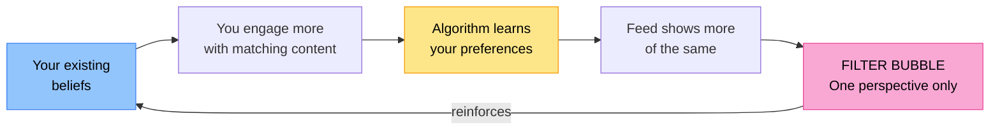

# Information Literacy

Grade 8 introduced the CRAAP test, fake news, and how to cite sources. Grade 9 goes further: understanding deepfakes, how search algorithms shape what you find, propaganda techniques, and advanced research skills.

## Recap: The Core Challenge

The problem isn't a lack of information — it's the opposite. We are drowning in information, and much of it is misleading, manipulated, or outright false. Being information literate means not just finding information, but critically evaluating it.

## Deepfakes

:::tip Key Term
A **deepfake** is a realistic-looking but fake video, audio recording, or image created using AI, in which a person appears to say or do something they never actually did.
:::

Deepfakes use a type of AI called **generative adversarial networks (GANs)** to synthesise realistic faces, voices, and body movements. The technology is advancing rapidly and becoming cheaper to produce.

**Dangers of deepfakes:**
- Political disinformation: fake videos of leaders making statements they never made
- Fraud: fake audio of a CEO ordering a bank transfer
- Harassment: putting someone's face in inappropriate content
- Evidence manipulation: fake evidence in legal proceedings

**How to spot a deepfake (increasingly difficult):**
- Unnatural blinking or eye movement
- Blurring around the hairline or edges of the face
- Inconsistent lighting or shadows
- Slightly mismatched lip sync
- Stiff or unnatural facial expressions
- Background inconsistencies

:::info
Deepfake detection tools exist (e.g. Microsoft Video Authenticator, Deepware Scanner) but the technology is in an arms race — as detectors improve, so do the fakes.
:::

## Propaganda Techniques

Understanding propaganda helps you recognise when someone is trying to manipulate your beliefs rather than inform you.

| Technique | How it works | Example |
|-----------|-------------|---------|
| **Bandwagon** | "Everyone believes/does this — join them!" | "9 out of 10 South Africans support this policy" |
| **Fear appeal** | Creates fear about the alternative | "If they win, crime will triple" |
| **Testimonial** | Celebrity or authority figure endorses the message | "Doctor X says this supplement cures everything" |
| **Glittering generalities** | Vague, emotionally positive words with no substance | "Freedom! Progress! A better future!" |
| **Plain folks** | Leader/brand pretends to be ordinary to seem relatable | Politician eating at a township school |
| **Card stacking** | Only shows evidence that supports one side | Only reporting positive trial results, hiding negative ones |
| **Transfer** | Associating something respected/disliked with the message | Politician appears with a respected community leader to gain credibility |
| **Repetition** | Repeating a claim enough times that it feels true | A slogan repeated in every ad |

## Astroturfing

:::tip Key Term
**Astroturfing** is a deceptive practice where organisations create the illusion of grassroots public support for a product, policy, or idea, when the support is actually manufactured and coordinated.
:::

Examples:
- Hundreds of fake social media accounts all pushing the same political message
- Fake "customer reviews" written by paid promoters
- Companies disguising sponsored research as independent scientific findings

The name comes from AstroTurf (artificial grass) — it looks like a genuine grassroots movement but is entirely artificial.

## Filter Bubbles and Echo Chambers

You covered this in Grade 8. Here is a deeper analysis:

**How filter bubbles form:**

- Social media algorithms are designed to keep you engaged
- Engagement is highest when content matches your existing beliefs
- So the algorithm shows you more of what you already agree with
- Over time, your feed becomes a bubble of one perspective

**Consequences:**
- Polarisation: groups become more extreme in their views because they are never exposed to opposing perspectives
- Radicalization: isolated communities can develop extreme views that seem normal within the bubble
- Misunderstanding of society: people genuinely believe their view is the majority view

**The lateral reading technique** (developed by fact-checkers):
Instead of reading down into a source (accepting it at face value), read **laterally** — immediately open new tabs and check what other sources say *about* the original source. Look up the organisation, not just the article.

## How Search Algorithms Work

Understanding how Google works helps you get better results and understand its limitations.

**Google's ranking factors include:**
- **Relevance**: How well does the page match your search terms?
- **Authority**: How many credible sites link to this page (PageRank)?
- **Freshness**: For time-sensitive topics, newer content ranks higher
- **User signals**: Pages that users click on and stay on rank higher
- **Personalisation**: Your location, search history, and preferences affect your results

**SEO (Search Engine Optimisation)**: The practice of designing content to rank higher in search results. This means high-ranking results are not necessarily the most accurate — they may simply be the most optimised.

:::warning
A website appearing as the first Google result does NOT make it the most reliable source. High-ranking results may be advertising, SEO-optimised but low-quality content, or even misinformation that has been widely shared.
:::

**Effective search strategies:**
- Use quotation marks for exact phrases: `"cybercrime act 2020"`
- Use `site:` to search within a specific domain: `site:gov.za cybercrime`
- Use `-` to exclude terms: `python programming -snake`
- Use Google Scholar for academic sources: scholar.google.com
- Check the date filter for recent information

## Evaluating Academic vs Popular Sources

| Feature | Academic/Scholarly | Popular/General |
|---------|------------------|----------------|
| Author | Named expert with credentials | Often unnamed or non-specialist |
| Review process | Peer-reviewed before publication | Editorial review or none |
| Language | Technical, formal | Accessible, informal |
| Sources cited | Extensive bibliography | Few or no references |
| Purpose | Research and scholarship | Entertainment, news, opinion |
| Examples | Journal articles, textbooks | News articles, blogs, Wikipedia |

For serious research, prefer academic sources. But popular sources can be useful for current events, different perspectives, and accessibility.

## Referencing: Harvard Style

South African schools and universities commonly use Harvard (author-date) referencing.

**Book:**
> Surname, Initial. Year. *Title of Book*. Place of publication: Publisher.

**Website:**
> Surname, Initial (if available). Year. Title of page. [Online]. Available: URL [Accessed: date].

**Journal article:**
> Surname, Initial. Year. Title of article. *Journal Name*, volume(issue):pages.

**Image:**
> Creator. Year. *Title*. [Medium]. Available: source [Accessed: date]. Licence.

:::info
Reference managers like Zotero (free) or Mendeley automatically format references for you and store your sources. These are tools you'll use in high school and university.
:::

## Check Your Understanding

1. What is a deepfake? Describe two contexts in which deepfakes could cause serious harm.
2. Identify the propaganda technique being used in each example:
   - "Join the millions of South Africans who have already switched to our bank"
   - "If this party wins, your family won't be safe"
   - "Our product is endorsed by Dr [famous doctor]"
3. Explain what astroturfing is. How could it deceive someone researching public opinion about a new government policy?
4. Describe what a filter bubble is and explain how the lateral reading technique helps you break out of it.
5. A learner Googles a controversial topic and uses the top three results for their essay. Explain two reasons why the top search results may not be the best sources.
6. Distinguish between a scholarly source and a popular source. For a school research project on cybercrime in South Africa, identify one example of each type of source you would look for.
7. Write a complete Harvard-style reference for a website article about POPIA written by the Information Regulator, published in 2023. (You may use a fictional URL.)
