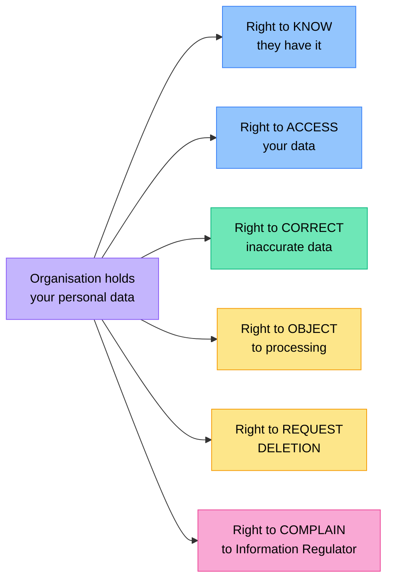

# Privacy & Security

Grade 8 introduced passwords, 2FA, and basic privacy concepts. In Grade 9 we examine South Africa's privacy legislation, how encryption works, what organisations are legally required to do with your data, and your rights when they fail.

## The POPI Act — Your Privacy Rights in South Africa

:::tip Key Term
The **Protection of Personal Information Act (POPIA or POPI Act), No. 4 of 2013** is South Africa's main data protection law. It came into full effect on **1 July 2021**. It governs how organisations collect, store, process, and share personal information.
:::

### What Is "Personal Information"?

Under POPIA, personal information includes:
- Name, ID number, age, race, gender, address, telephone number
- Email address and IP address
- Medical information and biometric data
- Financial information and account numbers
- Educational history and employment records
- Private correspondence (emails, messages)

### The Eight Conditions of POPIA

Any organisation handling your personal information must follow these eight conditions:

| Condition | What it means |
|-----------|--------------|
| **1. Accountability** | The responsible party must ensure POPIA is complied with |
| **2. Processing limitation** | Personal information may only be collected lawfully and with your knowledge |
| **3. Purpose specification** | Must tell you why they're collecting the data and only use it for that purpose |
| **4. Further processing limitation** | Cannot use your data for a different purpose later without your consent |
| **5. Information quality** | Must keep your information accurate and up to date |
| **6. Openness** | Must be transparent about what they collect and how they use it |
| **7. Security safeguards** | Must protect your information against loss, theft, and unauthorised access |
| **8. Data subject participation** | You have the right to access, correct, and request deletion of your data |

### Your Rights Under POPIA

As a data subject (a person whose information is collected), you have the right to:
- **Know** that an organisation has your personal information
- **Access** your personal information held by an organisation
- **Request correction** of inaccurate information
- **Object** to the processing of your information
- **Request deletion** of your personal information in certain circumstances
- **Lodge a complaint** with the Information Regulator if your rights are violated

:::info
South Africa's **Information Regulator** is the body that enforces POPIA. Organisations that fail to protect personal information can face fines of up to **R10 million** and prison sentences of up to **10 years** for serious violations.
:::

## Data Breaches

:::tip Key Term
A **data breach** is a security incident where personal information is accessed, disclosed, or stolen without authorisation.
:::

### How Breaches Happen

- **Hacking**: attackers exploit vulnerabilities to gain access to databases
- **Phishing**: employees tricked into revealing credentials
- **Insider threat**: a dishonest employee leaking or selling data
- **Accidental exposure**: misconfigured databases accessible to anyone on the internet
- **Lost/stolen devices**: unencrypted laptop or USB drive with sensitive data

### What Organisations Must Do Under POPIA

When a data breach occurs, the responsible organisation must:
1. **Notify the Information Regulator** as soon as reasonably possible
2. **Notify affected individuals** (you) if there is a risk of harm
3. The notification must include what information was breached, what they are doing about it, and what you can do to protect yourself

### What to Do if Your Data Is Breached

1. **Change passwords** on the affected account and any accounts using the same password
2. **Enable 2FA** on important accounts
3. **Monitor your accounts** for unusual activity
4. **Check Have I Been Pwned** (haveibeenpwned.com) to see if your email has appeared in known breaches
5. **Alert your bank** if financial information was involved
6. **Lodge a complaint** with the Information Regulator if the organisation has not responded appropriately

## Encryption

:::tip Key Term
**Encryption** is the process of converting data into an unreadable format (ciphertext) using a mathematical algorithm and a key. Only someone with the correct key can decrypt (decode) it back into readable form.
:::

You encounter encryption constantly:

| Context | Encryption used |
|---------|----------------|
| HTTPS websites | TLS/SSL — encrypts data between your browser and the web server |
| WhatsApp | End-to-end encryption — only sender and recipient can read messages |
| Password storage | Hashing — passwords are stored as scrambled codes, not as plain text |
| Device storage | Full-disk encryption on smartphones and laptops |
| Banking apps | Multiple layers of encryption on all transactions |

### HTTPS and TLS

When you visit a website with **HTTPS**, all data between your browser and the server is encrypted using **TLS** (Transport Layer Security). The padlock symbol in the address bar confirms this.

:::warning
HTTPS means the *connection* is encrypted — it does NOT mean the website is safe or legitimate. Phishing sites can and do use HTTPS. Always check the domain name as well.
:::

## Multi-Factor Authentication (MFA)

You know 2FA from Grade 8. In Grade 9, understand the factors:

| Factor type | Examples |
|-------------|---------|
| **Something you know** | Password, PIN, security question |
| **Something you have** | One-time password (OTP) via SMS, authenticator app, hardware token |
| **Something you are** | Fingerprint, face ID, iris scan (biometrics) |

Using two or more factor types is multi-factor authentication (MFA). An attacker who steals your password still cannot access your account without the second factor.

**Authenticator apps** (Google Authenticator, Microsoft Authenticator) are more secure than SMS OTPs because they work offline and are not vulnerable to SIM-swapping attacks.

### SIM Swapping

:::danger
A **SIM-swap attack** is when a criminal convinces your mobile network to transfer your phone number to a SIM card they control. They can then receive your OTP messages and access your accounts — even though you have 2FA enabled. This is why authenticator apps are safer than SMS-based OTPs.
:::

## Cookies and Tracking

When you visit websites, they store small files called **cookies** on your device.

| Cookie type | Purpose |
|-------------|---------|
| **Session cookies** | Remember you during a browsing session (temporary) |
| **Persistent cookies** | Remember your preferences on future visits |
| **Authentication cookies** | Keep you logged in |
| **Tracking cookies** | Record your browsing behaviour across websites for advertising |

Under POPIA, websites operating in South Africa must inform you about cookies and give you the option to accept or decline non-essential ones.

**How to manage cookies:**
- Your browser settings allow you to view and delete stored cookies
- Use private/incognito mode to prevent persistent cookies
- Browser extensions (uBlock Origin, Privacy Badger) block tracking cookies

## Device Security

| Action | Why |
|--------|-----|
| Screen lock with PIN/biometric | Prevents physical access if device is lost or stolen |
| Full-disk encryption | If stolen, data is unreadable without the password |
| Regular OS and app updates | Patches known security vulnerabilities |
| Secure app permissions | Limits what apps can access on your device |
| Remote wipe capability | Allows deletion of all data if device is stolen |
| Antivirus software | Detects malware, especially on Android |

## Check Your Understanding

1. Explain what POPIA is and why it was necessary in South Africa.
2. Name **four** types of information that are protected under POPIA.
3. An online store suffers a data breach. Under POPIA, what are their obligations toward the customers whose data was compromised?
4. Explain the difference between a session cookie and a tracking cookie. Under what law must a South African website inform you about cookies?
5. Why is an authenticator app safer than using SMS-based OTPs for 2FA? What specific attack does it protect against?
6. A learner's email appears on "Have I Been Pwned." List **four** steps they should take immediately.
7. You visit a website with HTTPS and a padlock symbol. Does this guarantee the site is safe? Explain your answer carefully.
8. Explain how encryption protects your WhatsApp messages. Why can't WhatsApp read your private conversations?
