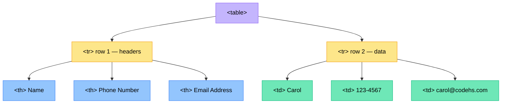

# HTML Tables

## What are Tables?

Tables are a great way to display information in a **grid** on our web pages. We see tables all the time on the internet:

- Sports websites like ESPN use tables to display rankings and scores
- Wikipedia uses tables to display information like a list of national birds
- Address books, schedules, and price lists are all great uses for tables

Whenever information naturally fits into rows and columns, a table is the right tool to use.

---

## Table Terminology

Before we start building tables, we need to understand some table terms. Consider a table showing the top summer songs of all time:

| Rank | Title | Artist | Peak Year |
|------|-------|--------|-----------|
| 1 | Song A | Artist A | 2005 |
| 2 | Song B | Artist B | 2010 |

- **Table** — the entire grid of information is called the table
- **Table rows** — each horizontal line of data is a table row (the header row and each data row)
- **Table headers** — the first row of a table usually contains **table headers**, which describe what information is in each column (e.g., Rank, Title, Artist, Peak Year)
- **Table data** — the actual information inside each cell of the table (e.g., "1", "Song A", "Artist A", "2005")

---

## HTML Tags for Tables

To build tables in HTML, we have a tag for each of these concepts:

| Tag | Stands For | Purpose |
|-----|-----------|---------|
| `<table>` | Table | The container for all the table data |
| `<tr>` | Table Row | One row inside the table |
| `<th>` | Table Header | A header cell (displayed bold and centred) |
| `<td>` | Table Data | A regular data cell in the table |

---

## Building a Basic Table

Here is how the tags work together:

```html
<table>
  <tr>
    <th>Name</th>
    <th>Points</th>
  </tr>
  <tr>
    <td>Carol</td>
    <td>32</td>
  </tr>
</table>
```

Breaking this down:
- The `<table>` tag wraps the entire table
- The first `<tr>` is the header row — it uses `<th>` tags (table headers)
- The second `<tr>` is a data row — it uses `<td>` tags (table data)
- In the first row, "Name" and "Points" are the headers describing each column
- In the second row, "Carol" and "32" are the actual data

---

## Adding a Border

By default, a table has no visible border — the cells appear without any lines between them. To add a border, we add a **`border` attribute** to the `<table>` tag:

```html
<table border="1">
  ...
</table>
```

The `border` attribute specifies **how thick the border should be in pixels**. The default is 0 (no border). Setting it to 1 gives a thin border around each cell. You can increase the value (for example, `border="5"`) to get a thicker border around the edge of the table.

---

## A Complete Table Example

Here is a complete example of an address book table:

```html
<!DOCTYPE html>
<html>
  <head>
    <title>Address Book</title>
  </head>
  <body>
    <h1>My Address Book</h1>
    <table border="1">
      <tr>
        <th>Name</th>
        <th>Phone Number</th>
        <th>Email Address</th>
      </tr>
      <tr>
        <td>Carol</td>
        <td>123-4567</td>
        <td>carol@codehs.com</td>
      </tr>
      <tr>
        <td>Jenny</td>
        <td>867-5309</td>
        <td>jenny@yahoo.com</td>
      </tr>
    </table>
  </body>
</html>
```

This creates a nicely organised address book with a header row and two rows of data. The `border="1"` gives us visible lines so we can clearly see each cell.

---

## How Tables are Structured

Notice the nesting structure of a table:



- `<tr>` tags go inside the `<table>` tag
- `<th>` and `<td>` tags go inside the `<tr>` tags
- The number of cells in each row should match the number of columns

---

## Check Your Understanding

1. What are the four HTML tags used to build a table? What does each one do?

2. What is the difference between `<th>` and `<td>`? How are they displayed differently by the browser?

3. What is the purpose of the `border` attribute on a `<table>` tag? What value gives a thin border?

4. Write the HTML for a table with borders that shows three of your favourite foods. The table should have columns for "Food" and "Category" (e.g., fruit, snack, main meal).

5. In a table, where do `<tr>` tags go? Where do `<th>` and `<td>` tags go?

6. What does the following code produce? Describe the table in words.
   ```html
   <table border="1">
     <tr>
       <th>Day</th>
       <th>Weather</th>
     </tr>
     <tr>
       <td>Monday</td>
       <td>Sunny</td>
     </tr>
     <tr>
       <td>Tuesday</td>
       <td>Cloudy</td>
     </tr>
   </table>
   ```

7. Write the HTML for a table with borders showing a school timetable. Include columns for "Period", "Subject", and "Teacher", with at least three rows of data.

8. **Extended question:** Why do you think table headers (`<th>`) are displayed in bold and centred by default? How does this help the reader of the table?
