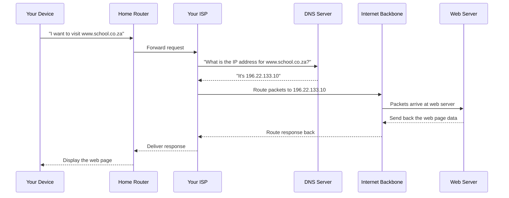

# The Internet

## What is the Internet?

The internet is the largest computer network ever built. At its simplest, it is a **global network of networks** — millions of private, public, academic, business, and government networks all linked together by a common set of rules (called **protocols**) that allow them to communicate.

:::tip Key Term
**Network:** A group of computers and devices connected together so they can share information and resources.

**Internet:** A worldwide system of interconnected networks that allows computers everywhere to communicate with each other.
:::

To picture it, imagine that every town in South Africa had its own local telephone exchange — a small network connecting all the phones in that area. Now imagine connecting all those exchanges together so that someone in Cape Town can call someone in Limpopo. That is roughly what the internet does, but instead of phone calls, it carries data: web pages, emails, videos, messages, and everything else.

The internet is not owned by any single company, government, or person. It is a cooperative system maintained by thousands of organisations around the world. This makes it remarkably resilient — there is no single switch that can turn it off.

---

## A Brief History of the Internet

### ARPANET (1969)
The internet's story begins with a Cold War project. In the 1960s, the United States military worried that a nuclear attack could destroy their communication systems. They funded research into a network that could survive partial destruction by automatically rerouting data around damaged sections.

The result was **ARPANET** (Advanced Research Projects Agency Network), launched in **1969**. On 29 October 1969, the first message was sent between computers at UCLA and Stanford University. The intended message was "LOGIN" — but the system crashed after the first two letters. The first internet message ever sent was simply "LO".

:::info Interesting Fact
The first ARPANET network had just four computers (called nodes). Today, the internet connects more than **15 billion devices** worldwide.
:::

### Growth and Civilian Use (1970s–1980s)
Through the 1970s and 1980s, universities and research institutions connected to ARPANET. Researchers used it to share files and send electronic mail. In 1983, ARPANET adopted the TCP/IP protocol (more on this shortly), which became the foundation of the modern internet.

By the late 1980s, the network was growing rapidly, but it was still mainly used by academics and scientists. Ordinary people had no easy way to access it.

### Tim Berners-Lee and the World Wide Web (1989–1991)
The breakthrough that brought the internet to the public came from a British scientist named **Tim Berners-Lee**, working at the CERN physics laboratory in Switzerland.

In **1989**, he proposed a system for sharing research documents using a concept he called **hypertext** — documents that could link to other documents. In **1991**, he launched the first website and made the system publicly available for free.

He called his invention the **World Wide Web**.

:::info Tim Berners-Lee
Tim Berners-Lee could have patented the World Wide Web and become one of the richest people on earth. Instead, he gave it away for free, saying he wanted it to be open and accessible to everyone. He has since campaigned for net neutrality and an open internet.
:::

### The Web Goes Mainstream (1990s–2000s)
The 1990s saw explosive growth. Web browsers like Netscape Navigator made the web accessible to ordinary people. Companies like Amazon (1994) and Google (1998) were founded. The "dot-com boom" saw huge investment in internet businesses — followed by a crash in 2000 when many of those businesses failed.

By the 2000s, broadband connections replaced slow dial-up modems, making the internet fast enough for video and music. Social media platforms like Facebook (2004) and YouTube (2005) transformed how people used the web.

---

## The Internet vs the World Wide Web

This is one of the most common confusions in digital technology. **The internet and the World Wide Web are not the same thing.**

| | Internet | World Wide Web |
|--|----------|----------------|
| **What it is** | The physical network infrastructure | A service that runs on top of the internet |
| **Components** | Cables, routers, servers, satellites, protocols | Web pages, websites, hyperlinks, browsers |
| **Invented** | ~1969 (ARPANET) | 1989–1991 (Tim Berners-Lee) |
| **Who uses it** | Everyone with a connected device | Anyone who visits a website |
| **Other services on the same network** | Email, video calls, online gaming, file transfers | Web pages and web apps only |

:::warning Common Misconception
Many people use "internet" and "web" interchangeably, but they mean different things. When you send an email, you are using the internet but not the World Wide Web. When you visit a website, you are using both the internet (to carry the data) and the Web (the system of pages and links).
:::

Think of it this way: the internet is like the road network. The World Wide Web is like the delivery trucks that use those roads. Email, online gaming, and video calls are like other vehicles using the same roads for different purposes.

---

## How the Internet Works: Packets and Routing

When you send data over the internet — whether it is a message, a video, or a web page request — that data does not travel as one big block. It is broken up into small chunks called **packets**.

:::tip Key Term
**Packet:** A small unit of data transmitted over the internet. Each packet contains a piece of the data being sent, plus addressing information so it knows where to go.
:::

Here is how it works:

1. **Splitting:** Your data is split into packets, each typically around 1,500 bytes in size.
2. **Addressing:** Each packet is labelled with the sender's IP address and the destination IP address.
3. **Routing:** Packets travel through a series of **routers** — specialised devices that read the destination address and decide the best path forward. Different packets may take different routes.
4. **Reassembly:** When all the packets arrive at the destination, they are reassembled in the correct order.
5. **Error checking:** If a packet is lost or damaged, the receiving device requests it again.

:::tip Key Term
**Router:** A device that connects networks together and directs packets of data towards their destination. Your home Wi-Fi box is a small router.
:::

The advantage of this approach is **resilience**. If one route is congested or broken, packets can automatically take a different path. The network does not have a single point of failure.

---

## TCP/IP: The Rules of the Internet

For all these different computers and networks to communicate, they need to follow the same rules. These rules are called **protocols**.

The internet runs on **TCP/IP** — two protocols that work together:

:::tip Key Term
**TCP (Transmission Control Protocol):** Responsible for breaking data into packets, ensuring all packets arrive, and reassembling them in the correct order.

**IP (Internet Protocol):** Responsible for addressing and routing packets — making sure each packet reaches the right destination.
:::

- **IP** is like the postal system — it handles addressing and routing, making sure each packet gets to the right place.
- **TCP** is like a careful delivery service — it tracks every packet, requests re-delivery of any that are lost, and puts everything back in the right order.

Together, TCP/IP makes communication reliable even over an unreliable network.

---

## IP Addresses

Every device on the internet needs a unique address so that data can be sent to it. This is called an **IP address** (Internet Protocol address).

:::tip Key Term
**IP Address:** A unique numerical label assigned to each device connected to the internet, used to identify and locate that device.
:::

### IPv4
The original IP address system, known as **IPv4**, uses addresses in this format:

```
192.168.1.1
```

Four numbers, each between 0 and 255, separated by dots. This gives about **4.3 billion** possible addresses — which sounded like more than enough in the 1970s. By the 2010s, we had nearly run out.

### IPv6
To solve the address shortage, **IPv6** was developed. IPv6 addresses look like this:

```
2001:0db8:85a3:0000:0000:8a2e:0370:7334
```

Eight groups of four hexadecimal digits, separated by colons. IPv6 provides approximately **340 undecillion** addresses (that is 340 followed by 36 zeros) — enough for every atom on earth to have multiple addresses.

:::info Transition to IPv6
The world is slowly transitioning from IPv4 to IPv6, but both systems coexist today. Most home and mobile connections still use IPv4 for the "last mile" but increasingly use IPv6 on the backbone networks.
:::

### Public vs Private IP Addresses
Your home router has a **public IP address** assigned by your ISP — this is how the internet identifies your home network. Each device inside your home (phone, laptop, smart TV) gets a **private IP address** assigned by your router. This is why many devices can share one internet connection.

---

## Internet Infrastructure

The internet is not just software — it is a massive physical infrastructure spread across the entire planet.

### Servers and Data Centres
A **server** is a computer that stores and serves data to other computers. Web servers host websites. Email servers handle mail. Video servers store streaming content.

Servers live in **data centres** — massive buildings filled with thousands of computers, kept cool by industrial air conditioning, powered by enormous electricity supplies, and protected by multiple layers of physical and digital security.

:::info Data Centres in South Africa
South Africa is home to several major data centres in Johannesburg, Cape Town, and Durban. Companies like Teraco and Africa Data Centres operate facilities that connect South Africa to the global internet backbone. Johannesburg's Teraco Isando campus is one of the largest interconnection hubs on the African continent.
:::

### Undersea Cables
Most international internet traffic travels through **fibre-optic cables** laid on the ocean floor. These cables carry data as pulses of light and can transmit enormous amounts of data over thousands of kilometres.

South Africa is connected to the global internet by several undersea cable systems:
- **SAT-3/WASC** — one of the first cables connecting southern Africa to Europe
- **SEACOM** — connecting East Africa and South Africa to Europe and Asia
- **WACS (West Africa Cable System)** — connecting West and South Africa to Europe
- **ACE (Africa Coast to Europe)** — connecting 23 African countries to France

:::warning When Cables Break
Undersea cables do get damaged — by ship anchors, fishing trawlers, earthquakes, and even sharks. When a major cable breaks, internet speeds across a region can drop dramatically. South Africa has experienced significant disruptions when cables serving the region have been damaged.
:::

### Satellites
Satellites in orbit can provide internet access to areas that cables cannot reach — remote rural areas, ships at sea, aircraft in flight. Traditional satellite internet was slow and had high latency (delay), but newer systems like **SpaceX Starlink** use large constellations of low-earth orbit (LEO) satellites to provide much faster, lower-latency connections.

Starlink became available in South Africa in 2023, offering a potential solution for rural connectivity.

---

## How the Request Travels: From Your Device to a Server

Here is a simplified view of what happens when you type a web address and press Enter:



The entire process above typically happens in **less than a second**.

---

## Internet Service Providers (ISPs)

To connect to the internet, you need an **Internet Service Provider (ISP)** — a company that provides a connection to the internet's backbone infrastructure.

:::tip Key Term
**ISP (Internet Service Provider):** A company that provides internet access to homes and businesses, typically for a monthly subscription fee.
:::

### Connection Types in South Africa

| Type | How it works | Typical Speed | Availability |
|------|-------------|---------------|--------------|
| **ADSL** | Data over copper telephone lines | 1–40 Mbps | Urban areas |
| **Fibre** | Light pulses through glass cables | 10–1000 Mbps | Urban/suburban |
| **LTE/4G** | Mobile cellular network | 5–100 Mbps | Most of SA |
| **5G** | Next-gen mobile network | 50–500+ Mbps | Major cities |
| **VSAT** | Satellite connection | 5–100 Mbps | Remote areas |
| **Starlink** | Low-earth orbit satellite | 50–200 Mbps | Most of SA |

Major ISPs in South Africa include Telkom, MTN, Vodacom, Afrihost, MWEB, Rain, and many others.

---

## The Internet in South Africa

### Coverage and Access
South Africa has one of the most developed internet infrastructures on the African continent, but access remains unequal. As of 2024:

- Approximately **72%** of South Africans have access to the internet
- Internet penetration in urban areas is significantly higher than in rural areas
- The Eastern Cape, Limpopo, and Northern Cape have the lowest levels of connectivity

### Mobile Internet Dominance
Unlike in Europe or North America where most people access the internet on computers via fixed broadband, **most South Africans access the internet primarily through mobile phones**. This has important implications for web design — websites must work well on mobile devices.

:::info Mobile-First South Africa
Because most South Africans browse the web on their phones, web designers working for South African audiences need to design "mobile-first" — meaning the mobile experience should be the priority, not an afterthought.
:::

### Challenges
- **Cost:** Data remains expensive relative to average income, though prices have dropped significantly
- **Load shedding:** Eskom's power outages disrupt internet connectivity (cell towers lose power)
- **Rural connectivity:** Many rural schools, clinics, and homes still lack affordable internet access
- **Digital divide:** The gap between those with and without internet access reinforces inequality

### Government Initiatives
The South African government has launched several programmes to address the digital divide, including providing free Wi-Fi hotspots in townships and subsidising internet access for schools through programmes like the National Curriculum Framework for ICT.

---

## Key Statistics: The Scale of the Internet

To appreciate just how enormous the internet is, consider these statistics (approximate, as of 2024):

- **5.4 billion** people use the internet worldwide (about 67% of the global population)
- **2 million** emails are sent every second
- **500 hours** of video are uploaded to YouTube every minute
- **5 million** Google searches happen every minute
- **1.3 trillion** GB of data is transmitted over the internet every year
- **200+ billion** websites exist (though most are inactive)
- **15 billion+** devices are connected to the internet (the "Internet of Things")

:::info Data Generated Per Minute
Every single minute on the internet (approximate figures):
- 500 hours of YouTube video uploaded
- 6 million Google searches
- 42 million WhatsApp messages sent
- 1 million TikTok videos watched
- 350,000 tweets posted
- 240,000 photos uploaded to Facebook
:::

---

## Check Your Understanding

1. In your own words, explain the difference between the internet and the World Wide Web. Give an example to support your explanation.

2. What was ARPANET, and why was it developed? In what year was the first message sent over ARPANET?

3. Who invented the World Wide Web, and in which year was it launched? Why is this person considered significant in the history of technology?

4. Explain what a packet is. Why is data broken into packets rather than sent as one large block?

5. What does TCP/IP stand for? Briefly explain the role of TCP and the role of IP in internet communication.

6. What is an IP address? Write an example of an IPv4 address.

7. Why was IPv6 developed? How many possible addresses does IPv6 provide compared to IPv4?

8. Name THREE physical components of internet infrastructure discussed in this chapter.

9. Name TWO undersea cable systems that connect South Africa to the rest of the world.

10. What is an ISP? Name THREE South African ISPs.

11. Why does South Africa have a "mobile-first" approach to web design? Explain in terms of how most South Africans access the internet.

12. List THREE challenges facing internet access in South Africa.

13. Look at the Mermaid diagram showing how a request travels from your device to a server. Describe each step in your own words.

14. **Extended question:** A friend says "I'm going to turn off the internet." Explain why this is not possible, based on what you have learned about how the internet is structured.
