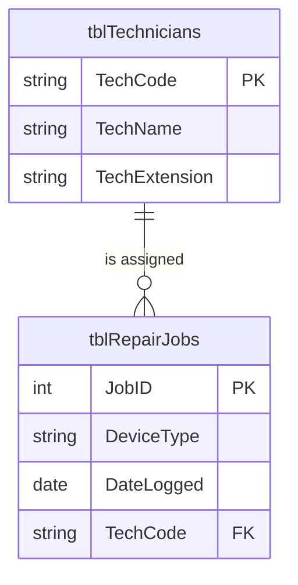

# Grade 12 Information Technology — Theory Study Notes

*A topic-by-topic reference for CAPS Information Technology theory (Paper 2).*

These notes follow the CAPS topic order: System Technologies → Communication and Network Technologies → Data and Information Management → Solution Development → Social Implications, Cybersecurity and Integrated Topics → Internet Technologies. Each topic is explained in full, so you can use the notes on their own to study for any examination.

::: tip 📥 Paper 2 Study Companion (PDF)
Download the **[Grade 12 IT Paper 2 Study Companion](/downloads/Grade12_IT_Paper2_Study_Companion.pdf)**. It is drawn from past NSC Paper 2 papers and covers:
- a glossary with the most-examined terms marked ★
- the confusion pairs examiners like to test
- a database design masterclass (Section D)
- UML class diagrams (Section E)
- a list of abbreviations to learn
:::

## How Paper 2 is structured

| Section | Content | Marks |
|---|---|---|
| A | Short questions: multiple choice, one-word answers, true/false with correction | 20 |
| B | Systems Technologies | 25 |
| C | Communication and Network Technologies | 25 |
| D | Data and Information Management | 25 |
| E | Solution Development | 25 |
| F | Integrated scenario: one long scenario with questions from **all** topics, especially Internet Technologies and Social Implications | 30 |
| | **Total (3 hours)** | **150** |

## What the question words mean

The verb in the question tells you what kind of answer earns the marks. The mark allocation tells you how many facts to give.

| Question word | What the marker wants |
|---|---|
| **State / Name / Identify** | A short, correct fact. No explanation is needed. |
| **Define** | The precise meaning of the term: what it *is*, plus what it *does* or its *purpose* if the question is worth 2 marks. |
| **Explain / Describe** | *How* or *why* something happens. Link your facts with "because" or "so that". |
| **Differentiate** | Say what **each** item is or does, comparing them on the **same point**. Describing only one side earns half the marks at most. |
| **Recommend / Justify / Motivate** | Choose one option, then give the reasons using **evidence from the scenario** (quote the specification, the user's needs, and so on). |
| **Critically evaluate** | Weigh up both sides: when the claim is true, when it is not, and the strengths and limitations. Then reach a conclusion. |
| **Show all your steps** | Every intermediate result must be written down. A correct final answer on its own may earn only one mark. |

## Revision checklist

Work through this list in the final weeks. The number in brackets tells you where to find each item in these notes. If you cannot explain an item out loud without looking, revise it again.

### Section A: Short questions (all topics)

- Multiple choice, one-word answers and true/false questions can come from **any** topic. Revise the ★ terms in the Study Companion glossary.
- Terms that are often confused: green computing vs ergonomics vs e-waste vs dematerialisation (5.7) · compiler vs interpreter (1.22) · CPU register vs cache (1.16) · worm vs Trojan (5.1) · phishing vs pharming vs spoofing (5.5) · freeware vs shareware vs open source vs copyleft (5.8) · Web 1.0 vs 2.0 vs 3.0 (6.1)
- Candidate, alternate, primary, composite and foreign keys (3.4, 3.17) · referential integrity (3.18) · GIGO (3.3)
- Email protocols SMTP, POP3 and IMAP (2.10) · modem vs router vs switch (2.14) · AUP (2.9)
- Parameters vs arguments (4.10) · the data type that `div`, `mod` and `/` produce (4.11) · SQL `WHERE` vs `HAVING` (3.26)
- 3D printing (1.23) · SEO (6.6) · DRM (5.8)
- **True/false technique:** if the statement is false, write FALSE **and** replace the underlined word(s) with the correct term. Writing FALSE on its own earns nothing.

### Section B: Systems Technologies

- Reading a computer advert: operating system, screen size, CPU, integrated vs dedicated GPU, RAM, storage (1.14)
- Recommending a computer for a specific user and justifying the choice with specifications (1.14)
- Why a bigger drive does not make programs run faster; virtual memory and thrashing (1.11, 1.15)
- Inside the CPU: control unit, ALU, registers; cache memory and its purpose (1.2, 1.16)
- BIOS, POST, UEFI and CMOS (1.12, 1.17)
- Device drivers and Plug-and-Play (1.18)
- Multitasking vs multiprocessing vs multithreading (1.1, 1.19)
- Virtualisation and virtual machines (1.6, 1.20)
- VR vs AR vs Mixed Reality (1.7, 1.21)
- Utility software, including file compression (1.13, 1.24)
- SaaS and its benefits (2.8) · UPS and backups (1.9, 1.10)

### Section C: Communication and Network Technologies

- Advantages and disadvantages of networks (2.11)
- LAN vs WAN: geographical coverage **and** who owns the communication media (2.12)
- How signals travel in UTP (electricity) vs fibre-optic (light) (2.2, 2.13)
- Switch vs router vs modem vs WAP, and why a lab needs both a switch and a router (2.14)
- Client-server vs peer-to-peer (P2P), e.g. BitTorrent (2.15)
- Bandwidth, its unit of measurement, shaping vs throttling (2.6, 2.16)
- Firewalls, SSL/TLS and HTTPS (2.7)
- Symmetric vs asymmetric encryption, and how a session key is shared securely (2.17)
- Digital certificates and Certificate Authorities (2.18)
- VPN vs Remote Desktop Connection, and when to use each (2.7, 2.19)
- Intranet, extranet and AUP (2.9)

### Section D: Data and Information Management

- Normalisation, data redundancy and the three anomalies: insert, update, delete (3.6, 3.19)
- Splitting an unnormalised table into two tables, with PK <u>underlined</u> and FK marked with an asterisk * (3.20)
- Drawing an ERD with correct cardinality (3.7, 3.21)
- Candidate, alternate and composite keys (3.4, 3.17) · referential integrity (3.18)
- Data independence (3.22)
- Transactional database vs data warehouse · data mining and the human role in it (3.13, 3.23, 3.24)
- Audit trails, access rights and data integrity (3.11, 3.25)
- Data types for fields (3.5) · SQL `WHERE` vs `HAVING` (3.26)

### Section E: Solution Development

- Choosing the right GUI component and giving a technical reason (4.16)
- Drawing a UML class diagram: private attributes with data types, a constructor with a parameter list, mutators and accessors (4.3, 4.9)
- Why the main form cannot assign a private attribute directly (4.9)
- Finding a logical error in a formula and writing the corrected line (4.6, 4.12)
- Runtime errors caused by invalid input, and the validation that prevents them (4.13)
- `Random(n) + 1` and generating random values in a range (4.14)
- Evaluating Boolean expressions with `NOT`, `AND`, `OR` and `mod`, using Delphi's order of precedence (4.5, 4.15)
- Writing pseudocode that processes an array: totals, averages, counts, percentages (4.17)
- Syntax vs runtime vs logical errors (4.6) · arrays (4.7)

### Section F: Integrated scenario

- CSS and site-wide styling (6.2) · AJAX (6.3)
- Client-side vs server-side processing (6.4) · cookies vs web cache (6.5)
- Customised (personalised) search and SEO (6.6)
- GUIDs and why they are used as session identifiers (6.7)
- Live streaming vs video on demand, buffering and bandwidth (6.8)
- Lossy vs lossless compression (6.9)
- Distributed computing (6.10)
- Certificate Authorities (2.18) · multi-factor authentication (2.7)
- Zombies, botnets and DDoS attacks (5.6)
- Information overload (5.9) · wikis and collaboration tools (6.11)
- IoT, AR, RFID, location-based computing and privacy (2.5, 3.9, 5.2, 5.3)

---

# SECTION 1: SYSTEM TECHNOLOGIES

## 1.1 CPU Performance Concepts

### Multiprocessing

**Multiprocessing** is when a computer has **more than one physical CPU core** and can execute multiple instructions **at the same time** — one instruction per core, truly in parallel. A specification like *"6 × Cores"* or *"hexa-core"* tells you the computer supports multiprocessing — it has six physical cores that can each run a separate task simultaneously.

This is different from one fast single-core CPU pretending to do multiple things by switching between them rapidly — that is just multitasking. With genuine multiprocessing, six things really are happening at once.

### Multithreading

**Multithreading** is the ability of a single CPU core to handle **multiple "threads" (sub-tasks) of a program at the same time**, by switching between them very rapidly or by running two threads in parallel on a single core (using hyper-threading technology).

A "thread" is one independent path of execution within a program. A web browser, for example, might have separate threads for downloading a web page, rendering it on screen, running JavaScript, and listening for the user's clicks — all at once. Multithreading makes the program feel more responsive because no single task can completely block the others.

Multiprocessing and multithreading are often combined: a 6-core CPU with hyper-threading can handle 12 threads at the same time.

## 1.2 Cache and Disk Cache

### Disk cache

**Disk cache** is a small amount of fast memory (RAM, or sometimes a dedicated chip on a storage drive) used to **temporarily hold data that has been recently read from, or is about to be written to, a storage device**. When the CPU needs the same data again, it can be fetched from the disk cache (which is fast) rather than from the much slower disk itself.

Disk cache is what makes opening the *same* file the second time so much faster than the first time — the first read pulled the data off the slow drive into the cache, and the second read got it from the cache.

### Cache memory vs RAM — two key differences

Although both are forms of memory, they differ sharply:

* **Speed and location** — Cache memory is built directly into (or right next to) the CPU and operates at almost CPU speed. RAM is on separate modules plugged into the motherboard, much further from the CPU, and is significantly slower.
* **Size and cost** — Cache memory is very small (typically a few MB) but very expensive per MB. RAM is much larger (typically 8 GB to 64 GB) and far cheaper per GB. This is why the cache cannot simply be made enormous to replace RAM.

## 1.3 Storage Hierarchy — Speed of Data Access

Inside a computer, different kinds of storage are arranged in a "hierarchy" — the fastest and most expensive at the top, the slowest and cheapest at the bottom. The CPU pulls data through this hierarchy.

From **fastest to slowest**:

1. **CPU cache** — fastest, smallest (MB), built into the CPU
2. **VRAM** — video RAM, dedicated to the graphics card, very fast
3. **RAM** — main system memory, fast, GBs in size
4. **SSD** — solid-state drive, fast for a storage device, hundreds of GBs to TBs
5. **HDD** — slowest, mechanical, often the largest, TBs

The reason for the hierarchy: faster memory is more expensive per byte, so we use a small amount of very fast memory close to the CPU, and a large amount of slow memory for the bulk storage of files.

## 1.4 Motherboard — Point-to-Point Connections

Most components on the motherboard share a **bus** — a common pathway that several devices take turns to use. A **point-to-point connection** is a private, dedicated link between two specific components, used by no one else.

A typical example is the connection between the **CPU and RAM** (via the memory controller built into modern CPUs), or the connection between the **CPU and the dedicated GPU** over a dedicated PCIe link.

**Point-to-point is faster than a shared bus** because:

* Only two devices use the link, so there is no waiting for other devices to finish.
* No "arbitration" overhead — no need to decide whose turn it is to use the bus.
* The link can be optimised for the specific traffic between those two devices.

## 1.5 The GPU (Graphics Processing Unit)

A **dedicated GPU** is a separate processor on the graphics card that is specialised for the kinds of mathematical calculations needed to draw graphics on screen — calculating where each pixel should appear, what colour it should be, and how 3D objects should be lit and rotated.

A **dedicated GPU improves general performance** by:

* **Taking the graphics workload off the CPU**, so the CPU is free to handle other tasks. The whole system feels snappier.
* **Handling 3D graphics, video editing and image processing much faster** than an integrated graphics chip could. Professional image- and video-editing software and modern games run smoothly.
* Having its own **VRAM (Video RAM)** so that images and textures don't have to share with the system RAM.

The trade-off is that a dedicated GPU is expensive and uses more power.

## 1.6 Virtual Machines (Standard Use Case)

A **virtual machine (VM)** is a software-created "computer within a computer" that runs its own operating system on top of the host computer.

A standard (non-developer) user might use a VM to:

* **Test new or unknown software safely** — install a program that might contain a virus inside the VM. If it does, the host computer is untouched and the VM can be deleted.
* **Run a different operating system** — keep Windows as the main OS but spin up an Ubuntu Linux VM to learn Linux, or run an old version of Windows to use legacy software that won't run on Windows 11.

## 1.7 Virtual Reality (VR)

**Virtual reality** is a computer-generated, **fully immersive 3D environment** that the user experiences by wearing a VR headset. The headset replaces what the user sees and hears, so they feel they are inside the virtual world instead of looking at a screen. Hand controllers (or hand tracking) let the user interact with virtual objects.

### Uses of VR

VR has applications across many industries:

* **Education and training** — simulating dangerous or expensive situations safely. Pilots can practise flying in a virtual cockpit; medical students can practise surgery on virtual patients; engineers can walk through a virtual factory before it is built.
* **Gaming and entertainment** — fully immersive games and interactive experiences.
* **Architecture and design** — clients can walk through a virtual building before construction begins, or designers can examine 3D products before any physical prototype is built.
* **Healthcare** — exposure therapy for phobias, pain management, and rehabilitation.
* **Retail** — customers can preview products in 3D (clothing on a virtual avatar, furniture in a virtual version of their home) before buying.
* **Remote collaboration** — colleagues in different cities can meet in a shared virtual environment as if they were in the same room.

### VR vs AR

VR (Virtual Reality) **replaces** the real world entirely with a virtual one. AR (Augmented Reality) **adds** computer-generated information on top of the real world that the user can still see. Examples of AR include phone-camera filters, navigation arrows overlaid on streets, and games like Pokémon GO where virtual creatures appear in real locations.

## 1.8 Beta Software

A **beta version** is a near-final version of a software product released to a limited group of users (or sometimes to the public) for **testing in real-world conditions before the official release**.

The purpose of releasing a beta is to:

* **Find bugs** that the developers' own tests missed, by exposing the software to a wide variety of computers and usage patterns.
* **Collect user feedback** about features, the interface and performance, so the final version can be improved.

The beta is not the final product — users are warned that it may be unstable, and they help the company by reporting problems.

## 1.9 UPS — Uninterruptible Power Supply

A **UPS (Uninterruptible Power Supply)** is a device that contains a battery and sits between the wall socket and the computer. When the mains power fails, the UPS instantly switches over to its battery and **keeps the computer running for a short time** — usually long enough to save open work and shut down properly. It also protects the computer from power surges and dips.

A UPS is especially valuable in **load-shedding regions and during thunderstorms**, where it prevents sudden shutdowns that can cause data loss and damage to the hardware.

## 1.10 Backups

A **backup** is a copy of the data, kept separately from the original, that can be used to restore the data if something goes wrong (hardware failure, file deletion, ransomware attack, theft, fire).

### Backup that is faster and uses less space

If full backups are taking too long and using too much space, the solution is to use **incremental backups** (or compressed backups):

* An **incremental backup** only copies the data that has *changed since the last backup*. A full backup is taken occasionally (say, once a week); in between, the daily incremental backups are tiny and quick. Much less storage is needed and the backup runs much faster.
* **Backup compression** can also be used — the backed-up data is compressed (zipped) as it is saved, so a 100 GB backup might only use 40 GB of disk space.

A combination of incremental backups + compression solves both the time problem and the storage problem.

## 1.11 Virtual Memory

**Virtual memory** is a technique used by the operating system to **use a portion of the storage device (SSD or HDD) as if it were extra RAM**. When physical RAM is full but a program needs more, the OS moves blocks of data that are not currently in active use out of RAM and onto the disk (into a special file called the **swap file** or **page file**). When that data is needed again, it is read back into RAM.

This allows the computer to run more programs at the same time than the physical RAM would normally allow.

### Negative effect on performance

The disk (even an SSD) is **vastly slower than RAM** — by a factor of hundreds or thousands. If the system has to swap data between RAM and the disk constantly (a situation called **thrashing**), the computer slows down dramatically. Programs become unresponsive, simple tasks take a long time, and the disk activity light is constantly on. The only real fix is to install more physical RAM so that virtual memory is needed less often.

## 1.12 CMOS — Storing BIOS Settings

The **CMOS** (Complementary Metal-Oxide-Semiconductor) is a small memory chip on the motherboard whose job is to **store the BIOS settings** — things like the system date and time, the boot order, and basic hardware configuration. The CMOS is kept powered by a small coin-shaped battery on the motherboard so that its contents are not lost when the computer is switched off.

When the small battery runs out, the computer "forgets" the time and boot settings each time it is unplugged.

## 1.13 System Software Quick Reference

* **System software** is software that manages and controls the computer hardware (the OS, drivers, utility programs).
* **Utility programs** are part of the system software and perform **maintenance and administrative tasks** — antivirus, backup, file compression, disk defragmenter, system clean-up tools.
* A **device driver** is software that enables an operating system to communicate with a specific hardware device.
* **Convergence** is the trend where separate technologies and functions are combined into a single multi-purpose device (the modern smartphone being the obvious example).
* **Synchronisation** in the context of online (cloud) storage means that the same files are automatically kept up to date across multiple devices. A file edited on the laptop appears in its updated form on the phone moments later — no manual copying needed.

## 1.14 Reading a Computer Specification (Advert Questions)

Section B often opens with two computer adverts, then asks you to pull facts out of them, compare them and recommend one for a particular user. You need to be able to decode every line of a specification.

**Example adverts** (for practice, not real products):

| | Laptop X | Laptop Y |
|---|---|---|
| Price | R11 499 | R32 999 |
| Operating system | Windows 11 Pro | Windows 11 Home |
| Display | 14" FHD (1920 × 1080) 16:9, 60Hz | 17.3" QHD (2560 × 1440) 16:10, 240Hz |
| CPU | AMD Ryzen 5 7530U | Intel Core Ultra 9 275HX |
| Graphics | AMD Radeon Graphics | NVIDIA GeForce RTX 5070 Ti, 12GB GDDR7 VRAM |
| Memory and storage | 8GB DDR4 RAM, 256GB NVMe SSD | 32GB DDR5 RAM, 2TB NVMe SSD |

### What each part means

* **Operating system**: the OS pre-installed (e.g. *Windows 11 Home* or *Windows 11 Pro*). If a question asks for the "specific" OS, give the full name, including the edition.
* **Screen size**: the number with the inch mark (") is the **diagonal** size of the screen, e.g. 17.3 inches.
* **Resolution**: the number of pixels across × down. FHD = 1920 × 1080; QHD = 2560 × 1440; UHD/4K = 3840 × 2160. More pixels give a sharper image.
* **Aspect ratio**: the shape of the screen (16:9 is the standard widescreen; 16:10 is slightly taller).
* **Refresh rate (Hz)**: how many times per second the screen redraws the image. A higher rate (144Hz, 165Hz, 240Hz) gives smoother motion, which matters for games and animation.
* **CPU**: the letters at the end of the model number show what it is designed for. **U** means a low-power chip for thin, long-battery laptops. **H** or **HX** means a high-performance chip for demanding work.
* **RAM**: the size (GB) and generation (DDR4, DDR5). DDR5 is newer and faster than DDR4.
* **Storage**: the capacity (GB/TB) and type. An *SSD* has no moving parts and is much faster than an *HDD*; *NVMe/M.2* SSDs are the fastest common type.

### Integrated vs dedicated graphics

This is one of the most-asked advert questions.

* **Integrated graphics** is built into the CPU and **shares the system RAM**. It shows up in adverts as just the chip maker's name: *Intel Graphics*, *Intel Iris Xe*, *AMD Radeon Graphics*. There is no separate VRAM amount.
* A **dedicated graphics card (GPU)** is a separate processor with **its own video memory (VRAM)**. You can recognise it in an advert because it has a **separate model name** (e.g. *NVIDIA GeForce RTX …* or *AMD Radeon RX …*) **and** its own VRAM listed (e.g. *12GB GDDR7*).

In the example above, Laptop Y has a dedicated GPU: an NVIDIA GeForce RTX 5070 Ti with 12GB of its own GDDR7 VRAM. Laptop X only has integrated AMD Radeon Graphics.

### Recommending a computer: how to earn all the marks

1. **Name the computer** you recommend.
2. **Quote the exact specifications** from the advert that support your choice. "It has a better GPU" is too vague; "it has a dedicated NVIDIA GeForce RTX 5070 Ti with 12GB VRAM" earns the mark.
3. **Link each specification to the user's task** using "because" or "so that".

**Model answer:** *A video editor who works with 4K footage should buy Laptop Y. It has a dedicated NVIDIA RTX 5070 Ti GPU with 12GB VRAM, so video effects and rendering can be processed by the GPU instead of the CPU. It also has 32GB of DDR5 RAM, so large video projects can be held in memory without the system resorting to slow virtual memory.*

A cheaper computer is the better recommendation when the user's needs are light, such as typing assignments, browsing and video calls. Paying for a powerful GPU would be wasted money. Always match the specification to the task in the scenario.

## 1.15 Storage Capacity Does Not Equal Speed

A common claim to evaluate: *"A 1TB SSD makes programs run twice as fast as a 512GB SSD."* This is **false**.

* **Capacity** is *how much* a drive can store. **Speed** depends on the *type* of drive and its interface (NVMe SSD > SATA SSD > HDD), measured by its read/write speed.
* Two SSDs of the same type read and write data at roughly the same speed, whatever their capacity. Doubling the capacity does not double the speed.
* Programs do not run *from* the storage drive. They are loaded into **RAM** and executed by the **CPU**. Once a program is loaded, the CPU and RAM decide how fast it runs.

### When more storage *can* help

When the computer **runs out of physical RAM**, the operating system uses **virtual memory**: part of the storage drive (the page file/swap file) acts as extra RAM (see 1.11).

* If the drive is **almost full**, the page file cannot grow. Programs then slow down badly, freeze or crash with "out of memory" errors, and a full SSD also slows down its own writes.
* A larger drive with plenty of **free space** gives virtual memory room to expand, so the system can keep working when RAM is full.

It is still slow, though: disk storage is far slower than RAM, so heavy use of virtual memory causes **thrashing** (see 1.11). The real solution to thrashing is **more RAM**.

## 1.16 Inside the CPU: Registers, ALU and Control Unit

The CPU has three main parts:

* **Control Unit (CU)**: directs the machine cycle (fetch, decode, execute, store). It controls the flow of data and instructions inside the CPU and between the CPU and memory.
* **Arithmetic Logic Unit (ALU)**: performs all **calculations** (+, −, ×, ÷) and **logical comparisons** (=, <, >, AND, OR, NOT).
* **Registers**: tiny, extremely fast storage locations **built directly inside the CPU**. They hold the instruction, data and intermediate results **currently being processed**. For example, the *program counter* holds the address of the next instruction, and the *accumulator* holds the result of the ALU's latest calculation.

### Registers vs cache memory

| | Registers | Cache memory |
|---|---|---|
| Location | Inside the CPU core itself | On the CPU chip (L1, L2, L3), next to the cores |
| Size | A few bytes each | Kilobytes to megabytes |
| Holds | The data being processed **right now** | Data and instructions the CPU is **likely to need next** |
| Speed | Fastest storage in the computer | Slightly slower than registers, much faster than RAM |

### Purpose of cache memory

Cache memory stores copies of **frequently used and recently used data and instructions** so that the CPU does not have to fetch them from the much slower RAM. This reduces the time the CPU spends **waiting** for data, so more instructions are processed per second.

## 1.17 BIOS, POST and UEFI

* The **BIOS (Basic Input/Output System)** is **firmware**: software stored on a **ROM/flash memory chip on the motherboard**. It is the first software to run when the computer is switched on.
* The BIOS performs the **POST (Power-On Self-Test)**: it checks that essential hardware such as the CPU, RAM, graphics and keyboard is present and working. If something fails, it reports the problem with an on-screen message or a series of beeps.
* It then reads the boot settings stored in **CMOS** (see 1.12), finds the storage device with the operating system on it, and **loads the operating system into RAM** (booting).
* **UEFI (Unified Extensible Firmware Interface)** is the modern replacement for BIOS. It boots faster, supports drives larger than 2TB, has a graphical interface that can use a mouse, and offers **Secure Boot**, which stops malware from loading during start-up.

## 1.18 Device Drivers and Plug-and-Play

A **device driver** is software that acts as a **translator between the operating system and a specific hardware device**. The OS sends general commands (e.g. "print this page"); the driver converts them into the exact instructions that particular printer model understands. Without the correct driver, the OS cannot use the device.

**Plug-and-Play (PnP)** means that when a compatible device is connected:

1. The operating system **automatically detects** the new device.
2. It **identifies** the device from the ID code the device sends.
3. It **automatically finds and installs the correct driver**, either from its built-in driver library or by downloading it (e.g. through Windows Update).
4. It **configures** the device so that it is ready to use. The user does not need to install anything manually or restart the computer.

## 1.19 Multitasking vs Multiprocessing vs Multithreading

| Term | What happens | Key idea |
|---|---|---|
| **Multitasking** | The **operating system** switches the CPU **very rapidly between several running programs**, giving each a tiny time slice in turn. | Tasks *appear* to run at the same time. It works even on a **single core**, but only one task is actually processed at any instant. |
| **Multiprocessing** | The computer has **two or more processors/cores**, so different tasks are **physically executed at the same time**, one per core. | True **simultaneous** (parallel) processing. |
| **Multithreading** | A **single program** is split into smaller **threads** that can run concurrently (see 1.1). | Parallelism **within one program**. |

**Differentiating model answer:** *Multitasking is when the OS rapidly switches the processor between applications so that they seem to run at the same time, even though only one task is processed at any moment. Multiprocessing uses multiple cores or CPUs, so several tasks are really executed at the same time.*

## 1.20 Virtualisation

**Virtualisation** is the use of software (called a **hypervisor**) to create **virtual (software-based) versions of hardware**. This allows **one physical computer to run several virtual machines at the same time**, each with its own operating system and applications, all **sharing the physical computer's resources** (CPU, RAM, storage).

Benefits:

* **Fewer physical servers** are needed, saving hardware costs, space and electricity (green computing).
* Each virtual machine is **isolated**. If one crashes or is infected, the others are not affected.
* New servers or test environments can be created **in minutes** and deleted just as easily.
* Cloud computing depends on virtualisation: providers rent out virtual machines that run on shared physical servers.

## 1.21 VR vs AR vs Mixed Reality

| | Virtual Reality (VR) | Augmented Reality (AR) | Mixed Reality (MR) |
|---|---|---|---|
| Can the user see their physical surroundings? | **No.** The headset completely blocks the real world out. | **Yes.** Digital content is shown on top of the real world. | **Yes.** The real world stays visible. |
| How does the user interact? | Only with **virtual** objects in a fully computer-generated world, using controllers or hand tracking. | Mostly **views** digital overlays through a phone, tablet or glasses. The overlays do not truly react to real objects. | Virtual objects are **anchored to, and interact with, the real environment**. The user can touch and move them, and a virtual ball can bounce off a real table. |
| Example | Flight simulator, immersive game | Phone camera filters, Pokémon GO | Microsoft HoloLens, Apple Vision Pro, Meta Quest 3 in passthrough mode |

**Differentiating model answer:** *In VR the user is fully immersed in a virtual world and cannot see or interact with their physical surroundings. In MR the user can still see their physical surroundings, and virtual objects are placed into the real room so that the user can interact with both at the same time.*

## 1.22 Compiler vs Interpreter

Both are **translators**: system software that converts source code into machine code the CPU can execute (see 3.1).

| Compiler | Interpreter |
|---|---|
| Translates the **entire program at once**, before it runs | Translates and executes the program **one line at a time**, while it runs |
| Produces a standalone **executable file** (e.g. a Delphi `.exe`) | No executable is created; the source code is needed every time the program runs |
| The compiled program **runs fast** | Runs **more slowly**, because every line is translated each time |
| Lists all errors after compiling | Stops at the **first** error it reaches, which can make debugging easier |
| Example: Delphi | Example: Python (traditionally) |

## 1.23 3D Printing

A **3D printer** is an **output device** that builds a **three-dimensional physical object layer by layer** from a digital 3D model. This is called *additive manufacturing*.

The most common type (FDM, fused deposition modelling) **melts plastic filament** (e.g. PLA) in a heated nozzle and **extrudes** it in thin layers that harden as they cool. Uses include prototypes, spare parts, medical prosthetics, architectural models and school projects.

## 1.24 Utility Software

**Utility software** is system software that maintains, protects and optimises the computer.

| Utility | Purpose |
|---|---|
| **File compression** (e.g. 7-Zip, the built-in ZIP tool) | Reduces the size of files so they take up **less storage space** and are faster to send |
| **Disk defragmenter** | Rearranges the fragmented pieces of files on an **HDD** so each file is stored in one continuous block, making file access faster. (SSDs should *not* be defragmented.) |
| **Disk clean-up** | Deletes temporary files, old updates and the recycle bin contents to free up space |
| **Antivirus / anti-malware** | Scans for, quarantines and removes malicious software |
| **Backup software** | Makes copies of data so it can be restored after loss (see 1.10) |
| **Firewall** | Filters network traffic according to security rules (see 2.7) |

---

# SECTION 2: COMMUNICATION AND NETWORK TECHNOLOGIES

## 2.1 Network Concepts and Hardware

### Host

A **host** is any computer or device on a network that **provides services or resources to other computers** on the network. A server is the most common example. Hosts are different from **clients**, which are the devices that *use* the services that hosts provide. The same device can act as a host and a client at different times.

### NIC — Network Interface Card

A **NIC (Network Interface Card)** is the hardware component that **physically connects a computer to a network**. It is installed inside the computer (or built into the motherboard) and provides the Ethernet port (RJ-45) for a cable, or the Wi-Fi antenna for a wireless connection. Without a NIC, a computer cannot join a network at all.

### Switch

A **switch** is a network device that connects multiple devices on the same network and forwards data only to the device it is intended for (using the device's MAC address). This is much more efficient than a "hub" (which sends all data to all devices), especially in a high-traffic environment, because:

* Each device gets the full bandwidth of its own connection to the switch — they are not sharing one pipe.
* Data is sent only where it needs to go, not flooded to every device, reducing congestion.
* The switch can handle many conversations between pairs of devices at the same time.

### Star topology

In a **star topology**, every device on the network is connected by its own cable to a **central switch** (or hub). It is the most common topology in modern LANs. Its advantages: easy to add or remove devices without affecting others; if one cable fails, only that one device is affected; easy to troubleshoot.

## 2.2 Cabling — Fibre vs UTP

For the **main backbone** of a high-traffic network, **fibre-optic cable** is preferred over copper UTP cable. Three technical advantages of fibre over copper:

* **Higher bandwidth and longer distance** — fibre can carry vastly more data per second and over much longer distances than copper, without losing signal strength.
* **Immune to electromagnetic interference (EMI)** — fibre uses pulses of light, not electrical signals, so it is not affected by nearby motors, fluorescent lights or other cables that would introduce noise on copper.
* **More secure** — fibre is extremely difficult to tap into without breaking the cable (which would cause a noticeable signal loss), so eavesdropping on the data is much harder than on copper.

The downside is that fibre is more expensive to buy and to install, and it cannot be bent sharply.

## 2.3 Signal Loss — Attenuation

**Attenuation** is the **loss of signal strength** as a signal travels along a cable, through the air, or through any other medium. Causes include the distance the signal has travelled, the quality of the cable, and external interference. Attenuation is why network cables have maximum length limits (e.g. 100 m for UTP) — beyond that distance the signal is too weak to be useful. **Repeaters** and **switches** can boost the signal back up.

Other related terms that often get confused with attenuation:

* **Electromagnetic interference (EMI)** — signal disturbance caused by external electromagnetic fields (motors, fluorescent lights, other cables).
* **Eavesdropping** — secretly listening in on the data on the network.
* **Crosstalk** — signal from one cable leaking into another nearby cable.

## 2.4 GPS and 5G

### GPS

**GPS (Global Positioning System)** is a technology that **determines the exact geographical coordinates of a device on Earth** using signals from a constellation of satellites orbiting the planet. The GPS receiver in the device picks up signals from multiple satellites at once and calculates its position from the tiny differences in the time the signals took to arrive.

### Combining GPS with 5G — real-time tracking

GPS tells a device *where it is*; 5G is a fast cellular network that allows the device to **send that information across the internet** quickly. Together they make real-time tracking possible:

* The GPS receiver in the vehicle calculates the current location every few seconds.
* The 5G connection immediately sends those coordinates to a central tracking system over the internet.
* The tracking software at headquarters displays the vehicle's position on a map in real time, updating as the vehicle moves.
* Because 5G has high bandwidth and low latency, the position can be updated with almost no delay even when the vehicle is in motion between cities.

### 5G vs fixed-line for mobile use

For research units that **travel between locations**, **5G mobile connectivity is the right choice** because fixed lines obviously cannot follow a moving vehicle.

Reasons for choosing 5G:

* **Mobility** — 5G works anywhere the cellular network reaches, so the vehicle stays connected as it moves.
* **High speed** — modern 5G easily matches or exceeds typical fixed-line broadband, so large files can be transferred while the vehicle is on the move.
* **No physical installation** — no cabling needs to be laid; the units are productive immediately.

## 2.5 Location-Based Computing

**Location-based computing** is the use of a device's geographical location (usually from GPS, but also from Wi-Fi and cell-tower triangulation) to **provide services or information that are relevant to where the user is**. Examples include Google Maps directing you to the nearest petrol station, an app showing you the weather forecast for your current city, or a security app recording where the device is.

### Ethical concern

The major ethical concern is **privacy**. Location data is extremely sensitive: it reveals where you live, where you work, where your children go to school, what time you go to gym, and where you spent last Saturday night. If this data is collected without informed consent, sold to advertisers, leaked in a data breach, or accessed by a stalker or abusive partner, it can cause real harm. Companies collecting location data have an ethical (and often legal) duty to be transparent about how it is used and to keep it secure.

## 2.6 Bandwidth Management — Shaping vs Throttling

ISPs and network administrators control how bandwidth is used through two related but different techniques:

* **Bandwidth shaping** (also called **traffic shaping**) **prioritises** certain types of traffic over others. It gives more bandwidth to important traffic (e.g. video calls, critical business apps) and less to less important traffic (e.g. file downloads, software updates). The total bandwidth available is unchanged — it is just shared more cleverly.
* **Bandwidth throttling** **deliberately limits the speed** of certain types of traffic (or of certain users) to a specific cap. The throttled traffic cannot exceed that limit even if there is plenty of unused bandwidth available.

### Which to use for a lab that prioritises video conferencing

**Shaping** is the right choice. Shaping gives video conferencing **priority** so that calls are smooth and clear, while still allowing other traffic (like software updates) to use the leftover bandwidth at whatever speed is available. Throttling would simply cap one type of traffic regardless of conditions and might still leave video calls competing for bandwidth.

## 2.7 Network Security

### Firewall

A **firewall** is a security technology that acts as a **barrier between an internal network and external traffic**, monitoring all incoming and outgoing data and **blocking anything that does not meet a defined set of security rules**. Firewalls can be hardware devices, software running on each computer, or a combination. They are the first line of defence against unauthorised external access.

### Multi-layer verification (Multi-Factor Authentication)

**Multi-layer verification** (also called **multi-factor authentication / MFA / 2FA**) is a security process that requires the user to provide **two or more independent pieces of evidence** before access is granted. Typically this is a combination of:

* **Something you know** — a password or PIN
* **Something you have** — a phone receiving an SMS code, an authentication app generating codes, a security key
* **Something you are** — a fingerprint, face scan or iris scan

### Why multi-layer is better than a simple password

A password alone can be **stolen, phished, guessed, leaked in a data breach, or cracked by brute force**. If an attacker has the password, they have full access. Multi-layer verification means that even if the password is stolen, the attacker still cannot log in — they would also need the user's actual phone (or fingerprint), which is much harder to obtain. This dramatically reduces the chance of a successful break-in.

### HTTPS / SSL — Secure Web Connections

**HTTPS** (HyperText Transfer Protocol Secure) is the protocol used to ensure that a connection between a browser and a website is **encrypted and secure**. HTTPS uses the underlying **SSL/TLS** encryption to scramble the data, so that even if an attacker intercepts it, they cannot read or modify it. HTTPS is essential for any website that handles passwords, personal information or payment details — a green padlock or "https://" in the browser address bar is the visual sign that HTTPS is in use.

### VPN — Virtual Private Network

A **VPN (Virtual Private Network)** creates a secure, encrypted "tunnel" between the user's device and a remote network (often the user's company network), with all data flowing through the tunnel. To outsiders, the connection looks like ordinary encrypted traffic; they cannot see what is being sent.

A VPN is recommended for remote workers accessing the company network because:

* All data sent over the public internet is **encrypted**, protecting it from being read or tampered with — even on insecure public Wi-Fi.
* The user appears to be **inside the company network**, so they can access internal resources (file servers, internal applications) as if they were sitting at the office desk.

## 2.8 Cloud Services

### SaaS — Software as a Service

**SaaS (Software as a Service)** is a model where the software is **hosted in the cloud and accessed through a web browser** (or thin client app), rather than installed on each user's computer. The user pays a subscription instead of buying the software outright.

Examples include Microsoft 365 (online), Google Workspace, Salesforce, Canva and many logistics tracking systems.

Benefits of SaaS over traditional desktop software include:

* **No installation or maintenance** — the provider handles updates, patches and infrastructure; the user just opens a browser.
* **Access from anywhere** — works on any device with internet access; not tied to one machine.
* **Lower upfront cost** — paid monthly instead of a large once-off licence purchase.
* **Automatic updates** — everyone is always on the latest version, so there are no compatibility headaches.

The trade-off is that an internet connection is essential and the company is dependent on the SaaS provider's reliability.

### VoIP — Voice over Internet Protocol

**VoIP** is technology that allows **voice calls to be made over the internet** instead of the traditional telephone network. Skype, WhatsApp calls, Microsoft Teams calls and most modern business phone systems use VoIP. It is much cheaper than traditional phone calls, especially internationally.

Disadvantages of relying *only* on VoIP:

* **Depends entirely on a working internet connection** — when the internet is down, the phones do not work.
* **Affected by network problems** — slow or unstable connections cause poor call quality, dropouts and echo.
* **Customers without good internet** may struggle to reach the business (older customers or rural customers may prefer a normal phone number).
* **Power dependency** — traditional phones often work during a power cut; VoIP devices need power and a working router.

## 2.9 Internet Terminology

### Intranet

An **intranet** is a **private network internal to an organisation**, used for sharing information, files and services between employees. Despite using the same technology as the internet (web pages, email, etc.), the intranet is *not* accessible to outsiders. If outsiders are given limited access, the resulting network is called an *extranet*.

A common misconception worth correcting: an intranet is *not* accessible to users outside the organisation. That is a key difference between an intranet (internal only), an extranet (internal plus selected outsiders) and the internet (open to all).

### AUP — Acceptable Use Policy

An **AUP (Acceptable Use Policy)** is a document that sets out the **rights and responsibilities of users on an organisation's network**. It explains what users are allowed to do (and not do), the consequences of misuse, and the organisation's right to monitor activity. New employees (and learners in a school) usually have to sign an AUP before being given a network account.

## 2.10 Email Protocols

* **SMTP** (Simple Mail Transfer Protocol) — used to **send** email.
* **POP3** (Post Office Protocol v3) — used to **receive** email; downloads messages to one device and (by default) removes them from the server.
* **IMAP** (Internet Message Access Protocol) — used to **receive** email; keeps the messages on the server, so the same inbox can be seen from multiple devices in sync.

A common exam trick is to claim that "POP3 is a protocol for *sending* emails" — that is **false**. POP3 receives; SMTP sends.

## 2.11 Advantages and Disadvantages of Networks

| Advantages | Disadvantages |
|---|---|
| **Share hardware**: many computers use one printer and one internet connection | **Security risk**: malware can spread quickly from one infected computer to the others, and hackers can try to reach every device through the network |
| **Share files and software**: users work on the same files from any computer | **Single point of failure**: if the central server or switch fails, everyone loses access |
| **Central backup and security**: data is backed up and protected in one place | **Cost**: cabling, switches, servers and installation are expensive |
| **Communication**: email, messaging and collaboration | **Needs a skilled network administrator** to set up and maintain it |
| **Central administration**: software updates and user accounts are managed from one place | **Performance**: heavy traffic can slow the network down for everyone |

## 2.12 LAN vs WAN: Coverage and Ownership

| | LAN (Local Area Network) | WAN (Wide Area Network) |
|---|---|---|
| **Geographical coverage** | A **small area**: one room, building or campus (e.g. a school) | A **large area**: across cities, countries or continents |
| **Ownership of the communication media** | The cabling and equipment are **owned and controlled by the organisation** itself | The long-distance links are **owned by telecommunications companies** (e.g. Openserve, undersea-cable operators) and are **leased/rented** by the organisation |
| **Speed** | Usually faster | Usually slower and more expensive per Mbps |

Other network types to know: a **PAN** (personal area network, a few metres, e.g. Bluetooth); a **WLAN** (wireless LAN, e.g. Wi-Fi); and a **MAN** (metropolitan area network, covering a city). The **internet** is the largest WAN.

## 2.13 How Signals Travel: UTP vs Fibre-Optic

| UTP (copper) | Fibre-optic |
|---|---|
| Data is sent as **electrical signals** (changes in voltage) along **copper wires** | Data is sent as **pulses of light** along thin strands of **glass or plastic** |
| The wires are **twisted in pairs** to reduce interference and crosstalk | The light stays inside the core by **total internal reflection** as it bounces along the strand |
| Affected by **electromagnetic interference (EMI)** | **Immune to EMI**, because light is not affected by electrical fields |
| Signal weakens quickly (maximum around 100 m) | Travels many kilometres with little attenuation |

**Model answer:** *A UTP cable transmits data as electrical pulses through copper wires, while a fibre-optic cable transmits data as pulses of light through glass fibres.*

## 2.14 Network Devices: Switch, Router, Modem, WAP

| Device | Function |
|---|---|
| **Switch** | Connects devices **within the same LAN**. It reads each device's **MAC address** and forwards data **only to the device it is meant for**. |
| **Router** | Connects **different networks** (e.g. the school LAN and the ISP/internet). It reads **IP addresses** and forwards packets **between networks**, choosing the best route. |
| **Modem** | **Mo**dulates and **dem**odulates: converts **digital** signals from the computer into **analogue** signals that can travel over telephone or cable lines, and back again. |
| **WAP** (Wireless Access Point) | Lets **wireless devices connect to a wired network**. |

### Why a computer lab needs both a switch and a router

* The **switch** connects all the lab computers to each other, so they form one LAN and can share resources.
* The **router** connects that LAN to a different network, **the internet** (through the ISP), and passes traffic between the two.

A switch cannot connect to the internet on its own, and a router alone does not have enough ports to connect every computer in the lab. That is why both are needed.

*A home "router" is really a router, switch, WAP and modem combined in one box. In an exam answer, describe each function separately.*

## 2.15 Client-Server vs Peer-to-Peer (P2P)

* **Client-server**: a central, powerful **server** provides resources (files, websites, email) to the **client** computers that request them. It is easy to secure and back up centrally, but the server is expensive and is a single point of failure.
* **Peer-to-peer (P2P)**: there is **no central server**. Every computer (**peer**) is equal and can **both share and download** resources directly from other peers.

### BitTorrent: an example of P2P

BitTorrent is a **P2P** file-sharing protocol. A large file is split into many small **pieces**. Your computer downloads different pieces **from many peers at the same time** and **uploads** the pieces it already has to other peers. The more people share a file, the faster it downloads, and no expensive central server is needed. The risks are that shared files may contain malware, and P2P networks are often used to share pirated content.

## 2.16 Measuring Bandwidth

**Bandwidth** is the **maximum amount of data that can be transmitted per second** over a connection. It is measured in **bits per second (bps)**, usually **Mbps** (megabits per second) or **Gbps** (gigabits per second).

* **Do not confuse** bandwidth (Mbps, a *speed*) with a **data cap** (GB, a *volume* of data).
* **Download** bandwidth is how quickly you can *receive* data. **Upload** bandwidth is how quickly you can *send* data, which matters for video calls, uploading files and live-streaming an event.
* 8 bits = 1 byte, so a 100 Mbps line downloads at about 12.5 MB per second.

## 2.17 Encryption: Symmetric and Asymmetric

**Encryption** scrambles data using a **key**, so that only someone with the correct key can **decrypt** and read it.

| Symmetric encryption | Asymmetric (public-key) encryption |
|---|---|
| The **same key** encrypts and decrypts | Uses a **key pair**: a **public key** and a **private key** |
| Very **fast**, so it is good for large amounts of data | **Slower**, so it is used for small amounts of data such as a key |
| Problem: the key must somehow be shared safely. If it is intercepted, the data can be read. | The **public key** is shared openly and is used to **encrypt**. Only the matching **private key**, kept secret by its owner, can **decrypt**. |

### How SSL/TLS safely shares a session key

Secure websites (HTTPS) combine both types. They use asymmetric encryption to share a key safely, then switch to fast symmetric encryption:

1. The browser connects to the secure website. The **server sends its digital certificate**, which contains the server's **public key**.
2. The browser checks that the certificate is valid and was issued by a trusted **Certificate Authority** (see 2.18).
3. The browser generates a random **symmetric session key** and **encrypts it with the server's public key**, then sends it to the server.
4. Only the server's **private key** can decrypt the message. An attacker who intercepts it cannot read the session key.
5. The browser and server now both hold the same session key and use **fast symmetric encryption** for the rest of the session.

*(This is the simplified model used at school level. Newer versions of TLS use a different mathematical method to agree on the session key, but the principle is the same.)*

### Purpose of SSL

**SSL (Secure Sockets Layer)**, now replaced by **TLS** but still commonly called SSL, **encrypts the data sent between a browser and a web server**. Passwords, card numbers and personal details therefore cannot be read or changed if they are intercepted. It also lets the browser **verify that the website is genuine**.

## 2.18 Digital Certificates and Certificate Authorities

A **digital certificate** is an electronic document that **proves the identity of a website or organisation**. It contains the owner's name, the owner's **public key**, an expiry date and the **digital signature of the Certificate Authority** that issued it.

A **Certificate Authority (CA)** is a **trusted third-party organisation** (e.g. DigiCert, GlobalSign, Let's Encrypt) that:

* **verifies the identity** of the organisation that owns the website **before issuing a certificate**
* **digitally signs** the certificate, vouching that the public key really belongs to that organisation
* can **revoke** certificates that have been compromised

Browsers have a built-in list of trusted CAs. If a site's certificate was signed by a trusted CA and is valid, the browser shows the padlock. If the certificate is fake, expired or self-signed, the browser shows a **security warning**. This is how a user can trust that a payment page is genuine and not a fake site set up by a criminal.

## 2.19 VPN vs Remote Desktop Connection

| | VPN (Virtual Private Network) | Remote Desktop Connection (RDC) |
|---|---|---|
| What it does | Creates an **encrypted tunnel** over the internet so that the home device **joins the company network** as if it were in the office | Lets the user **see and control a specific remote computer** (e.g. their office PC or a server) from another device |
| Where processing happens | On the **user's own device**, using software installed on it. Files are transferred to and from the network. | On the **remote office computer**. Only screen images, keyboard input and mouse input travel over the connection. |
| Best when | The worker needs **network resources** (shared drives, intranet, internal databases, printers) using apps on their own device, or needs to **work securely on public Wi-Fi** | The software the worker needs is **only installed on the office computer**, the home device is **too slow**, or **sensitive data must never leave** the office |

**Critical evaluation:** neither is always better; the choice depends on the task.
* A VPN gives full, secure access to the network, but large files must travel over the worker's home connection, and the home device must be powerful enough and have the right software.
* RDC works even on a weak home computer because all processing happens in the office, but it needs a stable connection (lag makes the screen slow to respond) and the office computer must be left switched on.

In practice, companies often **use both together**: the worker first connects through the **VPN**, then uses **RDC** inside that secure tunnel. Exposing remote desktop directly to the internet is a security risk.

---

# SECTION 3: DATA AND INFORMATION MANAGEMENT

## 3.1 Source Code vs Machine Code

* **Source code** is the human-readable code written by a programmer in a programming language like Delphi, Python, Java or C++. It is plain text — programmers can read and edit it.
* **Machine code** is the **binary instructions in 0s and 1s that the CPU can execute directly**. The CPU does not understand source code at all.

A **compiler** translates the source code into machine code so the CPU can run it. A common exam trick is to claim "source code is in binary format that the CPU can execute directly" — that is **false**. Source code is in a human-readable programming language; *machine code* is the binary version.

## 3.2 The Machine Cycle

The **machine cycle** is the **specific sequence of steps the CPU follows when carrying out an instruction**. The four steps are usually called:

1. **Fetch** — get the next instruction from memory.
2. **Decode** — work out what the instruction is telling the CPU to do.
3. **Execute** — perform the instruction (e.g. perform a calculation, move data).
4. **Store** — save the result back to memory or to a register.

The CPU repeats this cycle billions of times per second.

## 3.3 GIGO — Garbage In, Garbage Out

**GIGO** is the principle that the **quality of the output of any computer system is directly related to the quality of the input**. If the data put into the system is wrong, incomplete or nonsense ("garbage"), the system can only produce wrong, incomplete or nonsense results — no matter how well-written the program is. GIGO is the reason why data validation and verification matter so much.

## 3.4 Database Keys

### Primary key

A **primary key** is a field (or combination of fields) whose value **uniquely identifies each record in a table**. It cannot be null and cannot have duplicate values.

### Composite key

A **composite key** is a primary key made up of **a combination of two or more fields** — used when no single field on its own is unique enough to identify a record. For example, in a "MarksObtained" table, neither the LearnerID nor the SubjectID alone identifies a record uniquely (one learner has many subjects, and many learners take the same subject), but the *combination* of LearnerID + SubjectID is unique.

### Foreign key

A **foreign key** is a field in one table whose value matches the primary key of another table. It is the mechanism that creates **relationships** between tables in a relational database. For example, in a Loans table, the `MemberID` field is a foreign key linking to the Members table.

## 3.5 Data Types in a Database

When designing a database, each field needs an appropriate data type:

| Use | Data type |
|---|---|
| Money values like a total cost | **Currency** |
| Whole numbers (counts, quantities) | **Integer / Number** |
| Numbers with decimals (measurements) | **Real / Double** |
| Yes/No, True/False values | **Boolean / Yes/No** |
| Text (names, addresses, descriptions) | **String / Text** |
| Dates of birth, transaction dates | **Date/Time** |

A field that stores a monetary value (e.g. `TotalAmount`, `Price`, `Salary`) should be of type **Currency**. A field that stores a count or quantity (e.g. `NumberOfItems`, `Age`) should be **Integer**. A field that stores a true/false condition (e.g. `IsActive`, `HasPaid`) should be **Boolean**.

## 3.6 Normalisation

**Normalisation** is the process of **organising the fields and tables of a relational database to reduce redundancy and improve data integrity**. The aim is to ensure that each piece of information is stored in **one place only**, and that each table contains data about only one "thing" (one entity).

Normalisation is essential for good database design because:

* **It eliminates data redundancy** — information is not repeated across many records, saving storage and avoiding inconsistencies (where the same fact is updated in one place but not in another).
* **It protects data integrity** — when there is only one copy of a piece of data, there is no risk of two copies disagreeing.
* **It makes the database easier to maintain** — fields and tables have clear responsibilities, and the structure can grow without becoming a tangled mess.

### A field violating normalisation

A field that stores a **calculated or derived value** violates normalisation. The classic example is a `Total` field that stores the sum of several other fields in the same record — say `Total = Price + Tax + Delivery`. Storing the total duplicates information that already exists in the other fields. If one of the underlying values changes (the tax rate goes up) but the stored total is not also manually updated, the database becomes inconsistent — the `Total` no longer equals `Price + Tax + Delivery`.

The correct approach is to **calculate the value whenever it is needed** (using a query or a calculated field in the form) instead of storing it. Other examples of derived values that violate normalisation: storing an age (calculate from date of birth), storing an average (calculate from the underlying values), storing a person's full name when first name and surname already exist.

## 3.7 Database Relationships

A **one-to-many relationship** is the most common kind of relationship in a relational database: one record in Table A is related to many records in Table B. Some everyday examples:

* One **Author** writes many **Books**.
* One **Customer** places many **Orders**.
* One **Department** employs many **Staff** members.

To create a one-to-many relationship between two tables (let's call them `tblParent` and `tblChild`):

* `tblParent` has a primary key — e.g. `ParentID`.
* `tblChild` includes a field that stores the ID of the parent that the child record belongs to. In `tblChild`, that field is a **foreign key** that links to the primary key in `tblParent`.
* In the DBMS the relationship is then defined between the foreign key and the primary key, and **referential integrity** is enforced — meaning the system will not allow a child record to refer to a parent that does not exist, and will not allow a parent to be deleted while children still reference it.

## 3.8 Centralised vs Distributed Databases

* In a **centralised database** model, all the data is stored on **one central server**, and every user (no matter where they are) connects to that one location to read and write data.
* In a **distributed database** model, the data is **spread across multiple servers in different locations**, often kept in sync with each other. A user typically connects to the nearest server.

### Advantages of a centralised database

A centralised database makes it **easy to manage, back up and secure the data** because everything is in one place. The IT team controls one server, applies one set of security policies and runs one backup process. Data consistency is also easier to enforce — there is only one "version of the truth", so the same record cannot exist in slightly different forms in different places.

### Advantages of a distributed database

A distributed database is most useful when an organisation has multiple sites in different locations (typically different cities or countries). Its advantages are:

* **Faster local access** — each site reads from a nearby server, with no long delays caused by data having to travel across continents.
* **Resilience** — if one site's server fails or its internet link goes down, the other sites are not affected and can continue working.
* **Bandwidth efficiency** — less data has to travel between sites because most queries are answered locally.

However, distributed systems are **more complex and expensive**, and keeping the copies of the data in sync requires careful design.

## 3.9 RFID

**RFID (Radio Frequency Identification)** is a wireless technology in which a small tag (containing a microchip and antenna) transmits identifying information to a nearby reader using radio waves. RFID tags do not need line-of-sight (unlike barcodes), can be read from a short distance, and many tags can be read at the same time.

### Uses of RFID

RFID is used wherever many items need to be tracked or identified automatically. Common applications include:

* **Stock and asset tracking** — every item in a warehouse, library or laboratory is tagged so its current location can be checked instantly.
* **Access control** — staff use RFID cards or badges to unlock doors to secure or restricted areas.
* **Toll roads and public transport** — vehicles fitted with tags pass through gates without stopping; commuters tap pre-loaded RFID cards on a reader.
* **Animal identification** — pets and livestock can be implanted with tiny RFID tags carrying their unique ID and owner details.
* **Retail anti-theft** — clothing items are tagged; the tag triggers an alarm at the exit if not deactivated at the till.
* **Contactless payment** — bank cards and phones use a short-range form of RFID (NFC) to pay without inserting the card.

## 3.10 Invisible Online Data Collection

**Invisible (or covert) online data collection** is the gathering of information about users by websites and online services **without the user being directly aware that the data is being collected**. The user is focused on the page content; the data collection happens silently in the background.

Examples include:

* **Cookies** that record which pages you visited and for how long.
* **Browser fingerprinting** — recording details of your device, OS, screen size and installed fonts to identify you uniquely.
* **Tracking pixels** in emails and on web pages.
* **Click and scroll tracking** that records where you click and how far down a page you scroll.
* **IP address logging** and approximate geolocation.

This kind of data is used for targeted advertising, analytics and sometimes for profiling — and it is a major privacy concern.

## 3.11 Data Integrity Controls

### Logging changes (audit log)

**Logging changes** is the process of **recording every change made to the data in the database** so that there is a permanent record of who did what and when. The log allows changes to be traced, audited and (if necessary) undone.

Details that must be recorded in such a log include:

* **The user who made the change** (which account performed the action).
* **The date and time** of the change.
* **What changed** — the field, the old value and the new value.
* The **table and record** that was affected.

### Access rights and permissions

**User access rights** control **whether** a user can access a particular part of the database; **permissions** control **what** they can do (read, write, edit, delete) once they have access.

Used together, they prevent unauthorised personnel from altering sensitive data. For example, only staff who actually need to capture results into a specific table are given **write/edit access** to that table; everyone else is either denied access entirely or given **read-only access** (so they can see the data but not change it). The DBA configures these rights for each user account.

### Logical integrity

**Logical integrity** means that the data stored in the database **makes sense in the real world** — values fall within acceptable ranges and follow the rules of the application area. For example, a date of birth cannot be in the future, a person's age cannot be negative, and an event's end date cannot fall before its start date. Logical integrity is enforced by **validation rules** in the database design.

A common validation technique to ensure a date field is valid is a **range check** — the date must fall within a specified range (e.g. between an official start date and end date), or simply must not be in the future.

## 3.12 Transaction Rollback

A **transaction rollback** is a database mechanism that **undoes (rolls back) all changes made during a transaction if the transaction does not complete successfully**. Its purpose is to keep the database in a consistent state — either *all* the steps of a transaction happen, or *none* of them do.

If the system is updating a table during a power surge and the update is interrupted halfway through, a rollback undoes any partial changes that were made, returning the database to exactly the state it was in before the failed transaction started. This prevents corrupted, half-finished data from being left behind.

## 3.13 Data Warehousing and Data Mining

These two terms are often confused but mean very different things:

* A **data warehouse** is a **large central store of data**, often combined from many different sources (sales systems, customer systems, production systems), kept over a long period of time. Its purpose is to **gather, organise and store historical data** in a way that makes large-scale analysis possible. It is essentially a giant, well-organised database optimised for analysis rather than day-to-day operations.
* **Data mining** is the **process of analysing the data in a warehouse** to **discover useful patterns, trends and relationships** that were not previously known. Its purpose is to *extract* knowledge from the data.

A simple analogy: the data warehouse is the library; data mining is the act of reading through the library to find a story no one had noticed before.

## 3.14 SQL

**SQL (Structured Query Language)** is the **standard language used for querying and manipulating data in a relational database**. Almost every relational DBMS — MySQL, PostgreSQL, Oracle, Microsoft SQL Server, Microsoft Access — supports SQL. With SQL the programmer can create tables, insert records, update records, delete records and run powerful queries to extract exactly the information needed.

## 3.15 Database-Related Careers

Two careers involved in the day-to-day maintenance and security of databases:

* **Database Administrator (DBA)** — installs the DBMS, manages user accounts and permissions, schedules and verifies backups, monitors performance, applies security patches, and restores the database after failures.
* **Database Security Specialist** — focuses specifically on protecting the database from unauthorised access and cyberattack, including encryption, access controls, intrusion detection and vulnerability assessment.

Other careers in the database field include **Database Analyst** (designs the data model) and **Database Programmer / Developer** (writes the queries and application code).

## 3.16 Binary Conversion (8-bit)

To convert a decimal number to its 8-bit binary equivalent, use the place values:

| Place value | 128 | 64 | 32 | 16 | 8 | 4 | 2 | 1 |
|---|---|---|---|---|---|---|---|---|

Start with the largest place value that fits in the number, write a 1 in that position, subtract the place value, and repeat with the remainder.

**Example: Convert 53 to 8-bit binary**

* 53 − 32 = 21 → put a 1 in the 32 position
* 21 − 16 = 5 → put a 1 in the 16 position
* 5 − 4 = 1 → put a 1 in the 4 position
* 1 − 1 = 0 → put a 1 in the 1 position

| Place value | 128 | 64 | 32 | 16 | 8 | 4 | 2 | 1 |
|---|---|---|---|---|---|---|---|---|
| Binary digit | 0 | 0 | 1 | 1 | 0 | 1 | 0 | 1 |

**Answer: 00110101₂**

(Always check: 32 + 16 + 4 + 1 = 53 ✓)

## 3.17 Candidate, Alternate and Composite Keys

* A **candidate key** is **any field (or combination of fields) that could uniquely identify every record** in a table.
* The **primary key** is the candidate key that the designer **chooses** to identify the records.
* An **alternate key** is a **candidate key that was not chosen** as the primary key.
* A **composite key** is a primary key made up of **two or more fields combined** (see 3.4).

**Example:** in `tblLearner`, the fields `LearnerID`, `IDNumber` and `EmailAddress` are all unique for every learner, so all three are candidate keys. If `LearnerID` is chosen as the primary key, then `IDNumber` and `EmailAddress` are **alternate keys**.

## 3.18 Referential Integrity

**Referential integrity** is the database rule that **every foreign key value must match an existing primary key value** in the related table. In other words, a record may never point to a record that does not exist.

The two tables go by different names in different questions. They all mean the same thing:
* **one side**: parent table = primary table = **master** table
* **many side**: child table = related table = **detail** table

When referential integrity is enforced, the DBMS will:
* **not allow a detail record to be added** with a foreign key value that does not exist in the master table (e.g. an order for customer 999 when there is no customer 999)
* **not allow a master record to be deleted** while detail records still refer to it, unless *cascade delete* is switched on, in which case the related detail records are deleted too

This prevents **orphan records**: detail records that belong to nothing.

## 3.19 Data Redundancy and Anomalies

**Data redundancy** is when **the same data is unnecessarily stored more than once**. In an unnormalised table, redundancy causes three kinds of problem, called **anomalies**:

| Anomaly | What goes wrong |
|---|---|
| **Update anomaly** | The repeated data must be changed in **every** row where it appears. If one row is missed, the data becomes **inconsistent**. |
| **Insert anomaly** | You **cannot add** information about one thing **until you have data about something else**, because the primary key would be empty. |
| **Delete anomaly** | Deleting one record **also deletes other information that you wanted to keep**. |

To "identify and explain an anomaly" for 2 marks: **name the anomaly**, then **explain it using actual data from the table** in the question.

## 3.20 Normalising a Table into Two Tables (Worked Example)

A school IT department logs repair jobs in this **unnormalised** table:

**tblRepairJobs**

| JobID | DeviceType | DateLogged | TechCode | TechName | TechExtension |
|---|---|---|---|---|---|
| 1 | Laptop | 2026/08/03 | T01 | S. Naidoo | 204 |
| 2 | Printer | 2026/08/03 | T02 | L. Botha | 211 |
| 3 | Desktop | 2026/08/05 | T01 | S. Naidoo | 204 |
| 4 | Projector | 2026/08/06 | T03 | M. Dlamini | 219 |

### Finding the problems

* **Redundancy:** the details of technician **T01 (S. Naidoo, extension 204)** are stored twice, in jobs 1 and 3. Every new job for a technician repeats their name and extension.
* **Update anomaly:** if S. Naidoo's extension changes to 230, it must be changed in **every** row for T01. If one row is missed, the table shows two different extensions for the same person.
* **Insert anomaly:** a new technician, T04, **cannot be added** until they have been assigned a repair job, because every row needs a `JobID`.
* **Delete anomaly:** if job 4 is deleted, **all the information about technician M. Dlamini is lost**, because that is the only row that contains it.

### Step-by-step redesign

1. **Find the fields that describe a different entity.** `TechName` and `TechExtension` describe the **technician**, not the repair job. They depend on `TechCode`, not on `JobID`.
2. **Move those fields into a new table** together with the field that identifies them (`TechCode`), which becomes that table's **primary key**.
3. **Leave `TechCode` behind in the original table as the foreign key**, so each job still links to its technician. The foreign key always goes in the table on the **"many" side**.
4. **Check** that no field has been lost, and that nothing is repeated except the linking foreign key.

### The normalised design

Use the notation the question asks for. A common convention is to **underline the primary key** and mark the **foreign key with an asterisk (\*)**:

> **tblTechnicians** (<u>TechCode</u>, TechName, TechExtension)
>
> **tblRepairJobs** (<u>JobID</u>, DeviceType, DateLogged, TechCode\*)

Marks are usually given for: both table names · all the fields placed in the correct table · the primary key underlined in **each** table · the foreign key marked in the correct table.

Now the technician's details are stored **once**. A new technician can be added before they get a job, and deleting a job never deletes a technician.

## 3.21 Drawing an ER Diagram

An **Entity Relationship Diagram (ERD)** shows the **entities** (tables) and the **relationships** between them. For the design in 3.20:



When you draw it by hand, the simplest acceptable form is two labelled boxes joined by a line, with **1** on the "one" side and **∞** (or a crow's foot) on the "many" side:

```
┌──────────────────┐ 1                 ∞ ┌──────────────────┐
│  tblTechnicians  │───────────────────────│  tblRepairJobs   │
└──────────────────┘     is assigned      └──────────────────┘
```

Read it in both directions: *one technician is assigned **many** repair jobs; each repair job is assigned to **one** technician.*

What earns the marks:
* **both entities** shown and named
* a **relationship line** between them
* the **"one" side** marked correctly (on the table with the primary key being referenced)
* the **"many" side** marked correctly (on the table holding the foreign key)

For more worked ERDs (including resolving many-to-many relationships with a junction table), see Part 3 of the Study Companion PDF.

## 3.22 Data Independence

**Data independence** means that **the way data is stored or structured can be changed without having to change the application programs that use the data**. The DBMS makes this possible by keeping the data separate from the programs.

* **Physical data independence**: the *physical storage* can change (e.g. the database is moved to a new server or drive, or new indexes are added) without changing the logical design or the programs.
* **Logical data independence**: the *logical structure* can change (e.g. a new field or table is added) without having to rewrite existing programs that do not use the new field.

## 3.23 Transactional Database vs Data Warehouse

| Transactional (operational) database | Data warehouse |
|---|---|
| Stores **current, day-to-day** data | Stores **historical** data collected **over many years** |
| Data comes from **one** system (e.g. the tills in a shop) | Data is **combined from many different sources** |
| Handles many small, fast **read and write** transactions (e.g. recording each sale as it happens) | Mostly **read-only**; loaded with new data periodically (e.g. overnight) |
| Used to **run the business** every day | Used for **analysis, reporting and decision-making** (including data mining) |

## 3.24 The Human Role in Data Mining

**Data mining** software searches large data sets for **hidden patterns, trends and relationships** (see 3.13). It still depends on people:

* **Defining the goal**: people decide which business question must be answered and which data should be mined.
* **Preparing the data**: people select the relevant data, and clean it by removing errors and duplicates (GIGO applies, see 3.3).
* **Interpreting the results**: software can find patterns that are **meaningless or just coincidence**. People must judge whether a pattern is useful, makes sense in the real world and can be trusted.
* **Making decisions**: people decide what action to take based on the patterns (e.g. change a marketing campaign or restock differently).
* **Ethics and legality**: people must make sure that personal data is used lawfully and fairly (POPIA).

## 3.25 Audit Trails

An **audit trail** (audit log) is an **automatic, time-stamped record of every action performed on the data**. It records **who** (the user account), **what** they did (viewed, added, changed or deleted, including old and new values), **which** record, **when**, and often **from which device** (see also *Logging changes* in 3.11).

### How an audit trail improves the security of personal information

* **Accountability and deterrence**: users know that every action is traced back to them, so staff are less likely to snoop on or misuse personal information.
* **Detection**: unusual activity, such as a user viewing hundreds of records at midnight, can be spotted and investigated.
* **Investigation and recovery**: after a breach or an incorrect change, the log shows exactly what happened and who was responsible, and the original values can be restored.
* **Compliance**: it helps prove that the organisation protects personal information as POPIA requires.

The audit trail itself must be protected, so that ordinary users cannot edit or delete it.

## 3.26 SQL: WHERE vs HAVING

* **`WHERE`** filters **individual records before they are grouped**. It **cannot** use aggregate functions such as `SUM`, `COUNT` or `AVG`.
* **`HAVING`** filters **groups after `GROUP BY`**, using a condition that **does** use an aggregate function.

```sql
SELECT Grade, AVG(Mark) AS AverageMark
FROM tblResults
WHERE Subject = "IT"          -- filters records first
GROUP BY Grade
HAVING AVG(Mark) > 60         -- then filters the groups
```

A common true/false trap claims that `WHERE` is used with aggregate functions. That is **false**: the correct word is `HAVING`.

---

# SECTION 4: SOLUTION DEVELOPMENT

## 4.1 Algorithms and Programming Concepts

An **algorithm** is a **step-by-step approach followed to solve a problem**. Every program begins as an algorithm before any code is written.

## 4.2 Integer Division Operators in Delphi

Delphi provides several operators for working with whole-number division. The four to know:

| Expression | Meaning | Result of example |
|---|---|---|
| `64 div 6` | Integer division — the whole-number quotient | 10 (because 6 × 10 = 60, and the .67 part is discarded) |
| `64 mod 6` | Modulus — the remainder after integer division | **4** (because 64 − 60 = 4) |
| `Floor(64/6)` | Rounds the real division *down* to the nearest whole number | 10 |
| `Trunc(64/6)` | Truncates the real division (chops off the decimals) | 10 |
| `Round(64/6)` | Rounds to the nearest whole number | 11 |

So among `div`, `Floor` and `Trunc`, all three give 10 for `64 ÷ 6`. **`64 mod 6` is the odd one out — it gives 4**, the remainder, not 10.

(Note: for **negative** numbers, `Trunc` and `Floor` behave differently — `Trunc(-2.5)` is −2, while `Floor(-2.5)` is −3. For positive numbers, they agree.)

## 4.3 UML Class Diagrams (OOP)

A **UML (Unified Modeling Language) class diagram** is a visual blueprint of an object class. It shows the class's **attributes** (the data each object will store) and its **methods** (the actions each object can perform). A UML class diagram is split into three sections from top to bottom: the class name, the attributes, and the methods.

### Naming conventions

* Class names begin with **T**: `TPerson`, `TBook`, `TVehicle`.
* Attribute names use Hungarian notation prefixes: `s` for string, `i` for integer, `r` for real, `b` for Boolean, `c` for char, `arr` for array. For example: `sName`, `iAge`, `rPrice`, `bIsActive`.
* Methods are named clearly to describe what they do.

### Three kinds of methods

* A **constructor** is a special method called **Create** that runs once when the object is created, and is used to **set up the initial values of all the attributes** (usually by receiving them as parameters). For example, a `Create(sName : String; iAge : Integer)` constructor takes the name and age and stores them in the matching attributes.
* A **mutator (setter)** is a method that **changes the value of an attribute** after the object has been created. By convention it is named `SetSomething(newValue)`. For example, `SetAge(iNewAge : Integer)` updates the `iAge` attribute.
* An **accessor (getter)** is a method that **returns the value of an attribute** to the outside world. By convention it is named `GetSomething` (or `IsSomething` for booleans). For example, `GetName : String` returns the stored name; `IsActive : Boolean` returns the active flag.

### How a UML class diagram is laid out

A UML class diagram is divided into three horizontal sections:

```
┌──────────────────────────────────────────────┐
│ TClassName                                   │   <- Section 1: class name
├──────────────────────────────────────────────┤
│ - fAttribute1 : Type                         │
│ - fAttribute2 : Type                         │   <- Section 2: attributes
│ - fAttribute3 : Type                         │
├──────────────────────────────────────────────┤
│ + Create(p1 : Type; p2 : Type)               │
│ + GetAttribute1 : Type                       │   <- Section 3: methods
│ + SetAttribute2(pNew : Type)                 │
│ + SomeAction : Type                          │
└──────────────────────────────────────────────┘
```

* **Minus signs (`-`)** indicate **private** members — only methods of this class can access them.
* **Plus signs (`+`)** indicate **public** members — accessible from outside the class.
* Each attribute line shows the attribute name and its data type, separated by a colon.
* Each method line shows the method name, the parameters in brackets, and (for functions) the return type after a colon.

Reading the diagram in this order — class name first, then attributes, then methods — gives a complete summary of what the class can do and what data each object holds.

## 4.4 Validation Types

Different types of validation suit different kinds of input:

* **Range check** — confirms the value falls within an allowed range. *Most appropriate for attributes that must lie between two limits, such as a percentage (0–100) or a rating (1–5).*
* **Length check** — confirms the input has the required number of characters. *Most appropriate for fixed-length fields, such as an SA ID number (exactly 13 digits) or a country code (exactly 3 letters).*
* **Type check** — confirms the value is the right data type (no letters in a number field, no symbols where only digits are allowed).
* **Presence check** — confirms a compulsory field has been filled in.
* **Format check** — confirms the input matches a required pattern (e.g. an email address contains an `@`, a phone number contains only digits and spaces).

For a value that must be one of a small fixed set of options (e.g. a number from 1 to 5, or one of three categories), the appropriate **input component** is a **SpinEdit** or a **ComboBox / RadioGroup** with the valid options pre-loaded — both restrict the user to valid input from the start, so validation only has to confirm that *something* was selected.

## 4.5 Boolean Logic

A complex condition can be built using **AND**, **OR** and **NOT** combined with parentheses to control the order of evaluation. Each part must be evaluated true or false, then combined according to the standard rules:

* `AND` is true only when **both** sides are true.
* `OR` is true when **at least one** side is true.
* `NOT` inverts the value (turns True into False and False into True).

### Truth tables

| A | B | A AND B | A OR B | NOT A |
|---|---|---|---|---|
| True  | True  | True  | True  | False |
| True  | False | False | True  | False |
| False | True  | False | True  | True  |
| False | False | False | False | True  |

### Combining conditions with parentheses

When a condition mixes AND and OR, parentheses are essential to make the intended grouping clear. Without parentheses, AND has higher precedence than OR (just like multiplication has higher precedence than addition in arithmetic) — so the meaning can change unexpectedly.

For example, the condition "A is true, **and** either B or C is true" must be written:

```
A AND (B OR C)
```

Without the brackets, `A AND B OR C` is read as `(A AND B) OR C`, which has a completely different meaning.

### Working through a compound condition

A typical compound condition combines two or three simple tests:

```
(iAge >= 18) AND (rHeight >= 150) AND (bHasLicence OR iYearsExperience >= 5)
```

This says: the person qualifies if **all three** of the following are true:

1. They are **at least 18 years old**.
2. They are **at least 150 cm tall**.
3. **Either** they have a licence (`bHasLicence = True`) **or** they have **at least 5 years of experience**.

If `iAge = 25`, `rHeight = 160`, `bHasLicence = False`, `iYearsExperience = 7`, then:

* Test 1: `25 >= 18` is **True**.
* Test 2: `160 >= 150` is **True**.
* Test 3: `bHasLicence OR iYearsExperience >= 5` → `False OR True` → **True**.
* All three are True → the overall expression is **True**.

**Common trap**: pay close attention to whether the operator is `>` (strict) or `>=` (inclusive). A value of `18` satisfies `iAge >= 18` but does *not* satisfy `iAge > 18`.

## 4.6 Types of Errors

Programs can fail in three different ways:

* **Syntax errors** — the code breaks the rules of the language (e.g. missing semicolon, misspelled keyword). The compiler catches these *before* the program can run.
* **Runtime errors** — the program is syntactically fine but crashes while running (e.g. division by zero, trying to access an item past the end of an array). The program stops with an error message at the point of failure.
* **Logical errors** — the program compiles, runs to completion without crashing, but **produces the wrong result** because the logic is incorrect. The computer does exactly what the programmer told it to do — but what the programmer told it to do was wrong.

### Worked example — a logical error

Consider a piece of code where the programmer wanted to use random letters A–Z, but wrote:

```pascal
sLetters[RandomRange(1,26)]
```

`RandomRange(1,26)` in Delphi returns a random integer from 1 up to but **not including** 26 — in other words, 1 to 25. So the letter at position 26 (which is 'Z') is **never** selected, and the output never contains the letter Z.

This is a **logical error**: the program runs fine and prints output, but the output is subtly wrong. The correct call would have been `RandomRange(1,27)` to include 26, or `Random(26)+1`.

## 4.7 Arrays

### One-dimensional array

A **one-dimensional array** is a numbered list of values, all of the same data type, accessed by an index. Example declaration:

```pascal
var
   arrColours : array [1..6] of String;
   arrMarks   : array [1..30] of Integer;
   arrPrices  : array [1..100] of Real;
```

Each element is accessed by writing the array name and the index in square brackets — `arrColours[1]` is the first item, `arrColours[2]` the second, and so on.

### Two-dimensional array

A **two-dimensional array** is a grid (rows × columns) of values of the same type — like a spreadsheet. It is accessed with two indexes: `arr[row, col]`.

Example: a 10 × 20 grid of single characters (for example, a word-search puzzle, a Sudoku board, a tile map, or a pixelated image) can be stored in:

```pascal
var
   arrGrid : array [1..10, 1..20] of Char;
```

A 2D array of integers, useful for a numeric grid such as a class register:

```pascal
var
   arrMarks : array [1..30, 1..5] of Integer;       // 30 learners × 5 subjects
```

### Storing each character of a string into a row of a 2D array

To store the contents of `sLine` (an N-character string) into row `k` of a 2D character array:

```pascal
for j := 1 to N do
   arrGrid[k, j] := sLine[j];
```

### Advantages of a 2D array over a string of strings

* **Individual cells can be read or changed by row and column directly** — `arrGrid[3, 5]` gives the character at row 3, column 5 instantly. Doing the same with rows stored as separate strings would mean working out the right string and the right position inside it every time. A 2D array makes grid-style algorithms (e.g. checking if a word fits horizontally at row R, column C) much cleaner.
* The structure mirrors the real-world grid, making the code easier to read.
* Each cell stores exactly one character of the correct type (`Char`), rather than the whole row as a less precise `String`.

## 4.8 Permanent Storage of Program Data

When data must be kept **after the program ends and even after the computer is switched off**, the program must save it to a non-volatile data structure. Options include:

* **Text file** — the simplest option, good for plain readable data, easy to inspect with Notepad.
* **Binary file / structured file** — more efficient for large amounts of typed data.
* **Database** — best when the data is structured, large, related and must support queries and multiple users.

For permanently storing readable data such as reports, logs, generated content, or simple lists, a **text file** is usually the most appropriate choice — it is simple, can be opened in any text editor or printer, and is easy for the program to write and read back later.

### Note on loop placement

A common bug to look out for: if a `Lines.Add(sLine)` call is moved to **after** the end of the loop that builds the value of `sLine`, then `sLine` is added only **once** — and only the *last* value will appear in the output, instead of every value the loop produced. Each iteration's result must be added **inside** the loop, after the value for that iteration has been built.

## 4.9 UML Diagrams in Practice and Private Attributes

### A diagram with a parameterised constructor

A courier company needs an object for each parcel. Each parcel has a tracking code, a weight in kilograms, the number of items inside, a priority letter (A, B or C) and whether it has been delivered.

```
┌───────────────────────────────────────────────────────────────┐
│ TParcel                                                       │
├───────────────────────────────────────────────────────────────┤
│ - fTrackingCode: String                                       │
│ - fWeight: Real                                               │
│ - fNumItems: Integer                                          │
│ - fPriority: Char                                             │
│ - fDelivered: Boolean                                         │
├───────────────────────────────────────────────────────────────┤
│ + constructor create (sTrackingCode: String; rWeight: Real;   │
│      iNumItems: Integer; cPriority: Char; bDelivered: Boolean)│
│ + setWeight (rWeight: Real)                                   │
│ + getTrackingCode: String                                     │
│ + isDelivered: Boolean                                        │
│ + toString: String                                            │
└───────────────────────────────────────────────────────────────┘
```

Checklist for a UML class diagram question. Tick off every requirement listed in the question:

* **Every attribute** from the scenario is included, with the `f` prefix, a sensible name and a **data type** (money or decimal values → `Real`; counts → `Integer`; yes/no → `Boolean`; a single letter → `Char`; text and codes → `String`).
* **Every attribute is private** (`-`) and **every method is public** (`+`).
* The **constructor** receives a parameter for **each** attribute the question says it must set. Parameters are separated by **semicolons**, and each parameter name has a type prefix (`s`, `r`, `i`, `c`, `b`).
* A **mutator** has a **parameter** of the same data type as the attribute it changes, and **no return type**.
* An **accessor** has **no parameter** and **returns** the data type of its attribute.

### Why the main form cannot assign a private attribute

```pascal
objParcel.fWeight := 2.5;   // in the main form unit: compiler error
```

This line causes a **compiler error** because `fWeight` is declared **private**. Private attributes are **hidden from code outside the class**, so the main form cannot see or change them directly. The value must be changed through the **mutator** (`objParcel.setWeight(2.5)`) or set when the object is **created** by passing it to the constructor.

*(Delphi detail: `private` members are hidden from other units. The object class is kept in its own unit, so the main form's unit cannot access them.)*

For more on the three kinds of UML question and a bank of model answers, see Part 4 of the Study Companion PDF.

## 4.10 Parameters and Arguments

* A **parameter** (formal parameter) is a **variable declared in the header of a procedure or function**. It **receives** the data sent into the subroutine.
* An **argument** (actual parameter) is the **actual value or variable passed** to the subroutine **when it is called**.

```pascal
function CalcVAT(rAmount: Real): Real;   // rAmount is the PARAMETER
...
rVAT := CalcVAT(250);                    // 250 is the ARGUMENT
```

Remember also the difference between a **value parameter** (a copy is passed, so the original is not changed) and a **reference (`var`) parameter** (the actual variable is passed, so changes inside the subroutine change the original).

## 4.11 Data Types of Expressions

You may be asked what data type an expression produces:

| Expression | Result | Data type |
|---|---|---|
| `17 div 5` | 3 | **Integer** |
| `17 mod 5` | 2 | **Integer** |
| `17 / 5` | 3.4 | **Real**. `/` *always* gives a Real, even `10 / 5` gives 2.0 |
| `Round(3.6)`, `Trunc(3.6)` | 4, 3 | **Integer** |
| `Sqrt(16)` | 4.0 | **Real** |
| `iAge > 15`, `sName = 'Tom'` | True / False | **Boolean** |
| `Length('Hello')`, `Pos('l', 'Hello')` | 5, 3 | **Integer** |
| `IntToStr(12)`, `Copy('Hello', 1, 2)` | '12', 'He' | **String** |

`div` and `mod` only work with **integer** operands. Assigning the result of `/` to an Integer variable causes a **compiler error** (incompatible types).

## 4.12 Finding Logical Errors in Code

A **logical error** means the program runs but gives the **wrong answer** (see 4.6). The compiler cannot find these errors for you. You must compare the code with the **description** of what it is supposed to do.

### Worked example

The description says: *calculate the final price after a percentage discount has been subtracted from the price.*

```pascal
rFinalPrice := (rPrice - rPrice) * rDiscount / 100;
```

**Test it with simple numbers:** price R200, discount 10%. The answer should be R180. The code calculates (200 − 200) × 10 / 100 = **0**. The brackets are wrong.

**Corrected line:**

```pascal
rFinalPrice := rPrice - rPrice * rDiscount / 100;
```

### Common logical errors to check for

* **Operands the wrong way round**: "*A per B*" means `A / B`. For example, *rand per litre* = rands ÷ litres, and *kilometres per hour* = distance ÷ time.
* **Missing or wrong brackets**, which change the order of calculation.
* **`<` instead of `<=`** (or `>` instead of `>=`), so a boundary value is left out.
* A **total or counter not set to 0** before the loop, or reset **inside** the loop.
* An **output statement outside the loop** when it should be inside it (see 4.8), or the other way round.
* A **loop that runs one time too few or too many** (e.g. `for i := 1 to N - 1`).

**Answer format:** "Identify the line and correct it" questions want **the line number** *and* **the complete corrected line of code**, not just a description of the fix.

## 4.13 Runtime Errors from Invalid Input and How to Prevent Them

Conversion functions such as `StrToInt` and `StrToFloat` **crash the program with a runtime error** (an `EConvertError`) when the text cannot be converted to a number. This happens when the user:

* leaves the edit box **empty**
* types **letters, symbols or spaces** (e.g. `abc`, `R50`, `12 km`)
* types a **decimal value** into a box read with `StrToInt` (e.g. `12.5`)
* uses the **wrong decimal separator** for the computer's regional settings (a comma instead of a full stop, or the other way round)

Dividing by **zero** also causes a runtime error.

### Validation that prevents the crash

Check the input **before** converting it:

```pascal
if edtWeight.Text = '' then                          // presence check
  ShowMessage('Please enter the weight')
else if not TryStrToFloat(edtWeight.Text, rWeight) then  // type check
  ShowMessage('The weight must be a number')
else if rWeight <= 0 then                            // range check (also avoids dividing by 0)
  ShowMessage('The weight must be more than 0')
else
begin
  // input is valid: continue processing
end;
```

Other acceptable methods:
* use `Val(sText, rValue, iCode)` and check that `iCode = 0`
* loop through each character to check that it is a digit
* wrap the conversion in a `try ... except` block
* use a **SpinEdit**, which only accepts numbers

## 4.14 Random Numbers in Delphi

| Statement | Possible values |
|---|---|
| `Random(10)` | **0 to 9**: from 0 up to *one less than* the number |
| `Random(10) + 1` | **1 to 10** |
| `RandomRange(5, 11)` | **5 to 10**: the upper limit is *not* included |
| `Random` (no argument) | A Real value from 0 up to (but not including) 1 |

**Why add `+ 1`?** `Random(n)` starts at **0** and never reaches **n**. Adding 1 **shifts the whole range up by one**, from 0…n−1 to **1…n**. This matters when the value is used as an **array index for an array declared from 1** (`array[1..n]`):
* without `+ 1`, the value **0 could be generated**, which is **outside the array** and causes a range error
* the **last element (n) could never be chosen**

General formula for a random integer from `Low` to `High` inclusive:

```pascal
iNum := Random(High - Low + 1) + Low;
```

Examples: roll a dice with `Random(6) + 1`; pick a random learner from `arrNames[1..25]` with `arrNames[Random(25) + 1]`. Call `Randomize` once (e.g. in `FormCreate`) so the program gives a different sequence each time it runs.

## 4.15 Operator Precedence in Boolean Expressions

Delphi does **not** simply work from left to right. Operators are applied in this order:

| Priority | Operators |
|---|---|
| 1 (first) | Anything in **brackets** `( )` |
| 2 | `NOT` |
| 3 | `*` `/` `div` `mod` **`AND`** |
| 4 | `+` `-` **`OR`** `XOR` |
| 5 (last) | `=` `<>` `<` `>` `<=` `>=` |

Consequences:
* **`NOT` only applies to the value directly after it**: `NOT bA AND bB` means `(NOT bA) AND bB`.
* **`AND` is done before `OR`**, even when `OR` comes first in the line.
* **Comparisons must be in brackets** when combined with `AND`/`OR`. Writing `iAge > 15 AND iAge < 20` makes Delphi try `15 AND iAge` first, which causes an error. Write `(iAge > 15) AND (iAge < 20)`.

### Worked example (show all your steps)

```pascal
iScore := 51;
bLate  := False;
bResult := (iScore >= 50) OR NOT bLate AND (iScore mod 4 = 0);
```

| Step | Working | Expression becomes |
|---|---|---|
| 1. Brackets | `51 >= 50` → True; `51 mod 4` = 3, and `3 = 0` → False | `True OR NOT False AND False` |
| 2. NOT | `NOT False` → True | `True OR True AND False` |
| 3. AND | `True AND False` → False | `True OR False` |
| 4. OR | `True OR False` → True | **`bResult = True`** |

⚠️ If you had worked left to right, `(True OR True) AND False`, you would get **False**, which is wrong.

**Another trap:** with `bLate := True` and `bPaid := False`:
* `NOT bLate AND bPaid` → `False AND False` → **False**
* `NOT (bLate AND bPaid)` → `NOT False` → **True**

The brackets change the answer.

## 4.16 Choosing the Right GUI Component

When an input must come from a **limited set of valid values**, a component that **restricts** the input is better than a `TEdit`, where the user can type anything.

| Kind of input | Best component | Technical reason |
|---|---|---|
| **One option from a small fixed list** (grade, size, province) | **`TComboBox`** (with `Style` set to `csDropDownList`) or **`TRadioGroup`** | The user can only **select one of the valid options**, so spelling mistakes and invalid values ("Gr10", "ten", "13") are impossible. No extra validation code is needed and the stored data is consistent. |
| A **whole number within a range** (age, quantity) | **`TSpinEdit`** (set `MinValue`/`MaxValue`) | Only whole numbers can be entered, and the range is limited, which prevents conversion errors |
| **Yes / No** | **`TCheckBox`** | Gives a Boolean value directly |
| A **date** | **`TDateTimePicker`** | Only valid dates can be chosen, with no date-format problems |
| **Several** options from a list | **`TCheckListBox`** or several `TCheckBox`es | More than one option can be selected |
| **Free text** (a name) | `TEdit` | The value cannot be predicted in advance |
| **Several lines** of text | `TMemo` | Holds multi-line text |

**Model answer structure:** *Use a **ComboBox** (or radio group) containing the valid options, because the user can only select one of the valid values and cannot type invalid or inconsistent input, so no validation is needed.*

## 4.17 Pseudocode Algorithms that Process Arrays

Pseudocode is not marked on exact syntax. It is marked on **correct logic**, **correct order** and **clear structure**. Use these conventions:

* `←` for assignment: `iTotal ← 0`
* `FOR i ← 1 TO 30 … END FOR`
* `IF … THEN … ELSE … END IF`
* `OUTPUT` to display a result

The examples use an array `arrTemps` that holds 30 daily temperatures (integers).

### Pattern 1: total and average

```
iTotal ← 0
FOR i ← 1 TO 30
    iTotal ← iTotal + arrTemps[i]
END FOR
rAverage ← iTotal / 30
OUTPUT rAverage
```

### Pattern 2: count, then percentage

```
iCount ← 0
FOR i ← 1 TO 30
    IF arrTemps[i] >= 30 THEN
        iCount ← iCount + 1
    END IF
END FOR
rPercentage ← iCount / 30 * 100
OUTPUT rPercentage
```

### Pattern 3: highest value and its position

```
iMax ← arrTemps[1]
iPos ← 1
FOR i ← 2 TO 30
    IF arrTemps[i] > iMax THEN
        iMax ← arrTemps[i]
        iPos ← i
    END IF
END FOR
OUTPUT "Hottest day: ", iPos, " at ", iMax
```

### Pattern 4: two loops, when the test depends on the whole array

Some tasks compare each element to a value that can only be worked out **after the whole array has been processed**, such as the average. You **cannot** compare against the average before you have it, so:

1. **Loop 1:** calculate the total, then the average, **after** the loop.
2. **Loop 2:** go through the array again and compare each element to that average.

```
// Loop 1: calculate the average
iTotal ← 0
FOR i ← 1 TO 30
    iTotal ← iTotal + arrTemps[i]
END FOR
rAverage ← iTotal / 30

// Loop 2: compare each element to the average
FOR i ← 1 TO 30
    IF arrTemps[i] < rAverage THEN
        OUTPUT "Day ", i, " was ", rAverage - arrTemps[i], " degrees below average"
    END IF
END FOR
```

### Mistakes that lose marks

* **Hard-coding** the answer or the values instead of using the array. Your algorithm must work for **any** data.
* Calculating the average or percentage **inside** the loop instead of after it.
* Forgetting to **initialise** totals and counters to 0, or re-initialising them inside the loop.
* Using `>=` when the question says **strictly** above (`>`), or the other way round.
* Forgetting `× 100` when a **percentage** is required.
* Leaving out a step that the question says you must still do, even when some lines are already given.

---

# SECTION 5: SOCIAL IMPLICATIONS, CYBERSECURITY AND INTEGRATED TOPICS

## 5.1 Cybercrime — Common Threats

### Ransomware

**Ransomware** is a type of malicious software (malware) that **encrypts the victim's files and then demands a ransom payment** (usually in cryptocurrency) in exchange for the decryption key that would unlock the files. Until the ransom is paid (or the files are restored from a clean backup), the victim cannot access their own data.

Ransomware typically enters a system through a phishing email attachment, a malicious download, or by exploiting a security vulnerability in unpatched software. Defences include keeping software up to date, training users to recognise phishing, restricting permissions on file servers, and (most importantly) maintaining **separate, offline backups** so that files can be restored without paying the criminals.

### Social engineering

**Social engineering** is the use of **psychological manipulation to trick people into revealing confidential information or doing something they would not normally do**. Instead of attacking the *computer*, the attacker attacks the *user*. Examples include phishing emails, fake "IT support" phone calls and impersonation scams.

**Possible consequence of falling victim to social engineering**: financial loss (stolen banking details, fraudulent transactions), identity theft, unauthorised access to accounts (the attacker now has the user's password), exposure of confidential company data, or installation of malware on the company network. A single successful social engineering attack against one employee can lead to a major data breach affecting the whole organisation.

### Spam

**Spam** is **unsolicited email sent in bulk to many recipients**, usually advertising products or services that the recipient did not ask to be told about. Most spam is harmless but annoying; some spam is part of phishing or malware-delivery campaigns.

### Worm vs Trojan

These two terms are often confused:

* A **worm** is a malicious program that **copies itself and spreads automatically from computer to computer across a network**, without needing a user to run it.
* A **Trojan (Trojan horse)** is a malicious program **disguised as something useful** — a game, a free utility, a video file — that the user is tricked into running. Once running, it performs harmful actions in the background.

A common exam trick is to claim "a worm is a malicious program disguised as something useful" — that is **false**. A *Trojan* is disguised as something useful; a *worm* spreads through a network on its own.

## 5.2 Internet of Things (IoT)

The **Internet of Things (IoT)** is the network of everyday physical objects that have been fitted with sensors, software and internet connectivity, so that they can **collect data and exchange it with each other and with central systems**. Examples include smart watches, smart fridges, smart light bulbs, wearable medical devices, and industrial sensors in factories and warehouses.

### A technology that enables IoT

Several technologies enable IoT — for example:

* **Wireless connectivity** (Wi-Fi, 5G, Bluetooth, LoRaWAN) — allows devices to talk to each other and to the cloud without cables.
* **Cloud computing** — provides the storage and processing power to handle the enormous amount of data IoT devices generate.
* **Embedded sensors** — temperature, humidity, motion, location, pressure sensors that collect the real-world data.

**Impact on supply chains and logistics**: IoT sensors allow goods to be monitored in real time as they move through warehouses, factories, transport vehicles and shops. Typical sensors include temperature sensors on refrigerated cargo (to confirm the cold chain is unbroken), humidity sensors on moisture-sensitive products, GPS trackers on shipping containers, vibration sensors on fragile loads, and RFID readers at every checkpoint. Problems — a freezer warming up, a delayed truck, a load that has been dropped — are detected the moment they happen instead of when the goods arrive damaged. This **reduces waste, improves quality, lowers costs and speeds up decision-making**.

## 5.3 Augmented Reality (AR)

**Augmented reality** is technology that **overlays computer-generated information (images, sound, text) onto the user's view of the real world**. Unlike virtual reality (which replaces reality entirely), AR enhances it. The user sees the real environment through a phone camera, tablet or AR glasses, with digital content added on top.

### How AR works in practice

A typical AR application captures the real world through the device's camera, identifies surfaces or markers in that view, and then renders computer-generated content (images, 3D objects, text, navigation arrows) on top — aligned with the real world. As the user moves the device, the overlay stays "stuck" to the real-world surface or position.

Common AR uses include:

* **Retail "virtual try-on"** — customers point a phone at themselves to see how clothing, glasses, makeup or hair colour would look on them, or at a room to see how a piece of furniture would fit.
* **Navigation** — directional arrows drawn over a live camera view of the street, guiding the user.
* **Education and training** — anatomy textbooks where a model of the human heart can be viewed and rotated in 3D over the page, or repair manuals that highlight which part to remove next.
* **Industry and design** — engineers and architects can place virtual prototypes in real environments to check fit, scale and appearance before manufacturing.
* **Gaming** — virtual creatures or objects appear in the player's real environment.

### Sensors needed for AR (besides the camera)

For AR to align digital content correctly with the real world, the device must know exactly how it is moving and where it is pointing. The key sensors apart from the camera include:

* **Accelerometer** — detects movement and direction of acceleration of the device.
* **Gyroscope** — detects rotation and orientation (tilt, pitch, yaw).
* **Magnetometer (digital compass)** — detects the direction the device is facing relative to magnetic north.
* **GPS** — needed for location-based AR (e.g. games where digital objects appear in specific real-world locations).
* **Proximity sensor** — detects how close the device is to other objects.

The accelerometer + gyroscope combination is the most important: without them, the digital overlay would not stay locked onto the real surface as the phone moves.

## 5.4 Central Server Storage — Advantages

For any system that generates a large volume of data — sensor readings in a factory, transaction logs in a shop, learner records in a school — storing the data on a **central server** has several advantages over keeping it on individual machines:

* **Centralised access** — anyone with permission can access the same data from anywhere on the network. There is one "version of the truth".
* **Easier backup and security** — one server can be backed up and secured properly. Each individual device does not need its own backup system.
* **Better processing** — a server has more storage and processing power than individual workstations, so it can handle the enormous volume of data and run analysis tasks on it.
* **Consistency** — all data is stored in one format, in one place, making reporting and analysis straightforward.

## 5.5 Phishing, Pharming, Spoofing and Spyware

| Threat | How it works | Needs the user to make a mistake? |
|---|---|---|
| **Phishing** | A **fraudulent email, SMS or message** pretends to come from a trusted organisation (a bank, a courier) and tricks the user into **clicking a link and entering personal details**. | **Yes**: the user must click and enter details |
| **Pharming** | The user is **secretly redirected to a fake copy of a website even though they typed the correct URL**. The criminal poisons a **DNS server** or changes the **hosts file** on the computer (using malware), so the real address leads to the fake site. | **No**, which is why it is so dangerous |
| **Spoofing** | **Faking an identity** so that something appears to come from a trusted source: a fake sender email address, a faked caller ID or IP address, or a fake website that looks like the real one. | Often used as part of phishing |
| **Spyware** | Malware that **secretly monitors the user's activity** and sends the information to the criminal. A **keylogger** records every key pressed, including passwords. | Installed without the user knowing |

**Protection:** check for HTTPS and a valid certificate (see 2.18) before entering details; never click links in unexpected messages (type the address yourself); keep antivirus software and the OS updated; use multi-factor authentication (see 2.7).

## 5.6 Zombies, Botnets and DDoS Attacks

* A **zombie** is a **computer or connected device that has been infected with malware** that lets a criminal **control it remotely without the owner knowing**. The owner usually notices nothing except perhaps a slower device.
* A **botnet** is a **network of many zombie devices** (sometimes hundreds of thousands) that are **controlled together by one criminal** (the "bot herder") from a command server.
* Botnets are used to send **spam**, spread malware, mine cryptocurrency, guess passwords and launch **DDoS (Distributed Denial of Service) attacks**. In a DDoS attack, **all the zombies flood a website or server with requests at the same time**, until it is overloaded and genuine users cannot reach it.

**IoT devices** such as smart cameras, smart TVs and home routers are common targets because they often still use **default passwords** and are rarely updated. **Protection:** change default passwords, install firmware updates, use a firewall and antivirus software, and switch off features that are not needed.

## 5.7 Green Computing, E-waste, Dematerialisation and Ergonomics

These four terms are easy to confuse in multiple-choice questions:

* **Green computing**: the **environmentally responsible and efficient design, manufacture, use and disposal** of computers and ICT resources. Examples: buying energy-efficient hardware, using sleep/hibernate settings, virtualising servers (see 1.20), printing less (double-sided), extending the life of devices, and recycling responsibly.
* **E-waste**: **discarded electronic devices** (old phones, computers, batteries). E-waste contains **toxic materials** such as lead, mercury and cadmium that pollute soil and water if dumped, so it must go to certified e-waste recyclers.
* **Dematerialisation**: **replacing physical items or processes with digital versions**, e.g. e-books instead of paper books, online banking instead of paper statements, e-tickets, and streaming instead of DVDs. It reduces paper, plastic and transport.
* **Ergonomics**: the **study and design of the workplace and equipment to fit the user**, improving **comfort, safety and productivity**. Examples: an adjustable chair, the screen at eye level, a wrist rest, good lighting and regular breaks. Good ergonomics prevents **RSI** (repetitive strain injury), **CVS** (computer vision syndrome) and back and neck strain.

## 5.8 Software Licensing and DRM

| Type | Cost | Source code | Key idea |
|---|---|---|---|
| **Proprietary** | Usually paid | Closed | Owned by a company. The licence (EULA) restricts copying, modifying and sharing. |
| **Freeware** | **Free**, permanently | Closed | Proprietary software given away free; you may not modify it |
| **Shareware** | **Free trial**, then **pay** | Closed | Copyrighted software you may try for a limited time, or with limited features. **Payment is required after the trial** to keep using it or to unlock all features. |
| **Open source (FOSS)** | Usually free | **Open** | The source code is available to view, modify and redistribute |
| **Copyleft** | Usually free | **Open** | An open-source licence (e.g. the GPL) that requires **modified versions to be shared under the same free licence** |

*Free does not mean open: freeware is free of charge but its source code is closed.*

### DRM (Digital Rights Management)

**DRM** is the **technology used by copyright holders to control how digital content (music, films, e-books, software, games) can be accessed, copied, shared or used**. Examples:
* **encrypting** files so they only open in an authorised app or on an authorised device
* **licence keys** and online **activation**
* limits on the number of devices
* streaming services that **block downloading**

**Disadvantage:** DRM can also restrict **legal** use. You may not be able to make a backup copy, or move a purchased e-book to a different device.

## 5.9 Information Overload

**Information overload** is when a person **receives more information than they can process effectively**. It becomes difficult to **identify what is important**, to **concentrate** and to **make good decisions**.

It is caused by constant notifications, large volumes of email, social media, many communication channels at once, and information that is repeated or conflicting.

### Negative impact on people who must manage an event or organisation

* **Important messages are missed** or buried among less important ones.
* **Decisions are delayed or poor**, because there is too much to read before acting.
* **More mistakes** are made under pressure.
* **Stress and fatigue** increase, and productivity drops.

**Ways to reduce it:** filter and prioritise messages (email rules, priority notifications), use a dashboard that summarises key information, assign different channels to different people, and switch off non-essential alerts.

---

# SECTION 6: INTERNET TECHNOLOGIES (INTEGRATED SCENARIO TOPICS)

These topics are most often examined in **Section F**, where one long scenario (a school portal, an online shop, a sports event) is used to ask questions from every topic. Always answer **in the context of the scenario**.

## 6.1 Web 1.0, Web 2.0, Web 3.0 and the Semantic Web

| | Web 1.0 | Web 2.0 | Web 3.0 / Semantic Web |
|---|---|---|---|
| Nickname | The "read-only" web | The "read-write" (social) web | The "intelligent" web |
| What users do | **Only read (consume)** information published by a few site owners | **Create, share and collaborate**: user-generated content | Receive **personalised, intelligent** results |
| Pages | **Static** HTML pages that rarely change | **Dynamic, interactive** pages | Data is **tagged with meaning** (metadata), so computers can understand how information is related |
| Examples | Early company brochure websites | Social media, blogs, wikis, YouTube, online reviews | AI assistants, smart recommendations, semantic search |

### Advances that made Web 2.0 possible

* **Dynamic, server-side scripting and databases**: pages are generated from stored data, so content posted by users can be saved and displayed.
* **AJAX and JavaScript** (see 6.3): interactive pages that update without reloading.
* **Broadband, always-on internet**: users can upload photos and videos and stay connected.
* **Content management systems and easy-to-use platforms**: ordinary users can publish without knowing HTML.
* **Smartphones with cameras and mobile data**: anyone can create and share content anywhere.

## 6.2 CSS: Cascading Style Sheets

**CSS** is the language that controls the **presentation** of web pages: fonts, colours, borders, spacing and layout. **HTML** defines the **content and structure**, while **CSS** defines how it **looks**.

```css
/* styles.css */
h1    { font-family: Arial, sans-serif; color: #0f766e; }
.card { border: 2px solid #0f766e; border-radius: 8px; }
```

```html
<!-- in the <head> of EVERY page -->
<link rel="stylesheet" href="styles.css">
```

### Why an external style sheet makes site-wide changes easy

All the pages **link to one external `.css` file**. To change the theme (e.g. new colours or fonts), the developer **edits the rules once in that single file**, and **every linked page updates automatically**. There is no need to edit each page separately, which saves time, keeps the design **consistent** and avoids missing a page.

## 6.3 AJAX: Updating Part of a Page

**AJAX (Asynchronous JavaScript and XML)** is a technique in which **JavaScript in the browser sends a request to the web server in the background** and receives a small amount of data (often as JSON or XML). It then **updates only the part of the page that has changed, without reloading the whole page**.

"Asynchronous" means the user can **keep using the page while the request happens** in the background.

Examples: live-updating sports scores, new messages appearing in a chat, a map loading more area as you drag it, "load more" or infinite scrolling, and search boxes that show suggestions as you type.

### How AJAX improves the user experience

* The page responds **quickly**, because there is **no full page reload** and no screen flashing.
* The user can **continue interacting** (reading, scrolling, typing) while new data loads.
* **Less data is transferred**, because only the changed information is sent. This helps users on slow or expensive mobile connections.

## 6.4 Client-Side vs Server-Side Processing

| | Client-side | Server-side |
|---|---|---|
| Where it runs | In the **user's browser** on their own device (JavaScript) | On the **web server** (e.g. PHP, Python, ASP.NET) |
| Typical tasks | Checking a form **before** it is sent: required fields, **length checks**, format checks. Also animations, and showing or hiding parts of a page. | Checking a **login against the database**, processing payments, saving data, checking stock, building personalised pages |
| Advantages | **Instant feedback**; reduces the load on the server and the bandwidth used, because invalid data is never sent | **Secure**; has access to the **database** and to confidential data; the user cannot tamper with it |
| Disadvantages | Can be **bypassed or switched off** by the user, so it cannot be relied on for security | **Slower**, because the data must travel to the server and back; uses server resources |

**How to decide:** can the check be done using **only what the user typed**, without the database? Then it can be **client-side**. Does it need **stored data** (a password, stock levels, existing records)? Then it must be **server-side**. Good systems validate on **both** sides.

## 6.5 Cookies vs Web Cache

| | Cookie | Web cache (browser cache) |
|---|---|---|
| What is stored | A **small text file** holding **information about the user or session**: a login session ID, preferences, shopping-cart contents, tracking data | **Copies of web page resources**: images, style sheets, scripts and pages already downloaded |
| Primary purpose | To **remember the user and their state** between pages and visits (HTTP itself does not remember anything between requests) | To **load pages faster** when they are visited again, and to **save bandwidth**, by using local copies instead of downloading everything again |
| Concern | **Privacy**: third-party cookies can track users across websites | Pages can show **old (stale) content** until the cache is refreshed |

## 6.6 Search Engines: Customised Search and SEO

A search engine uses **crawlers (spiders)** to visit web pages, stores what it finds in an **index**, and uses a **ranking algorithm** to order the results for each search.

### Customised (personalised) search

**Customised search** means the search engine **tailors the results to the individual user**. It uses information stored about that user in their **account profile and cookies**:
* previous searches and **browsing history**
* links they clicked before
* their **location**
* their **interests**
* the **device** they are using

Two users can therefore type **exactly the same keyword** and get **different results**, because the search engine predicts what each person most likely means. For example, a programmer and a snake enthusiast searching for "Python" are shown programming sites and reptile sites respectively.

* **Advantage:** results are more relevant to the individual.
* **Disadvantages:** privacy concerns about the data collected, and a "filter bubble" in which users mostly see information that matches their existing interests and views.

### SEO: Search Engine Optimisation

**SEO** is the process of **improving a website's content, structure and keywords so that it appears higher in the organic (unpaid) search results**. Techniques include:
* relevant **keywords** in page titles, headings and content
* descriptive **meta descriptions**
* **fast-loading**, mobile-friendly (**responsive**) pages
* **alt text** on images
* clear URLs
* **links from other reputable sites**
* regularly updated, high-quality content

## 6.7 GUIDs: Globally Unique Identifiers

A **GUID (Globally Unique Identifier)** is a **128-bit number, usually written as 32 hexadecimal characters in five groups**, e.g. `3F2504E0-4F89-41D3-9A0C-0305E82C3301`. It is generated so that the chance of two GUIDs ever being the same is **practically zero**, **without any central list or counter being checked**.

### Why use a GUID instead of a sequential number to identify a session?

* **Security:** sequential numbers are **predictable**. If a user's session ID is 1005, an attacker could simply try 1004 or 1006 to **take over (hijack) another user's logged-in session**. A random GUID is practically **impossible to guess**.
* **Uniqueness across servers:** a large website runs on many servers at once. Each server can generate GUIDs independently **without clashing**, whereas sequential numbers would need one central counter.

## 6.8 Streaming: Live vs Video on Demand

**Streaming** plays audio or video **as it arrives over the network**, without first downloading the whole file. The player keeps a small **buffer**: a few seconds of data downloaded ahead so playback is smooth.

| Live streaming | Video on demand (VOD) |
|---|---|
| Broadcast **in real time, as the event happens** | **Pre-recorded** content stored on a server |
| Everyone watches at the **same time**; you **cannot fast-forward** past the live point | Viewers **choose when to watch**, and can **pause, rewind and fast-forward** |
| Little buffering time is possible, so it is **very sensitive to bandwidth drops** | The player can buffer further ahead, so playback is smoother |
| Examples: a live sports broadcast, a school event stream | Examples: Netflix, YouTube videos, recorded highlights |

### Effect of a drop in bandwidth on a live stream

When bandwidth drops, less video data can be sent per second, so the viewer experiences:
* **buffering**, where the video freezes while waiting for data
* **lower picture quality** (pixelation or a lower resolution chosen automatically)
* **lag**, or audio and video going out of sync
* in severe cases, the stream **disconnecting**

If it is the **broadcaster's upload** bandwidth that drops, **every viewer** is affected, because less video can be sent out from the venue.

## 6.9 Compression: Lossy vs Lossless

| Lossless compression | Lossy compression |
|---|---|
| Reduces file size **without losing any data** | **Permanently removes** some data that people are least likely to notice |
| The **original can be restored exactly** | The original **cannot** be fully restored |
| Smaller reduction in size | **Much smaller** files |
| Used where **every bit matters**: text, programs, databases, spreadsheets | Used for **images, audio and video**, where small quality losses are acceptable |
| Examples: ZIP, PNG, FLAC | Examples: JPEG, MP3, MP4 (H.264) |

### Why lossy compression is used for video streaming

Uncompressed video files are **enormous**. Lossy compression makes them **far smaller**, so:
* **much less bandwidth** is needed
* the video **streams smoothly without constant buffering**, even on slower or wireless connections
* more viewers can watch at the same time

The small loss in quality is **hardly noticeable to the human eye**, especially in moving images.

## 6.10 Distributed Computing

**Distributed computing** solves a very large task by **splitting it into many smaller sub-tasks**, which are **sent to many networked computers (nodes) to be processed at the same time**:

1. A **central coordinating computer** divides the big task into smaller parts.
2. Each part is **sent over the network** to a different computer.
3. Each computer **processes its part simultaneously** (in parallel), using its own CPU and GPU.
4. The results are **sent back** to the coordinating computer and **combined** into the final result.

Because many computers work in parallel, the task finishes **much faster** than on one computer. It also uses **existing hardware**, which is cheaper than buying a supercomputer.

Examples:
* **Folding@home**, where volunteers' home computers help with medical research
* **render farms**, where each computer renders different frames of an animation or film

Disadvantages: it depends on the **network**, coordinating the work is complex, and if one computer fails, its part must be reassigned.

## 6.11 Wikis and Other Collaboration Tools

A **wiki** is a website whose pages can be **created and edited by many users directly in a web browser** (e.g. Wikipedia).

### Advantages of a wiki for a group project

* **Many people can contribute** from anywhere, at any time.
* Everyone always works on the **latest version**. There is no emailing of files back and forth.
* The **page history** shows who changed what, and bad changes can be **reverted**.
* It is **easy to use**, with no HTML knowledge needed, and pages can be linked together to organise the information.

**Disadvantage:** anyone with access can add **inaccurate content or vandalise pages**, so moderation is needed.

Other Web 2.0 tools:
* **Blog**: regular posts by an author, with reader comments.
* **Podcast**: a series of downloadable audio episodes.
* **RSS feed**: automatically delivers new content from sites you subscribe to.
* **Social networks**: platforms for sharing content and connecting with other people.

---

*End of Grade 12 Theory Notes*
