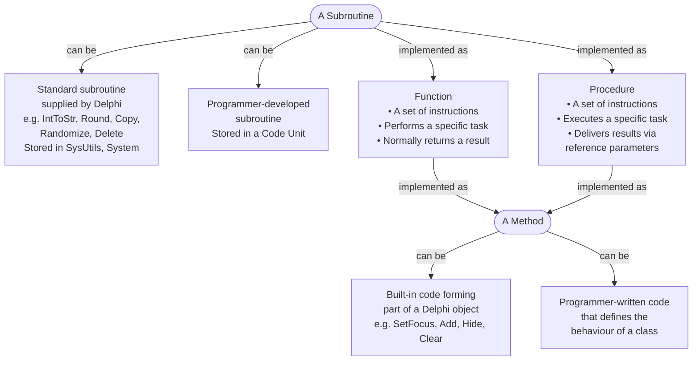
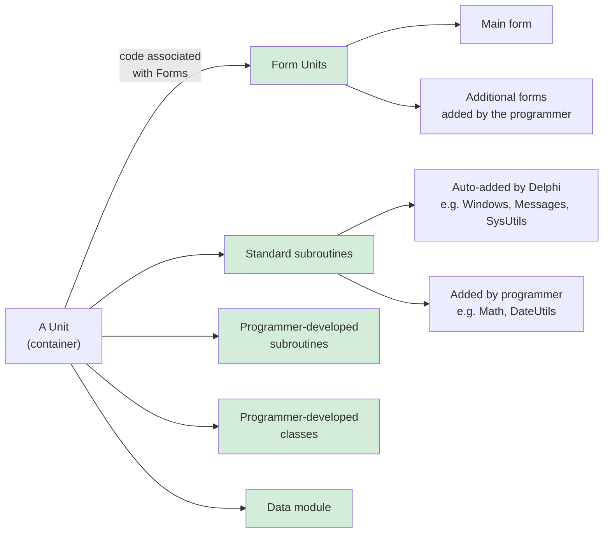

# Procedures & Functions

As programs grow, repeating the same code in multiple places becomes a maintenance problem. **Procedures** and **functions** let you write code once, name it, and call it wherever needed.

> [!NOTE] Grade 10+
> User-defined procedures and functions are introduced in Grade 10 and are extended in Grade 11 with parameter passing. Both value parameters and variable (reference) parameters are examined.

---

## Subroutines, Functions, Procedures and Methods

The diagram below shows how these terms relate to each other:



### Units — what a unit can contain



---

## Procedure vs Function — The Key Difference

| | Procedure | Function |
|---|---|---|
| **Returns a value?** | No | Yes — one value |
| **Used in expression?** | No | Yes |
| **Called how?** | As a statement | As part of an expression |
| **Keyword** | `procedure` | `function` |

```pascal
// Procedure — does something, returns nothing
procedure ShowGreeting(sName : String);
begin
  ShowMessage('Hello, ' + sName + '!');
end;

// Function — calculates and returns a value
function Square(iNum : Integer) : Integer;
begin
  Result := iNum * iNum;
end;
```

---

## Procedures — Writing and Calling

### Structure

```pascal
procedure ProcedureName(parameter1 : Type1; parameter2 : Type2);
var
  // local variables (if needed)
begin
  // code
end;
```

### Simple procedure with no parameters

```pascal
procedure TForm1.ClearOutputs;
begin
  redOutput.Lines.Clear;
  lblResult.Caption := '';
  edtInput.Text := '';
end;

// Calling it:
procedure TForm1.btnClearClick(Sender: TObject);
begin
  ClearOutputs;
end;
```

### Procedure with parameters

```pascal
procedure DisplayLine(sText : String);
begin
  redOutput.Lines.Add(sText);
end;

// Called with:
DisplayLine('Sum = ' + IntToStr(iSum));
DisplayLine('Average = ' + FloatToStrF(rAvg, ffFixed, 8, 2));
```

---

## Functions — Writing and Calling

### Structure

```pascal
function FunctionName(parameter1 : Type1) : ReturnType;
var
  // local variables (if needed)
begin
  Result := <value>;   // assign the return value to Result
end;
```

> [!NOTE] Result — the Return Value
> In Delphi, you assign the return value to the built-in identifier `Result`. The function returns whatever `Result` holds when it finishes.

### Example functions

```pascal
// Returns the larger of two integers
function Maximum(iA, iB : Integer) : Integer;
begin
  IF iA > iB THEN
    Result := iA
  ELSE
    Result := iB;
end;

// Returns True if a number is even
function IsEven(iNum : Integer) : Boolean;
begin
  Result := (iNum MOD 2 = 0);
end;

// Returns a letter grade for a mark
function GetGrade(iMark : Integer) : String;
begin
  IF iMark >= 80 THEN
    Result := 'Distinction'
  ELSE IF iMark >= 70 THEN
    Result := 'Merit'
  ELSE IF iMark >= 50 THEN
    Result := 'Pass'
  ELSE
    Result := 'Fail';
end;
```

### Calling functions

```pascal
// Function result used directly in expressions
iLarger := Maximum(iScore1, iScore2);

lblGrade.Caption := GetGrade(StrToInt(edtMark.Text));

IF IsEven(iNumber) THEN
  ShowMessage('Even number');

// Chain functions
lblMax.Caption := 'Highest: ' + IntToStr(Maximum(iA, iB));
```

---

## Parameters — Passing Values In

### Value Parameters (default)

A **copy** of the value is passed. The original variable is **not changed**.

```pascal
procedure Double(iNum : Integer);
begin
  iNum := iNum * 2;   // only changes the local copy
end;

// After calling Double(iX), iX is UNCHANGED
```

### Variable Parameters (VAR) — Pass by Reference

The **actual variable** is passed — changes inside the procedure affect the original.

```pascal
procedure Double(var iNum : Integer);
begin
  iNum := iNum * 2;   // changes the original variable
end;

// After calling Double(iX), iX IS now doubled
```

> [!WARNING] VAR Keyword Is Critical
> Without `var`, the procedure gets a copy. With `var`, it gets the real variable. The exam often tests this distinction explicitly.

```pascal
// Value parameter — original unchanged
procedure AddTen(iValue : Integer);
begin
  iValue := iValue + 10;
end;

// Variable parameter — original IS changed
procedure AddTenToReal(var iValue : Integer);
begin
  iValue := iValue + 10;
end;
```

### Multiple parameters

```pascal
function CalculateArea(iLength, iWidth : Integer) : Integer;
begin
  Result := iLength * iWidth;
end;

procedure SwapValues(var iA, iB : Integer);
var
  iTemp : Integer;
begin
  iTemp := iA;
  iA    := iB;
  iB    := iTemp;
end;
```

### Calling with VAR parameters

```pascal
var
  iX, iY : Integer;
begin
  iX := 10;
  iY := 20;
  SwapValues(iX, iY);   // iX = 20, iY = 10 after this call
end;
```

---

## Where to Declare Procedures/Functions

In a Delphi form unit, user-defined routines are declared:

1. **In the `private` or `public` section** of `TForm1` (the declaration)
2. **Below the event handlers** in the implementation section (the code)

```pascal
type
  TForm1 = class(TForm)
    btnCalc: TButton;
    // ...
  private
    function CalculateVAT(rPrice : Real) : Real;      // declare here
    procedure DisplayResults(rTotal : Real);           // declare here
  end;

implementation

// Event handler
procedure TForm1.btnCalcClick(Sender: TObject);
var
  rPrice, rVAT, rTotal : Real;
begin
  rPrice := StrToFloat(edtPrice.Text);
  rVAT   := CalculateVAT(rPrice);
  rTotal := rPrice + rVAT;
  DisplayResults(rTotal);
end;

// Your functions/procedures (below the event handlers)
function TForm1.CalculateVAT(rPrice : Real) : Real;
begin
  Result := rPrice * 0.15;   // 15% VAT
end;

procedure TForm1.DisplayResults(rTotal : Real);
begin
  lblTotal.Caption  := 'Total: R' + FloatToStrF(rTotal, ffFixed, 8, 2);
  lblVAT.Caption    := 'VAT included: R' + FloatToStrF(rTotal * 15/115, ffFixed, 8, 2);
end;
```

---

## Complete Worked Example

```pascal
// ─── Declarations (in private section of TForm1) ───────────────────
function GetLetterGrade(iMark : Integer) : String;
function IsPass(iMark : Integer) : Boolean;
procedure AnalyseMark(iMark : Integer);

// ─── Event handler ─────────────────────────────────────────────────
procedure TForm1.btnAnalyseClick(Sender: TObject);
var
  iMark : Integer;
begin
  iMark := StrToInt(edtMark.Text);
  AnalyseMark(iMark);
end;

// ─── Implementations ───────────────────────────────────────────────
function TForm1.GetLetterGrade(iMark : Integer) : String;
begin
  IF iMark >= 80 THEN       Result := 'A'
  ELSE IF iMark >= 70 THEN  Result := 'B'
  ELSE IF iMark >= 60 THEN  Result := 'C'
  ELSE IF iMark >= 50 THEN  Result := 'D'
  ELSE                      Result := 'F';
end;

function TForm1.IsPass(iMark : Integer) : Boolean;
begin
  Result := iMark >= 50;
end;

procedure TForm1.AnalyseMark(iMark : Integer);
begin
  lblGrade.Caption := 'Grade: ' + GetLetterGrade(iMark);

  IF IsPass(iMark) THEN
    lblStatus.Caption := 'PASSED'
  ELSE
    lblStatus.Caption := 'FAILED';
end;
```

---

## Value vs Reference — Side-by-Side Comparison

```pascal
// Demonstrate the difference:
procedure TForm1.btnDemoClick(Sender: TObject);
var
  iNum : Integer;
begin
  iNum := 5;

  AddTenByValue(iNum);
  lblA.Caption := IntToStr(iNum);     // still 5

  AddTenByRef(iNum);
  lblB.Caption := IntToStr(iNum);     // now 15
end;

procedure TForm1.AddTenByValue(iN : Integer);
begin
  iN := iN + 10;   // changes LOCAL copy only
end;

procedure TForm1.AddTenByRef(var iN : Integer);
begin
  iN := iN + 10;   // changes the ORIGINAL variable
end;
```

---

## Common Mistakes

> [!WARNING] Watch Out For
> 1. **Forgetting `Result :=`** — function returns garbage/zero if you forget to assign Result
> 2. **Missing `var` keyword** for reference parameter — changes won't affect the original
> 3. **Calling a function as a statement** — `CalculateVAT(rPrice);` discards the return value; assign it: `rVAT := CalculateVAT(rPrice);`
> 4. **Not declaring in the `private` section** — compiler error "Unknown identifier" when calling from an event handler
> 5. **Local variable same name as parameter** — shadowing can cause hard-to-find bugs; use distinct names

---

## Practice Exercises

**Exercise 1 — Temperature conversion**

Write a function `CelsiusToFahrenheit` that takes a Real temperature in Celsius and returns the Fahrenheit equivalent.
Formula: F = (C × 9/5) + 32

<details>
<summary>Show solution</summary>

```pascal
// In private section:
function CelsiusToFahrenheit(rCelsius : Real) : Real;

// Implementation:
function TForm1.CelsiusToFahrenheit(rCelsius : Real) : Real;
begin
  Result := (rCelsius * 9 / 5) + 32;
end;

// Calling it:
procedure TForm1.btnConvertClick(Sender: TObject);
var
  rC, rF : Real;
begin
  rC := StrToFloat(edtCelsius.Text);
  rF := CelsiusToFahrenheit(rC);
  lblFahr.Caption := FloatToStrF(rF, ffFixed, 8, 1) + '°F';
end;
```
</details>

---

**Exercise 2 — Swap using VAR**

Write a procedure `SwapIntegers` that uses VAR parameters to swap two integer values. Demonstrate it by swapping the values in two edit boxes.

<details>
<summary>Show solution</summary>

```pascal
// In private section:
procedure SwapIntegers(var iA, iB : Integer);

// Implementation:
procedure TForm1.SwapIntegers(var iA, iB : Integer);
var
  iTemp : Integer;
begin
  iTemp := iA;
  iA    := iB;
  iB    := iTemp;
end;

// Calling it:
procedure TForm1.btnSwapClick(Sender: TObject);
var
  iX, iY : Integer;
begin
  iX := StrToInt(edtA.Text);
  iY := StrToInt(edtB.Text);

  SwapIntegers(iX, iY);

  edtA.Text := IntToStr(iX);
  edtB.Text := IntToStr(iY);
end;
```
</details>

---

> [!TIP] Exam Tip
> In Paper 1, if you're asked to write a function, always check: (1) what type does it receive as parameters, (2) what type does it return, (3) is `Result` assigned in every possible code path? A function that can exit without setting `Result` will return garbage — the most common mark deduction for function questions.
