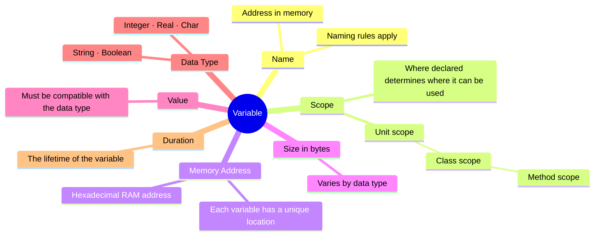

# Variables & Data Types

Before your program can store anything — a score, a name, a price — it needs a **variable**: a named slot in memory that holds a value of a specific type.

> [!NOTE] Grade 10+
> Variables and data types are introduced in Grade 10 and underpin everything in Paper 1. Naming conventions, correct type selection, and scope are all examinable.

---

## What is a Variable?

A variable is a **named memory location** that stores a value. In Delphi you must declare every variable before using it — the compiler needs to know the type so it can allocate the right amount of memory.

```pascal
var
  iAge   : Integer;   // declared — holds an integer
begin
  iAge := 16;         // assigned a value
  lblAge.Caption := IntToStr(iAge);  // used
end;
```

---

## Variable Overview

A variable has several key properties — where it is stored, what it can hold, and where in the program it can be used:



---

## Delphi Data Types

### Integer Types

| Type | Range | Memory | When to Use |
|---|---|---|---|
| `Integer` | −2 147 483 648 to 2 147 483 647 | 4 bytes | Standard whole number — use this by default |
| `ShortInt` | −128 to 127 | 1 byte | Very small numbers (rare in exams) |
| `Word` | 0 to 65 535 | 2 bytes | Unsigned small integer |
| `LongInt` | −2 147 483 648 to 2 147 483 647 | 4 bytes | Same as Integer in 32-bit Delphi |
| `Int64` | ±9.2 × 10¹⁸ | 8 bytes | Very large whole numbers |

> [!TIP] In Exams — Just Use Integer
> For whole numbers, always declare `Integer`. The other integer types are rarely tested.

### Real (Floating-Point) Types

| Type | Significant Digits | When to Use |
|---|---|---|
| `Real` | 15–16 digits | Standard decimal number — use this by default |
| `Single` | 7–8 digits | Lower precision (less common in exams) |
| `Double` | 15–16 digits | Same precision as Real in modern Delphi |

> [!TIP] In Exams — Just Use Real
> For decimal numbers, declare `Real`. Delphi's `Real` is 64-bit double precision.

### String

```pascal
var
  sName : String;      // holds any sequence of characters
  sCode : String[5];   // fixed-length string, max 5 chars
```

In most exam questions, use plain `String` (variable length). Fixed-length strings are rarely required.

### Char

```pascal
var
  cGrade : Char;    // holds exactly ONE character
```

```pascal
cGrade := 'A';
cGrade := edtGrade.Text[1];   // first character of input
```

### Boolean

```pascal
var
  bPassed : Boolean;    // holds True or False only
```

```pascal
bPassed := iMark >= 50;
IF bPassed THEN
  lblResult.Caption := 'Passed';
```

### Summary Table

| Type | Example Values | Prefix | Typical Use |
|---|---|---|---|
| `Integer` | `0`, `42`, `−7` | `i` | Counts, scores, indexes |
| `Real` | `3.14`, `99.9` | `r` | Prices, averages, measurements |
| `String` | `'Hello'`, `'Grade 10'` | `s` | Names, text, codes |
| `Char` | `'A'`, `'!'` | `c` | Single characters, menu options |
| `Boolean` | `True`, `False` | `b` | Flags, yes/no conditions |

---

## Naming Conventions (Hungarian Notation)

SA IT exams use **Hungarian notation** — a prefix letter indicates the data type. You will lose marks in Paper 1 if your naming is inconsistent.

| Prefix | Type | Example |
|---|---|---|
| `i` | Integer | `iCount`, `iScore`, `iMax` |
| `r` | Real | `rAverage`, `rPrice`, `rTotal` |
| `s` | String | `sName`, `sCode`, `sInput` |
| `c` | Char | `cGrade`, `cChoice`, `cLetter` |
| `b` | Boolean | `bFound`, `bValid`, `bPassed` |
| `a` | Array | `aScores`, `aNames` |

**Control/component names use a different prefix:**

| Prefix | Component | Example |
|---|---|---|
| `btn` | TButton | `btnCalc`, `btnClear` |
| `lbl` | TLabel | `lblResult`, `lblTotal` |
| `edt` | TEdit | `edtName`, `edtScore` |
| `red` | TRichEdit | `redOutput` |
| `mmo` | TMemo | `mmoNotes` |
| `chk` | TCheckBox | `chkRemember` |
| `rdb` | TRadioButton | `rdbMale` |
| `cmb` | TComboBox | `cmbGrade` |
| `lst` | TListBox | `lstItems` |

> [!WARNING] Naming Matters in Exams
> Examiners mark on **naming conventions**. Use the prefix system consistently. A variable holding a score should be `iScore`, not `score`, `Score`, or `x`.

---

## Declaring Variables

All variables are declared in the `var` section, **before** `begin`.

```pascal
procedure TForm1.btnCalcClick(Sender: TObject);
var
  iScore   : Integer;
  rAverage : Real;
  sName    : String;
  bPassed  : Boolean;
begin
  // code here
end;
```

### Multiple variables of the same type

```pascal
var
  i, j, iCount : Integer;      // three integers on one line
  rTotal, rAvg : Real;
```

### Constants

Use `const` for values that never change. Placed before `var`:

```pascal
const
  MAX    = 10;
  PI_VAL = 3.14159;
  TITLE  = 'IT Gateway';
var
  aScores : array[1..MAX] of Integer;
```

---

## Assignment

The **assignment operator** `:=` copies a value into a variable:

```pascal
iAge  := 16;
rPrice := 49.99;
sName  := 'Finn';
bPassed := True;

// Right side can be an expression:
iTotal := iScore1 + iScore2;
rAvg   := iTotal / 2;
sGreet := 'Hello, ' + sName + '!';
```

> [!WARNING] Assignment (:=) vs Comparison (=)
> `:=` assigns a value. `=` tests equality. Using `=` instead of `:=` is a **syntax error**.
> ```pascal
> iAge := 16;         // CORRECT — assignment ✓
> iAge = 16;          // WRONG — this is not valid Pascal ❌
> IF iAge = 16 THEN   // CORRECT — comparison in condition ✓
> ```

---

## Scope — Where Variables Live

A variable declared inside a procedure **only exists inside that procedure**. It is created when the procedure starts and destroyed when it ends.

```pascal
procedure TForm1.btnAClick(Sender: TObject);
var
  iTemp : Integer;
begin
  iTemp := 5;   // iTemp exists here
end;

procedure TForm1.btnBClick(Sender: TObject);
begin
  // iTemp does NOT exist here — compiler error if you try to use it
end;
```

### Form-Level Variables (Global to the Form)

Declare in the `private` or `public` section of `TForm1` to share between procedures:

```pascal
type
  TForm1 = class(TForm)
    // components auto-added here
  private
    iClickCount : Integer;   // accessible by ALL procedures in this unit
    aScores : array[1..10] of Integer;
  end;
```

> [!TIP] When to Use Form-Level Variables
> Use them when data needs to **persist between button clicks** or be **shared across procedures**. For example: load an array in one button, process it in another. The array must be declared at form level, not inside a procedure.

---

## Default Values

Delphi does **not** automatically initialise local variables. They may contain garbage values.

```pascal
var
  iSum : Integer;
begin
  // iSum could be anything here — DO NOT rely on it being 0
  iSum := 0;   // always initialise before use
  // ... rest of code
end;
```

> [!WARNING] Always Initialise
> - Accumulators (sum, count): set to `0`
> - Maximum trackers: set to `aArray[1]` or an appropriately small value
> - Minimum trackers: set to `aArray[1]` or an appropriately large value
> - Boolean flags: set to `False` (or `True` depending on the algorithm)

---

## Typed Constants (Value That Can Change)

```pascal
const
  iRunCount : Integer = 0;  // typed constant — can be modified at runtime
```

Rarely tested but good to know.

---

## Practice Exercises

**Exercise 1 — Variable declaration and assignment**

Declare appropriate variables and write code to:
- Store the mark `87` in an integer variable
- Store the average `73.5` in a real variable
- Store the name `'Alice'` in a string variable
- Calculate whether the mark is a pass (≥ 50) and store in a boolean
- Display all four values in `redOutput`

<details>
<summary>Show solution</summary>

```pascal
procedure TForm1.btnDisplayClick(Sender: TObject);
var
  iMark   : Integer;
  rAvg    : Real;
  sName   : String;
  bPassed : Boolean;
begin
  iMark   := 87;
  rAvg    := 73.5;
  sName   := 'Alice';
  bPassed := iMark >= 50;

  redOutput.Lines.Clear;
  redOutput.Lines.Add('Name:    ' + sName);
  redOutput.Lines.Add('Mark:    ' + IntToStr(iMark));
  redOutput.Lines.Add('Average: ' + FloatToStrF(rAvg, ffFixed, 8, 1));
  IF bPassed THEN
    redOutput.Lines.Add('Status:  Passed')
  ELSE
    redOutput.Lines.Add('Status:  Failed');
end;
```
</details>

---

**Exercise 2 — Identify the mistake**

What is wrong with each of these declarations/assignments?

```pascal
// Line A
var grade : String;

// Line B  
iScore = 85;

// Line C
var rTotal : Integer;
rTotal := 3.14;

// Line D
var
  bActive : Boolean;
IF bActive = True THEN  // used without initialising
```

<details>
<summary>Show solution</summary>

- **Line A**: Variable name `grade` has no type prefix — should be `sGrade : String`
- **Line B**: Uses `=` instead of `:=` for assignment — should be `iScore := 85`
- **Line C**: `rTotal` is declared as `Integer` but assigned a Real value (`3.14`) — type mismatch; should be `rTotal : Real`
- **Line D**: `bActive` is never initialised — it may contain garbage. Should add `bActive := False;` (or `True`) before the IF
</details>

---

> [!TIP] Exam Tip
> The most common variable-related marks lost in Paper 1 are: wrong naming convention (no prefix or wrong prefix), using `=` instead of `:=`, and not initialising accumulator variables. Get these right automatically and you pick up easy marks.
