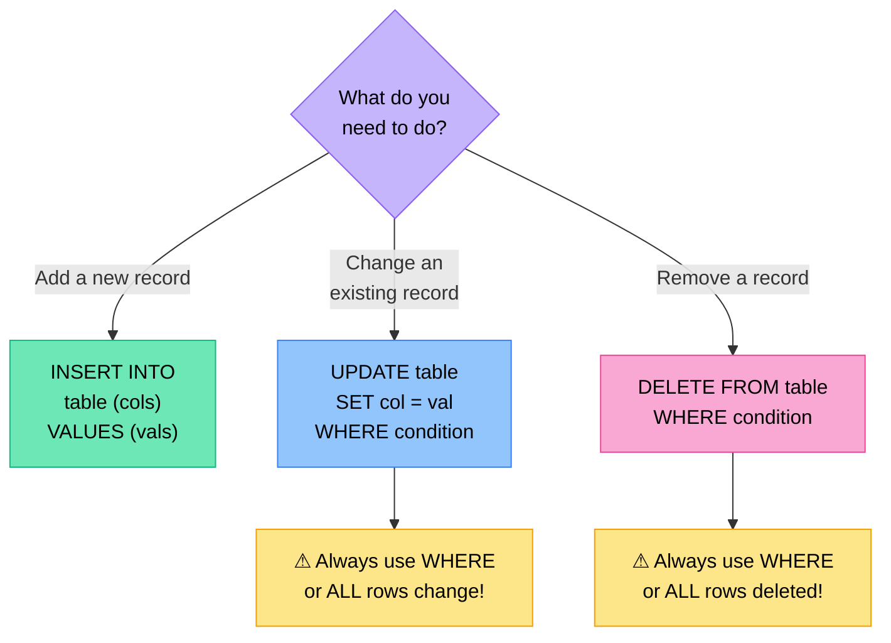

# Data Manipulation — INSERT, UPDATE, DELETE

SELECT retrieves data. But databases also need to receive new data, update existing records, and remove records that are no longer needed. These three operations — INSERT, UPDATE, DELETE — are called Data Manipulation Language (DML).

---

## The Three DML Commands

| Command | Purpose |
|---|---|
| `INSERT` | Add new rows to a table |
| `UPDATE` | Modify existing rows |
| `DELETE` | Remove rows from a table |



---

## INSERT — Adding New Rows

### Syntax

```sql
INSERT INTO TableName (col1, col2, col3, ...)
VALUES (val1, val2, val3, ...);
```

The columns and values must match — same number, same order.

### Examples

```sql
-- Add a new student
INSERT INTO Students (StudentID, FirstName, Surname, Grade, Email)
VALUES (1010, 'Thabo', 'Nkosi', 12, 'thabo@school.co.za');

-- Columns can be omitted if providing values for ALL columns in table order
INSERT INTO Students
VALUES (1011, 'Zanele', 'Dlamini', 11, 'zanele@school.co.za');

-- Omit optional fields (they must accept NULL or have a default)
INSERT INTO Students (FirstName, Surname, Grade)
VALUES ('Keiran', 'Botha', 10);
```

### String values vs numeric values

```sql
-- Strings in single quotes
INSERT INTO Students (FirstName, Surname, Grade, Active)
VALUES ('Thabo', 'Nkosi', 12, TRUE);
--      ^^^^^^   ^^^^^^  ^^  ^^^^
--      string   string  num boolean
```

> [!WARNING] Text needs quotes, numbers don't
> `VALUES ('Thabo', 12)` ✓ — string in quotes, number without  
> `VALUES (Thabo, '12')` ✗ — both wrong

---

## UPDATE — Modifying Existing Rows

### Syntax

```sql
UPDATE TableName
SET col1 = val1, col2 = val2
WHERE condition;
```

> [!WARNING] ALWAYS include WHERE with UPDATE
> `UPDATE Students SET Grade = 12` — changes ALL students' grade to 12!  
> Always specify which rows to update.

### Examples

```sql
-- Update one student's email
UPDATE Students
SET Email = 'new.email@school.co.za'
WHERE StudentID = 1010;

-- Update multiple fields at once
UPDATE Students
SET Grade = 12, Email = 'thabo.gr12@school.co.za'
WHERE StudentID = 1010;

-- Increase all marks by 5
UPDATE Marks
SET Mark = Mark + 5
WHERE SubjectCode = 'IT';

-- Update all Grade 11 students to Grade 12 (end of year promotion)
UPDATE Students
SET Grade = 12
WHERE Grade = 11;

-- Set email to NULL where not provided
UPDATE Students
SET Email = NULL
WHERE Email = '';
```

### UPDATE with a user-supplied variable in Delphi

When the new value comes from a variable rather than a literal, concatenate it into the SQL string. The conversion function depends on the variable's data type — the result goes directly into the SQL with no quotes, because it is a number.

| Variable type | Conversion function | Example |
|---|---|---|
| `Integer` | `IntToStr(n)` | `'SET Mark = Mark + ' + IntToStr(nBonus)` |
| `Real` / `Double` | `FloatToStr(r)` | `'SET WeeklyRent = WeeklyRent * ' + FloatToStr(rFactor)` |

```pascal
// Increase all Coffee stall rents by a user-entered percentage
// rPercent is a Real variable already read from an edit box or InputBox
qry.SQL.Text := 'UPDATE tblStalls ' +
                'SET WeeklyRent = WeeklyRent * (1 + ' + FloatToStr(rPercent) + ' / 100) ' +
                'WHERE Category = "Coffee"';
qry.ExecSQL;

// Add a whole-number bonus to all Grade 12 marks
// nBonus is an Integer variable
qry.SQL.Text := 'UPDATE tblStudents ' +
                'SET Mark = Mark + ' + IntToStr(nBonus) + ' ' +
                'WHERE Grade = 12';
qry.ExecSQL;
```

> [!NOTE]
> `Round()` and `IntToStr()` are both accepted alternatives where a Real value only needs whole-number precision. Use `FloatToStr()` when the variable is declared as `Real`, `Double`, or `Currency` and you need to preserve decimal places in the calculation.

---

## DELETE — Removing Rows

### Syntax

```sql
DELETE FROM TableName
WHERE condition;
```

> [!WARNING] ALWAYS include WHERE with DELETE
> `DELETE FROM Students` — deletes EVERY student in the table!  
> Always double-check your WHERE condition before running DELETE.

### Examples

```sql
-- Delete one student
DELETE FROM Students
WHERE StudentID = 1010;

-- Delete all marks below 0 (invalid data cleanup)
DELETE FROM Marks
WHERE Mark < 0;

-- Delete all records for a specific subject
DELETE FROM Marks
WHERE SubjectCode = 'OLD_SUBJ';
```

---

## Practice Exercises

### Exercise 1 — Add new records

Given this Students table:

| StudentID | FirstName | Surname | Grade |
|---|---|---|---|
| 1001 | Thabo | Nkosi | 12 |
| 1002 | Zanele | Dlamini | 11 |

Write SQL to:  
a) Add a new student: Keiran Botha, Grade 10, StudentID 1003  
b) Add another student: Amahle Sithole, Grade 11, StudentID 1004

<details>
<summary>Solution</summary>

```sql
-- a)
INSERT INTO Students (StudentID, FirstName, Surname, Grade)
VALUES (1003, 'Keiran', 'Botha', 10);

-- b)
INSERT INTO Students (StudentID, FirstName, Surname, Grade)
VALUES (1004, 'Amahle', 'Sithole', 11);
```
</details>

---

### Exercise 2 — Update records

Write SQL to:  
a) Change Zanele Dlamini's grade to 12  
b) Add 10 marks to all marks in the Marks table where the subject is 'IT'  
c) Set all blank email fields to `'noemail@school.co.za'`

<details>
<summary>Solution</summary>

```sql
-- a)
UPDATE Students
SET Grade = 12
WHERE FirstName = 'Zanele' AND Surname = 'Dlamini';

-- b)
UPDATE Marks
SET Mark = Mark + 10
WHERE Subject = 'IT';

-- c)
UPDATE Students
SET Email = 'noemail@school.co.za'
WHERE Email IS NULL OR Email = '';
```
</details>

---

### Exercise 3 — Delete records

Write SQL to:  
a) Delete the student with StudentID = 1003  
b) Delete all marks where the mark is NULL  
c) Delete all marks below 0

<details>
<summary>Solution</summary>

```sql
-- a)
DELETE FROM Students
WHERE StudentID = 1003;

-- b)
DELETE FROM Marks
WHERE Mark IS NULL;

-- c)
DELETE FROM Marks
WHERE Mark < 0;
```
</details>

---

## Common Mistakes

| Mistake | Consequence | Fix |
|---|---|---|
| UPDATE without WHERE | Updates every row in the table | Always specify WHERE |
| DELETE without WHERE | Deletes every row | Always specify WHERE |
| Wrong quotes on strings | Syntax error | Text → 'quotes', numbers → no quotes |
| Column count mismatch | Syntax error | Count columns = count values |
