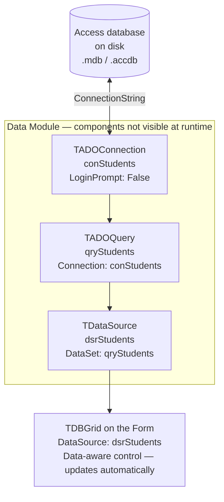

# Delphi & Databases

In the Grade 12 exam you connect a Delphi application to a Microsoft Access database and use code to query, display, and update data. All SQL runs as a text string assigned to a query component's `SQL.Text` property, then executed with either `Open` (SELECT) or `ExecSQL` (INSERT, UPDATE, DELETE).

> [!NOTE] Grade 11–12
> Database integration with Delphi is a Grade 12 CAPS topic. You must be able to set up the ADO components, write dynamic SQL strings, loop through results, and perform all four CRUD operations.

---

## Component Setup (Design Time)

Two non-visual ADO components do all the work. Drop them on the form and configure them in the Object Inspector — no code needed for the connection itself.

### TADOConnection

| Property | Value to set |
|---|---|
| `Name` | `adoConn` (or any meaningful name) |
| `ConnectionString` | Path to your `.mdb` or `.accdb` file — click **Build…** to use the wizard |
| `LoginPrompt` | `False` — prevents a password dialog appearing at runtime |

**ConnectionString wizard steps:**
1. Click the `...` button on `ConnectionString`
2. Choose **Microsoft Jet 4.0 OLE DB Provider** (`.mdb`) or **Microsoft ACE OLEDB 12.0** (`.accdb`)
3. Browse to the database file
4. Click **Test Connection** → OK

### TADOQuery

| Property | Value to set |
|---|---|
| `Name` | `qryStudents`, `qryActivity`, etc. — prefix `qry` is the convention |
| `Connection` | Select your `TADOConnection` component from the drop-down |
| `SQL.Text` | Optionally set a default SELECT at design time |

### TDataSource and TDBGrid (for display)

If you want results to appear automatically in a grid:

| Component | Property | Value |
|---|---|---|
| `TDataSource` | `DataSet` | Your `TADOQuery` component |
| `TDBGrid` | `DataSource` | Your `TDataSource` component |

Once this chain is in place, every time you call `qryStudents.Open` the grid updates automatically.

### Component chain diagram



---

## Running a SELECT Query

Use `Open` to run any SELECT statement. If the query is already open, close it first or you will get a runtime error.

```pascal
// First time — query is not yet open
qryActivity.SQL.Text := 'SELECT * FROM tblActivity ORDER BY ActivityName';
qryActivity.Open;
```

```pascal
// Query is already open — close it first
qryActivity.Close;
qryActivity.SQL.Text := 'SELECT * FROM tblActivity WHERE CompanyID = ' + QuotedStr(sID);
qryActivity.Open;
```

> [!WARNING] Always close before changing SQL.Text
> Setting `SQL.Text` on an open query causes a runtime error. Calling `Close` on a query that is already closed is safe — it does nothing.

---

## Reading Field Values

After `Open`, the query is positioned on the first record. Access any field by name using bracket notation or `FieldByName`.

### Bracket notation (most common in exams)

```pascal
sName    := qryActivity['ActivityName'];
iTickets := qryActivity['TicketsSold'];
rCost    := qryActivity['RentingCost'];
```

No type conversion is needed when assigning to a `String` variable or populating a `ComboBox`. The bracket syntax returns the raw field value.

### FieldByName (also valid)

```pascal
sName    := qryActivity.FieldByName('ActivityName').AsString;
iTickets := qryActivity.FieldByName('TicketsSold').AsInteger;
rCost    := qryActivity.FieldByName('RentingCost').AsFloat;
```

Both approaches work — use whichever the question or your teacher requires.

---

## Getting a Record Count

`RecordCount` returns the number of rows the query retrieved.

```pascal
qryLearners.SQL.Text := 'SELECT * FROM tblLearners WHERE Grade = 11';
qryLearners.Open;
iNum := qryLearners.RecordCount;
lblCount.Caption := 'Learners in Grade 11: ' + IntToStr(iNum);
```

> [!TIP]
> `RecordCount` is only meaningful after `Open`. Also note that `SELECT COUNT(*) AS Total ...` returns a single row with the count as a field — use `qry['Total']` to read it.

---

## Looping Through Records

Use `First`, `Eof`, and `Next` to visit every record in the result set.

```pascal
qryActivity.First;
while not qryActivity.Eof do
begin
  lstOutput.Items.Add(qryActivity['ActivityName']);
  qryActivity.Next;   // MUST be here — moves to the next record
end;
```

A more complete example that builds a formatted list:

```pascal
qryActivity.Close;
qryActivity.SQL.Text := 'SELECT * FROM tblActivity ORDER BY ActivityName';
qryActivity.Open;

lstOutput.Clear;
qryActivity.First;
while not qryActivity.Eof do
begin
  lstOutput.Items.Add(qryActivity['ActivityName'] + ' — R' + qryActivity['TicketCost']);
  qryActivity.Next;
end;
```

> [!WARNING] Never forget qryActivity.Next
> Omitting `Next` at the bottom of the loop means `Eof` is never reached — the loop runs forever and freezes the application.

---

## User Input in SQL Strings

Dynamic queries are built by concatenating user input into the SQL string. The quoting rules depend on the data type of the field.

### String field — two valid options

```pascal
// Option 1: QuotedStr (recommended — handles apostrophes automatically)
sInput := InputBox('Search', 'Enter company name', '');
qryCompany.SQL.Text := 'SELECT * FROM tblCompany WHERE CompanyName = ' + QuotedStr(sInput);

// Option 2: manual double-quote delimiters (Access SQL style)
qryCompany.SQL.Text := 'SELECT * FROM tblCompany WHERE CompanyName = "' + sInput + '"';
```

### Number field — no quotes at all

```pascal
// Store as a string to avoid manual conversion — just concatenate directly
sGrade := InputBox('Grade', 'Enter grade number', '');
qryLearners.SQL.Text := 'SELECT * FROM tblLearners WHERE Grade = ' + sGrade;
```

### Date field — wrap in `#` delimiters

```pascal
sDate := DateToStr(dtpDate.Date);
qryCompany.SQL.Text := 'SELECT * FROM tblCompany WHERE RegDate < #' + sDate + '#';
```

### Boolean field — use BoolToStr

```pascal
bRestricted := chkAgeRestriction.Checked;
qryActivity.SQL.Text := 'SELECT * FROM tblActivity WHERE AgeRestriction = ' + BoolToStr(bRestricted);
```

> [!WARNING] Quoting rules summary
> - **String** → `"value"` or `QuotedStr(value)` — double quotes inside the SQL string, or use `QuotedStr`
> - **Number** → no quotes — just concatenate the digits
> - **Date** → `#date#` — hash symbols, not quotes
> - **Boolean** → no quotes — `True` or `False` as a bare word

---

## INSERT, UPDATE, DELETE

These statements do not return a result set. Use `ExecSQL` instead of `Open`.

### INSERT — adding a new record

```pascal
qryActivity.SQL.Text := 'INSERT INTO tblActivity (ActivityName, CompanyID, TicketCost) ' +
                        'VALUES ("' + edtName.Text + '", "' + edtCompID.Text + '", ' +
                        edtCost.Text + ')';
qryActivity.ExecSQL;
```

### UPDATE — changing existing records

```pascal
qryActivity.SQL.Text := 'UPDATE tblActivity SET TicketCost = ' + edtCost.Text +
                        ' WHERE ActivityID = ' + QuotedStr(edtID.Text);
qryActivity.ExecSQL;
```

### DELETE — removing a record

```pascal
qryActivity.SQL.Text := 'DELETE FROM tblActivity WHERE ActivityID = ' + QuotedStr(edtID.Text);
qryActivity.ExecSQL;
```

### Refreshing the DBGrid after a change

After `ExecSQL`, the grid still shows the old data. Re-run the display query to update it.

```pascal
// After INSERT/UPDATE/DELETE:
qryActivity.ExecSQL;

// Refresh the grid
qryDisplay.Close;
qryDisplay.SQL.Text := 'SELECT * FROM tblActivity ORDER BY ActivityName';
qryDisplay.Open;
```

> [!TIP]
> It is common practice to use a separate `TADOQuery` for INSERT/UPDATE/DELETE (`qryEdit`) and a different one for the display grid (`qryDisplay`). This keeps them independent and makes refreshing simpler.

---

## Displaying Aggregate Results in a Label

When your SQL uses `COUNT`, `SUM`, `AVG`, `MIN`, or `MAX`, the query returns a single row. Give the aggregate an alias and read it with bracket notation.

```pascal
// Average ticket cost
qryActivity.Close;
qryActivity.SQL.Text := 'SELECT AVG(TicketCost) AS AvgCost FROM tblActivity';
qryActivity.Open;
lblResult.Caption := 'Average cost: ' + FloatToStrF(qryActivity['AvgCost'], ffCurrency, 10, 2);
```

```pascal
// Count how many activities have age restriction
qryActivity.Close;
qryActivity.SQL.Text := 'SELECT COUNT(*) AS Total FROM tblActivity WHERE AgeRestriction = True';
qryActivity.Open;
lblCount.Caption := 'Restricted activities: ' + IntToStr(qryActivity['Total']);
```

```pascal
// Total tickets sold
qryActivity.Close;
qryActivity.SQL.Text := 'SELECT SUM(TicketsSold) AS GrandTotal FROM tblActivity';
qryActivity.Open;
lblTotal.Caption := 'Total tickets sold: ' + IntToStr(qryActivity['GrandTotal']);
```

---

## Common Mistakes

| Mistake | What goes wrong | Fix |
|---|---|---|
| Setting `SQL.Text` without calling `Close` first | Runtime error — cannot change SQL on an open query | Always call `qry.Close` before changing `SQL.Text` |
| Using `Open` for INSERT, UPDATE, or DELETE | Runtime error — these statements return no result set | Use `qry.ExecSQL` for all non-SELECT statements |
| Using `ExecSQL` for SELECT | No records are loaded — the grid stays empty | Use `qry.Open` for SELECT statements |
| Forgetting `qry.Next` inside the while loop | Infinite loop — the program freezes | `qry.Next` must be the last line inside the `while not qry.Eof` block |
| Putting string values without quotes in the SQL string | Access rejects the query with a syntax error | Wrap strings in `"..."` or use `QuotedStr()` |
| Using `'` (single quotes) around string values inside the SQL | Access SQL uses `"` for string delimiters, not `'` | Use double quotes inside the SQL string, or use `QuotedStr` (which adds single quotes Delphi-side but the result is compatible) |

---

## Key Terms

| Term | Meaning |
|---|---|
| `TADOConnection` | Component that holds the connection string to the database file |
| `TADOQuery` | Component that runs SQL and holds the returned records |
| `SQL.Text` | Property where the SQL statement is stored as a string |
| `Open` | Method — executes a SELECT query and loads the result set |
| `ExecSQL` | Method — executes INSERT, UPDATE, or DELETE (no result set returned) |
| `Close` | Method — closes the query and releases the result set |
| `RecordCount` | Property — number of rows returned by the last `Open` |
| `First` | Method — moves the current position to the first record |
| `Next` | Method — advances the current position by one record |
| `Eof` | Property — `True` when the current position is past the last record |
| `FieldByName` | Method — returns a field object by name; use `.AsString`, `.AsInteger`, `.AsFloat` |
| `QuotedStr` | Delphi function — wraps a string in single quotes for safe SQL embedding |
| `BoolToStr` | Delphi function — converts a Boolean to `'True'` or `'False'` |
| `DateToStr` | Delphi function — converts a `TDate` to a string for use in SQL |

---

## Exam Focus

The following question types appear regularly in Grade 12 Paper 1. Practice each one until the pattern is automatic.

**1. Open a query and count the records**

> Write code to count how many activities in `tblActivity` have a ticket cost greater than R50. Display the count in `lblCount`.

```pascal
qryActivity.Close;
qryActivity.SQL.Text := 'SELECT * FROM tblActivity WHERE TicketCost > 50';
qryActivity.Open;
lblCount.Caption := IntToStr(qryActivity.RecordCount);
```

**2. Loop through records and populate a list box**

> Write code to add the name and ticket cost of every activity to `lstActivity`, one per line.

```pascal
qryActivity.Close;
qryActivity.SQL.Text := 'SELECT * FROM tblActivity ORDER BY ActivityName';
qryActivity.Open;

lstActivity.Clear;
qryActivity.First;
while not qryActivity.Eof do
begin
  lstActivity.Items.Add(qryActivity['ActivityName'] + ' — R' + qryActivity['TicketCost']);
  qryActivity.Next;
end;
```

**3. Filter using user input from an edit box**

> The user types a company ID into `edtCompID`. Write code to display all activities for that company in the DBGrid (linked to `qryDisplay`).

```pascal
qryDisplay.Close;
qryDisplay.SQL.Text := 'SELECT * FROM tblActivity WHERE CompanyID = "' + edtCompID.Text + '"';
qryDisplay.Open;
```

**4. Display an aggregate value in a label**

> Write code to calculate and display the average ticket cost of all activities in `lblAverage`.

```pascal
qryActivity.Close;
qryActivity.SQL.Text := 'SELECT AVG(TicketCost) AS AvgCost FROM tblActivity';
qryActivity.Open;
lblAverage.Caption := FloatToStrF(qryActivity['AvgCost'], ffCurrency, 10, 2);
```

**5. INSERT a new record and refresh the grid**

> The user fills in `edtName` (activity name) and `edtCost` (ticket cost). Write code to insert the new record and refresh `qryDisplay`.

```pascal
qryActivity.SQL.Text := 'INSERT INTO tblActivity (ActivityName, TicketCost) ' +
                        'VALUES ("' + edtName.Text + '", ' + edtCost.Text + ')';
qryActivity.ExecSQL;

qryDisplay.Close;
qryDisplay.SQL.Text := 'SELECT * FROM tblActivity ORDER BY ActivityName';
qryDisplay.Open;
```
