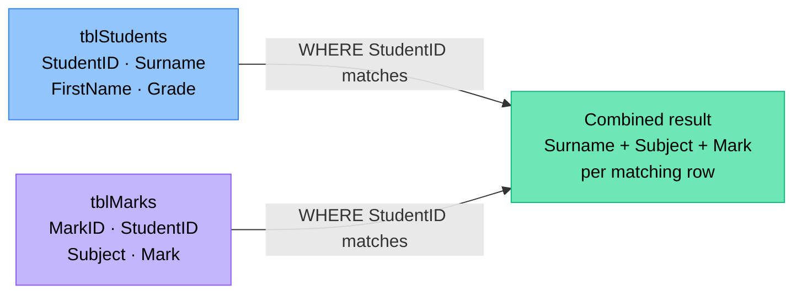

# Multi-Table Queries

Real databases split data across multiple tables to avoid duplication. A school database, for example, stores student details in one table and mark details in another. When you need information from both — such as a student's name alongside the subjects they take — you must query both tables at the same time. The two tables are linked by a common field: the **primary key** in one table matches a **foreign key** in the other. Your SQL tells Access which field forms that link, and Access combines the rows for you.

> [!NOTE] Grade 12
> Multi-table queries involving two tables are a Grade 12 CAPS topic. Expect at least one in every Paper 1 exam.

---

## How It Works



Four rules cover every multi-table query you will write:

- List **all tables** in the `FROM` clause, separated by a comma.
- Write the **relationship condition** in `WHERE` using `table1.field = table2.field` — this tells Access how the tables are connected.
- Any **extra filter conditions** go after the relationship condition, joined with `AND`.
- When the **same field name exists in more than one table**, always prefix it with the table name: `tblStudents.StudentID`, not just `StudentID`.

---

## Basic Syntax

```sql
SELECT table1.Field1, table2.Field2
FROM table1, table2
WHERE table1.LinkField = table2.LinkField
```

Replace `LinkField` with the actual primary key / foreign key pair that connects the two tables.

---

## Worked Example — School Database

**Tables:**

<div class="itg-erd-wrap">
  <div class="itg-erd-table">
    <div class="itg-erd-thead gr12">tblStudents</div>
    <div class="itg-erd-row"><span class="itg-erd-pk">PK</span> StudentID</div>
    <div class="itg-erd-row">Surname</div>
    <div class="itg-erd-row">FirstName</div>
    <div class="itg-erd-row">Grade</div>
  </div>
  <div class="itg-erd-connector">
    <div class="itg-erd-line"></div>
    <div class="itg-erd-rel">1 : M</div>
    <div style="font-size:0.65rem;color:var(--vp-c-text-2);text-align:center;margin-top:0.3rem">linked by<br>StudentID</div>
  </div>
  <div class="itg-erd-table">
    <div class="itg-erd-thead gr12">tblMarks</div>
    <div class="itg-erd-row"><span class="itg-erd-pk">PK</span> MarkID</div>
    <div class="itg-erd-row"><span class="itg-erd-fk">FK</span> StudentID</div>
    <div class="itg-erd-row">Subject</div>
    <div class="itg-erd-row">Mark</div>
  </div>
</div>

The two tables are linked by `StudentID`. It is the primary key in `tblStudents` and the foreign key in `tblMarks`.

**Query:** Show the surname, subject, and mark for every mark record.

```sql
SELECT tblStudents.Surname, tblMarks.Subject, tblMarks.Mark
FROM tblStudents, tblMarks
WHERE tblStudents.StudentID = tblMarks.StudentID
```

**Reading the query step by step:**

| Part | What it does |
|---|---|
| `SELECT tblStudents.Surname, tblMarks.Subject, tblMarks.Mark` | Choose the columns to display, prefixed with their table names |
| `FROM tblStudents, tblMarks` | Tell Access both tables are needed |
| `WHERE tblStudents.StudentID = tblMarks.StudentID` | Define the link — only combine rows where StudentID matches across both tables |

---

## In Delphi

SQL is written as a string and assigned to `qryData.SQL.Text`. Open the query with `.Open` to run a SELECT.

```pascal
qryData.Close;
qryData.SQL.Clear;
qryData.SQL.Text := 'SELECT tblStudents.Surname, tblMarks.Subject, tblMarks.Mark ' +
                    'FROM tblStudents, tblMarks ' +
                    'WHERE tblStudents.StudentID = tblMarks.StudentID';
qryData.Open;
```

> [!TIP]
> Each string segment in the concatenation must end with a **space before the closing quote**, or the keywords from different lines will run together (e.g. `...tblMarksWHERE...`).

---

## Adding Extra Filter Conditions

Place extra conditions **after** the relationship condition using `AND`. The relationship condition always comes first.

**Query:** Show the surname, subject, and mark where the mark is below 50.

```sql
SELECT tblStudents.Surname, tblMarks.Subject, tblMarks.Mark
FROM tblStudents, tblMarks
WHERE tblStudents.StudentID = tblMarks.StudentID
AND tblMarks.Mark < 50
```

In Delphi:

```pascal
qryData.Close;
qryData.SQL.Clear;
qryData.SQL.Text := 'SELECT tblStudents.Surname, tblMarks.Subject, tblMarks.Mark ' +
                    'FROM tblStudents, tblMarks ' +
                    'WHERE tblStudents.StudentID = tblMarks.StudentID ' +
                    'AND tblMarks.Mark < 50';
qryData.Open;
```

---

## When to Prefix Field Names

**Rule:** If a field name appears in **only one** of the queried tables, the prefix is optional but strongly recommended. If the same field name appears in **more than one** table, the prefix is **required** — Access cannot tell which table you mean, and the query will fail with an ambiguous field error.

In the school database, `StudentID` exists in both `tblStudents` and `tblMarks`. You must always write `tblStudents.StudentID` or `tblMarks.StudentID` — never just `StudentID`.

**Good habit:** prefix every field name in a multi-table query, regardless of whether it is ambiguous. This makes your intent clear and prevents errors when table structures change.

```sql
-- Correct — every field is prefixed
SELECT tblStudents.Surname, tblMarks.Subject
FROM tblStudents, tblMarks
WHERE tblStudents.StudentID = tblMarks.StudentID

-- Will cause an error — StudentID is ambiguous
SELECT Surname, Subject
FROM tblStudents, tblMarks
WHERE StudentID = StudentID
```

---

## With User Input

When the user types a value that will be included in the SQL string, store it in a variable and concatenate it in. For text fields, wrap the value in `QuotedStr()` to add the required single quotes around it.

**Query:** Ask the user for a subject name and show only that subject's records.

```pascal
var
  sSubject: string;
begin
  sSubject := InputBox('Subject', 'Enter subject name', '');
  qryData.Close;
  qryData.SQL.Clear;
  qryData.SQL.Text := 'SELECT tblStudents.Surname, tblMarks.Mark ' +
                      'FROM tblStudents, tblMarks ' +
                      'WHERE tblStudents.StudentID = tblMarks.StudentID ' +
                      'AND tblMarks.Subject = ' + QuotedStr(sSubject);
  qryData.Open;
end;
```

`QuotedStr(sSubject)` wraps the value in single quotes, producing SQL like:

```sql
AND tblMarks.Subject = 'Mathematics'
```

For numeric fields, do not use `QuotedStr` — concatenate the number directly:

```pascal
'AND tblMarks.Mark < ' + IntToStr(nLimit)
```

---

## Common Mistakes

| Mistake | What happens | Fix |
|---|---|---|
| Forgetting the relationship condition in `WHERE` entirely | Access combines every row from table 1 with every row from table 2 — a **Cartesian product**. If `tblStudents` has 30 rows and `tblMarks` has 180, you get 5 400 rows of garbage. | Always include `WHERE table1.PK = table2.FK` |
| Omitting the table prefix when the field name exists in both tables | Access returns an "ambiguous field name" error and the query does not run | Prefix every field with its table name |
| Writing the extra filter condition **before** the relationship condition | The query may still run but is harder to read and can cause logic errors with complex conditions | Write the relationship condition first, then `AND` for each filter |
| Forgetting a space at the end of a string segment in Delphi | Keywords merge across lines: `...tblMarksWHERE...` — Access returns a syntax error | End each string segment with a space before the closing quote |
| Using a field from the wrong table | Results may be incorrect or the query may fail | Know which table owns each field; check the database design |

---

## Key Terms

| Term | Meaning |
|---|---|
| **Primary key (PK)** | A field that uniquely identifies each record in a table — e.g. `StudentID` in `tblStudents` |
| **Foreign key (FK)** | A field in one table that stores the primary key value of a related record in another table — e.g. `StudentID` in `tblMarks` |
| **Relationship condition** | The `WHERE` clause expression that links two tables: `tblStudents.StudentID = tblMarks.StudentID` |
| **Cartesian product** | The result when no relationship condition is given — every row from table 1 is combined with every row from table 2, producing meaningless data |
| **Ambiguous field name** | An error caused by using a field name that exists in more than one of the queried tables without specifying which table it belongs to |
| **QuotedStr()** | A Delphi function that wraps a string in single quotes so it can be embedded safely in a SQL string |

---

## Exam Focus

**1.** A database has two tables: `tblStudent` (StudentID PK, Surname, Grade) and `tblMark` (MarkID PK, StudentID FK, Subject, Mark). Write a SQL query to show the surname, subject, and mark for all students in Grade 12.

<details>
<summary>Show answer</summary>

```sql
SELECT tblStudent.Surname, tblMark.Subject, tblMark.Mark
FROM tblStudent, tblMark
WHERE tblStudent.StudentID = tblMark.StudentID
AND tblStudent.Grade = 12
```
</details>

---

**2.** Using the same tables, write the Delphi code to run the query above and display results in a `DBGrid` connected to `qryMarks`. Assume the query component is already linked to the database.

<details>
<summary>Show answer</summary>

```pascal
qryMarks.Close;
qryMarks.SQL.Clear;
qryMarks.SQL.Text := 'SELECT tblStudent.Surname, tblMark.Subject, tblMark.Mark ' +
                     'FROM tblStudent, tblMark ' +
                     'WHERE tblStudent.StudentID = tblMark.StudentID ' +
                     'AND tblStudent.Grade = 12';
qryMarks.Open;
```

The `DBGrid` updates automatically when the query is opened, provided its `DataSource` is linked to `qryMarks`.
</details>

---

**3.** A learner writes the following query. Identify the error and explain what result it would produce.

```sql
SELECT Surname, Subject, Mark
FROM tblStudent, tblMark
```

<details>
<summary>Show answer</summary>

Two errors: (1) The `WHERE` clause with the relationship condition is missing entirely, so Access produces a Cartesian product — every student row is combined with every mark row, producing a meaningless result with many duplicate rows. (2) If `StudentID` or any other field name exists in both tables, the query will also fail with an ambiguous field name error. The fix is to add `WHERE tblStudent.StudentID = tblMark.StudentID` and prefix all field names with their table names.
</details>

---

**4.** Write a SQL query that asks the user to type a subject name and then displays the surname and mark of every student who took that subject. Use `InputBox` and `QuotedStr` in your Delphi code.

<details>
<summary>Show answer</summary>

```pascal
var
  sSubject: string;
begin
  sSubject := InputBox('Subject', 'Enter subject name', '');
  qryMarks.Close;
  qryMarks.SQL.Clear;
  qryMarks.SQL.Text := 'SELECT tblStudent.Surname, tblMark.Mark ' +
                       'FROM tblStudent, tblMark ' +
                       'WHERE tblStudent.StudentID = tblMark.StudentID ' +
                       'AND tblMark.Subject = ' + QuotedStr(sSubject);
  qryMarks.Open;
end;
```
</details>
