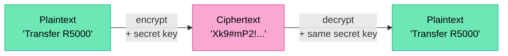
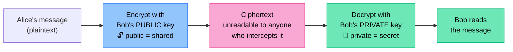
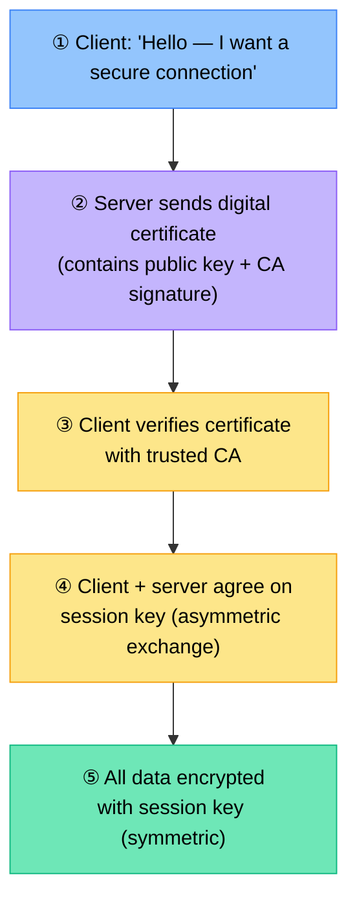
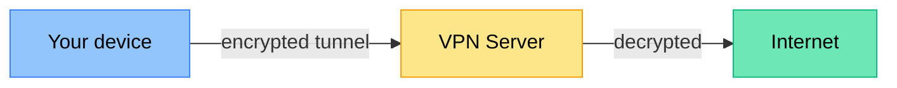

# Network Security

Every time data travels across a network, it could be intercepted, altered, or stolen. Network security is about ensuring that only authorised people can access data, and that the data arriving is exactly what was sent.

> [!NOTE] Grade 12
> Network security (encryption, SSL/TLS, public/private keys, certificates) is a Grade 12 topic.

---

## Why Network Security Matters

| Threat | What could happen |
|---|---|
| Eavesdropping | Attacker intercepts unencrypted data in transit |
| Man-in-the-middle | Attacker intercepts and alters data between two parties |
| Identity spoofing | Attacker pretends to be a trusted server |
| Data theft | Sensitive data (passwords, banking) stolen in transit |
| Denial of Service | Attacker floods network to make it unavailable |

---

## Encryption

**Encryption** is the process of scrambling data so that it can only be read by someone with the correct key.

- **Plaintext** → encrypted using a key → **ciphertext**
- Only someone with the correct **decryption key** can reverse the process
- Without the key, intercepted ciphertext is unreadable

```
Original:  "Transfer R5000 to account 1234"
Encrypted: "Xk9#mP2!vL8@qR7$..."
```

### Why encrypt?
- Protects data in transit (over the internet)
- Protects data at rest (stored on disk)
- Ensures only the intended recipient can read the message

---

## Symmetric Encryption

Both sender and receiver use the **same key** to encrypt and decrypt.



| Advantage | Disadvantage |
|---|---|
| Very fast | Key must be securely shared — how? |
| Simple | If key is intercepted, all data is compromised |

**Examples:** AES (Advanced Encryption Standard), DES

---

## Asymmetric Encryption (Public Key Cryptography)

Uses **two mathematically linked keys**:
- **Public key** — shared openly with everyone
- **Private key** — kept secret by the owner



| Advantage | Disadvantage |
|---|---|
| No need to share a secret key | Much slower than symmetric encryption |
| Public key can be freely distributed | Computationally intensive |
| Even if public key is intercepted, data is safe | |

**Examples:** RSA, ECC (Elliptic Curve Cryptography)

### Digital Signatures

The reverse process — encrypt with your **private key**, others verify with your **public key**:
- Proves the message came from you (authentication)
- Proves the message was not altered (integrity)

---

## SSL / TLS

**SSL** (Secure Sockets Layer) and its successor **TLS** (Transport Layer Security) are cryptographic protocols that secure communication over the internet.

TLS is what makes HTTPS work.

### How TLS works (simplified handshake):



```
HTTPS = HTTP + TLS encryption
http://  → unencrypted (avoid for sensitive data)
https:// → encrypted with TLS
```

### Visual indicators in a browser:
- **Padlock icon** — TLS certificate present
- `https://` in the address bar
- Certificate details: click padlock → certificate info

---

## Digital Certificates

A **digital certificate** is an electronic document that proves the identity of a website or organisation.

**What a certificate contains:**
- Organisation name and domain
- Public key of the organisation
- Expiry date
- Digital signature of the Certificate Authority (CA)

**Certificate Authority (CA):**
A trusted organisation that issues and signs certificates (e.g., DigiCert, Let's Encrypt, Comodo, VeriSign).

When your browser visits `https://mybank.co.za`:
1. Browser downloads the server's certificate
2. Checks if the CA is trusted (browser has a list of trusted CAs)
3. Verifies the signature is genuine
4. Confirms the domain matches the certificate

If verification fails → browser shows a security warning.

---

## Firewalls

A **firewall** monitors and controls network traffic based on predefined security rules.

**What firewalls do:**
- Block traffic from suspicious IP addresses
- Block specific ports (e.g., block port 23 — Telnet)
- Allow only authorised protocols
- Log traffic for audit purposes

| Type | Description |
|---|---|
| **Packet filtering** | Checks source/destination IP and port — allows or blocks |
| **Stateful inspection** | Tracks state of connections — knows if a packet is part of an existing session |
| **Application-layer (proxy)** | Inspects actual content of traffic |
| **Next-generation firewall** | Combines all above + deep packet inspection + threat intelligence |

---

## VPN — Virtual Private Network

A **VPN** creates an encrypted "tunnel" through the internet, making the connection appear as if it's on a private network.

**Uses:**
- Remote workers securely accessing company network
- Protecting data on public Wi-Fi
- Anonymising internet browsing
- Bypassing geographic content restrictions



**Without VPN on public Wi-Fi:** data is readable by anyone on the same network  
**With VPN:** data is encrypted from your device to the VPN server

---

## Authentication Methods

| Method | Description |
|---|---|
| **Password** | Secret string known only to user |
| **Two-factor authentication (2FA)** | Password + second factor (SMS OTP, app code) |
| **Biometrics** | Fingerprint, face recognition, iris scan |
| **Smart card** | Physical card with embedded chip |
| **Certificate-based** | Digital certificate verifies identity |

---

## Intrusion Detection Systems (IDS)

An **IDS** monitors network traffic for suspicious activity and alerts administrators.

- **Passive IDS**: detects and alerts only
- **Active IDS (IPS — Intrusion Prevention System)**: detects and automatically blocks

---

## HTTPS vs HTTP

| Feature | HTTP | HTTPS |
|---|---|---|
| Encryption | None | TLS encryption |
| Port | 80 | 443 |
| Data in transit | Readable by anyone | Encrypted — unreadable |
| Authentication | None | Certificate proves server identity |
| Use | Non-sensitive content | Login, banking, any sensitive data |

---

## Key Terms

| Term | Definition |
|---|---|
| **Encryption** | Scrambling data so only the key holder can read it |
| **Plaintext** | Original, unencrypted data |
| **Ciphertext** | Encrypted, scrambled data |
| **Symmetric encryption** | Same key used to encrypt and decrypt |
| **Asymmetric encryption** | Public key encrypts; private key decrypts |
| **Public key** | Key shared openly — used by others to encrypt messages to you |
| **Private key** | Secret key — only you can decrypt with it |
| **SSL/TLS** | Protocol securing internet communication (HTTPS) |
| **Digital certificate** | Electronic document proving a server's identity |
| **CA** | Certificate Authority — trusted organisation issuing certificates |
| **Firewall** | Security device filtering network traffic |
| **VPN** | Encrypted tunnel connecting devices over the internet |
| **2FA** | Two-factor authentication — requires two forms of verification |

---

## Exam Focus

> [!IMPORTANT] High-Frequency Questions
>
> 1. **"Explain the difference between symmetric and asymmetric encryption"** — Symmetric: both parties use the same key (fast but key must be shared); Asymmetric: public key encrypts, only private key decrypts (secure but slower)
>
> 2. **"What is a digital certificate? What does it contain?"** — Electronic document proving a server's identity; contains: organisation name, domain, public key, CA digital signature, expiry date
>
> 3. **"Explain how HTTPS protects data"** — Uses TLS to encrypt all data in transit; only the server's private key can decrypt it; certificate verifies server identity
>
> 4. **"What is the purpose of a firewall?"** — Monitors and controls network traffic based on security rules; blocks unauthorised access while allowing legitimate traffic
>
> 5. **"Why should you use a VPN on public Wi-Fi?"** — Public Wi-Fi is unencrypted — anyone on the network can read your data; a VPN creates an encrypted tunnel protecting your data from eavesdropping
