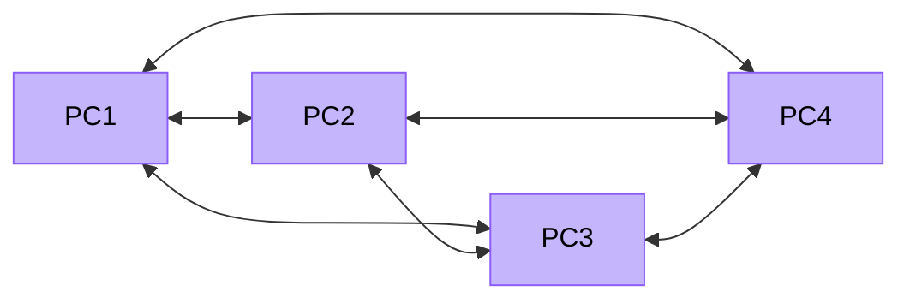

# Network Topologies

The arrangement of devices in a network — how they connect to each other physically and logically — is called the **topology**. The choice of topology affects cost, performance, reliability, and how easy it is to add or remove devices.

> [!NOTE] Grade 11
> Network topologies are a Grade 11 topic. You need to know the diagram, advantages, and disadvantages of each topology for Paper 2.

---

## What is a Topology?

**Physical topology** — the actual layout of cables and devices.  
**Logical topology** — how data flows through the network (may differ from physical).

The four main topologies you need to know:

  

    
⭐ Star

    <svg viewBox="0 0 160 130" width="160" height="130">
      <!-- Central switch -->
      <rect x="60" y="52" width="40" height="22" rx="4" class="itg-topo-hub"/>
      <text x="80" y="66" text-anchor="middle" class="itg-hub-text">Switch</text>
      <!-- PCs -->
      <rect x="5"  y="5"   width="32" height="18" rx="3" class="itg-topo-node"/>
      <rect x="62" y="5"   width="32" height="18" rx="3" class="itg-topo-node"/>
      <rect x="120" y="5" width="32" height="18" rx="3" class="itg-topo-node"/>
      <rect x="5"  y="105" width="32" height="18" rx="3" class="itg-topo-node"/>
      <rect x="62" y="105" width="32" height="18" rx="3" class="itg-topo-node"/>
      <text x="21"  y="17" text-anchor="middle" class="itg-node-text">PC1</text>
      <text x="78"  y="17" text-anchor="middle" class="itg-node-text">PC2</text>
      <text x="136" y="17" text-anchor="middle" class="itg-node-text">PC3</text>
      <text x="21"  y="117" text-anchor="middle" class="itg-node-text">PC4</text>
      <text x="78"  y="117" text-anchor="middle" class="itg-node-text">PC5</text>
      <!-- Lines to switch -->
      <line x1="21"  y1="23" x2="68" y2="52" class="itg-topo-line"/>
      <line x1="78"  y1="23" x2="80" y2="52" class="itg-topo-line"/>
      <line x1="136" y1="23" x2="92" y2="52" class="itg-topo-line"/>
      <line x1="21"  y1="105" x2="68" y2="74" class="itg-topo-line"/>
      <line x1="78"  y1="105" x2="80" y2="74" class="itg-topo-line"/>
    </svg>
  

  

    
🚌 Bus

    <svg viewBox="0 0 160 130" width="160" height="130">
      <!-- Backbone -->
      <line x1="10" y1="65" x2="150" y2="65" class="itg-topo-bus"/>
      <circle cx="10"  cy="65" r="4" fill="#93c5fd"/>
      <circle cx="150" cy="65" r="4" fill="#93c5fd"/>
      <text x="6"  y="58" class="itg-node-text" fill="#93c5fd">T</text>
      <text x="146" y="58" class="itg-node-text" fill="#93c5fd">T</text>
      <!-- PCs above -->
      <rect x="18" y="15" width="32" height="18" rx="3" class="itg-topo-node"/>
      <rect x="63" y="15" width="32" height="18" rx="3" class="itg-topo-node"/>
      <rect x="108" y="15" width="32" height="18" rx="3" class="itg-topo-node"/>
      <text x="34"  y="27" text-anchor="middle" class="itg-node-text">PC1</text>
      <text x="79"  y="27" text-anchor="middle" class="itg-node-text">PC2</text>
      <text x="124" y="27" text-anchor="middle" class="itg-node-text">PC3</text>
      <line x1="34"  y1="33" x2="34"  y2="65" class="itg-topo-line"/>
      <line x1="79"  y1="33" x2="79"  y2="65" class="itg-topo-line"/>
      <line x1="124" y1="33" x2="124" y2="65" class="itg-topo-line"/>
      <!-- PCs below -->
      <rect x="18"  y="97" width="32" height="18" rx="3" class="itg-topo-node"/>
      <rect x="108" y="97" width="32" height="18" rx="3" class="itg-topo-node"/>
      <text x="34"  y="109" text-anchor="middle" class="itg-node-text">PC4</text>
      <text x="124" y="109" text-anchor="middle" class="itg-node-text">PC5</text>
      <line x1="34"  y1="97" x2="34"  y2="65" class="itg-topo-line"/>
      <line x1="124" y1="97" x2="124" y2="65" class="itg-topo-line"/>
      <text x="80" y="82" text-anchor="middle" class="itg-node-text">Backbone cable</text>
    </svg>
  

  

    
💍 Ring

    <svg viewBox="0 0 160 130" width="160" height="130">
      <!-- Ring lines -->
      <polygon points="80,10 148,55 122,115 38,115 12,55" fill="none" stroke="#8b949e" stroke-width="1.5"/>
      <!-- Nodes -->
      <rect x="64"  y="5"  width="32" height="18" rx="3" class="itg-topo-node"/>
      <rect x="128" y="46" width="32" height="18" rx="3" class="itg-topo-node"/>
      <rect x="108" y="103" width="32" height="18" rx="3" class="itg-topo-node"/>
      <rect x="20"  y="103" width="32" height="18" rx="3" class="itg-topo-node"/>
      <rect x="0"   y="46" width="32" height="18" rx="3" class="itg-topo-node"/>
      <text x="80"  y="17"  text-anchor="middle" class="itg-node-text">PC1</text>
      <text x="144" y="58"  text-anchor="middle" class="itg-node-text">PC2</text>
      <text x="124" y="115" text-anchor="middle" class="itg-node-text">PC3</text>
      <text x="36"  y="115" text-anchor="middle" class="itg-node-text">PC4</text>
      <text x="16"  y="58"  text-anchor="middle" class="itg-node-text">PC5</text>
      <!-- direction arrow -->
      <text x="80" y="70" text-anchor="middle" font-size="9" fill="#8b949e">→ one direction</text>
    </svg>
  

  

    
🕸️ Mesh (Full)

    <svg viewBox="0 0 160 130" width="160" height="130">
      <!-- All cross-connections -->
      <line x1="32" y1="22" x2="128" y2="22"  class="itg-topo-line"/>
      <line x1="32" y1="22" x2="128" y2="108" class="itg-topo-line"/>
      <line x1="32" y1="22" x2="32"  y2="108" class="itg-topo-line"/>
      <line x1="128" y1="22" x2="32" y2="108" class="itg-topo-line"/>
      <line x1="128" y1="22" x2="128" y2="108" class="itg-topo-line"/>
      <line x1="32"  y1="108" x2="128" y2="108" class="itg-topo-line"/>
      <!-- Nodes -->
      <rect x="16"  y="13"  width="32" height="18" rx="3" class="itg-topo-node"/>
      <rect x="112" y="13"  width="32" height="18" rx="3" class="itg-topo-node"/>
      <rect x="16"  y="99"  width="32" height="18" rx="3" class="itg-topo-node"/>
      <rect x="112" y="99"  width="32" height="18" rx="3" class="itg-topo-node"/>
      <text x="32"  y="25"  text-anchor="middle" class="itg-node-text">PC1</text>
      <text x="128" y="25"  text-anchor="middle" class="itg-node-text">PC2</text>
      <text x="32"  y="111" text-anchor="middle" class="itg-node-text">PC3</text>
      <text x="128" y="111" text-anchor="middle" class="itg-node-text">PC4</text>
      <text x="80" y="70" text-anchor="middle" font-size="8" fill="#8b949e">all connected</text>
    </svg>
  

| Topology | Shape | Key feature |
|---|---|---|
| **Star** | Devices connect to central switch/hub | Most common; central failure = total failure |
| **Bus** | All devices on one shared cable | Simple; cable break = network fails |
| **Ring** | Devices in a circle; data travels one way | Each device regenerates signal; one break = network fails |
| **Mesh** | Every device connects to every other | Most reliable; very expensive |

---

## Star Topology

All devices connect to a **central switch or hub**. No direct connection between end devices.

### Advantages
- If one cable fails, only that device is affected — rest of network continues
- Easy to add or remove devices without disrupting network
- Easier to detect faults and isolate problems
- High performance — dedicated connection per device (with switch)
- Most commonly used topology in modern LANs

### Disadvantages
- Central switch/hub is a **single point of failure** — if it fails, entire network fails
- Requires more cable than bus topology
- Higher cost — central device must handle all connections

---

## Bus Topology

All devices connect to a single **shared backbone cable**. Data travels along the cable and all devices see every packet. A **terminator** (T) is placed at each end to prevent signal bounce.

### Advantages
- Simple and inexpensive to set up
- Less cable used than star or mesh
- Easy to extend (add devices to the cable)
- Suitable for small networks

### Disadvantages
- A break anywhere in the backbone cable = **entire network fails**
- All devices share bandwidth → performance degrades as more devices are added
- Data collisions are common (all devices transmit on the same medium)
- Difficult to isolate faults — entire cable must be checked
- Not suitable for large networks

---

## Ring Topology

Devices are connected in a **closed loop** (ring). Data travels in **one direction** around the ring, passing through each device until it reaches its destination. Each device acts as a **repeater**, boosting the signal as it passes through.

**Token Ring** (older technology): a "token" passes around the ring; only the device holding the token can transmit.

### Advantages
- No data collisions (only one device transmits at a time)
- Each device regenerates the signal — performs well over longer distances
- Equal access for all devices

### Disadvantages
- A single break in the ring = **entire network fails**
- Difficult to add or remove devices without disrupting the network
- Slower than star topology in modern implementations
- Largely replaced by star topology using Ethernet switches

---

## Mesh Topology

Every device connects directly to every other device. Two types:

- **Full mesh**: every device has a direct link to every other device
- **Partial mesh**: some devices have multiple connections, not all

Full mesh with 5 devices requires: n(n-1)/2 = 10 connections.

### Advantages
- **Highly redundant** — multiple paths between devices; network continues if a link fails
- No single point of failure
- High performance — dedicated links between pairs of devices
- Used in critical infrastructure (internet backbone, military networks)

### Advantages (summary)
| Feature | Result |
|---|---|
| Redundancy | If one link fails, data takes another path |
| No congestion | Dedicated links between pairs |
| Reliability | Most reliable of all topologies |

### Disadvantages
- **Very expensive** — number of cables grows rapidly with more devices
- Complex to install and manage
- Impractical for large LANs

---

## Topology Comparison

| Feature | Star | Bus | Ring | Mesh |
|---|---|---|---|---|
| Central device | Switch/Hub | None | None | None |
| Cable used | Moderate | Least | Moderate | Most |
| Cost | Moderate | Low | Moderate | Very high |
| Reliability | Medium (single point of failure) | Low | Low | Very high |
| Failure impact | One device loses connection | Whole network | Whole network | Minimal |
| Modern use | Very common | Rare | Rare | Internet backbone |
| Fault detection | Easy | Difficult | Difficult | Easy |

---

## Key Terms

| Term | Definition |
|---|---|
| **Topology** | The arrangement/layout of devices in a network |
| **Physical topology** | Actual physical layout of cables and devices |
| **Logical topology** | How data logically flows through the network |
| **Star topology** | All devices connect to a central switch |
| **Bus topology** | All devices on a single shared backbone cable |
| **Ring topology** | Devices form a closed loop; data travels in one direction |
| **Mesh topology** | Every device connects to every other device |
| **Terminator** | Device placed at ends of a bus cable to prevent signal bounce |
| **Single point of failure** | One component whose failure brings down the whole system |
| **Token** | Control signal passed around a ring; device holding it can transmit |

---

## Exam Focus

> [!IMPORTANT] High-Frequency Questions
>
> 1. **"Give TWO advantages of a star topology"** — failure of one cable only affects that device; easy to add/remove devices; easy fault detection
>
> 2. **"Give TWO disadvantages of a star topology"** — central switch is a single point of failure; requires more cable than bus; higher cost
>
> 3. **"Which topology is most reliable? Explain why."** — Mesh; multiple paths exist between devices so if one link fails, data takes an alternative route
>
> 4. **"What happens if the backbone cable in a bus topology breaks?"** — The entire network fails because all devices share the same cable
>
> 5. **"Why is a ring topology rarely used in modern networks?"** — A single break fails the entire network; star topology with switches is faster and easier to manage
