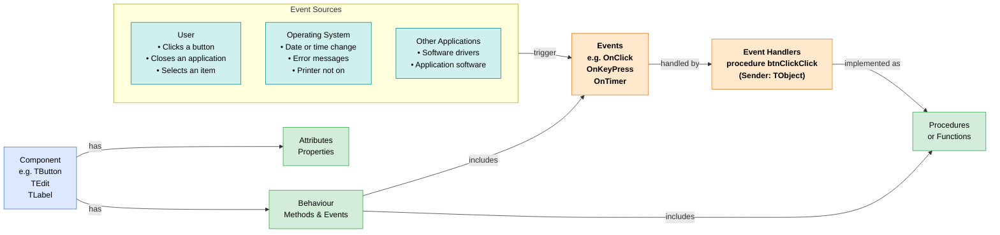

# Programming Concepts

Before writing a single line of code, developers need to understand how software is built — the paradigms, tools, and processes that turn an idea into a working program. This page covers the theoretical foundations of programming.

> [!NOTE] Grade 10–11
> Programming concepts (IDE, event-driven programming, development process) are introduced at Grade 10–11. OOP paradigm is Grade 11. Software engineering methodologies are Grade 12.

---

## What is Programming?

**Programming** (software development) is the process of creating instructions for a computer to follow.

A **program** is a set of instructions written in a programming language that a computer can execute to perform a specific task.

**Programming languages:**
| Level | Description | Examples |
|---|---|---|
| **Low-level** | Close to machine code; fast but complex | Assembly, machine code |
| **Mid-level** | Balances control and readability | C, C++ |
| **High-level** | Human-readable; most common | Delphi, Python, Java, JavaScript |
| **Very high-level** | Domain-specific | SQL, HTML |

---

## The Development Process

Software is not just written — it is designed, tested, and maintained.

### Phases of Software Development:

```
1. Analysis        → Understand what the software must do
2. Design          → Plan algorithms, data structures, interface
3. Coding          → Write the source code
4. Testing         → Find and fix errors
5. Implementation  → Deploy the software to users
6. Maintenance     → Update, fix bugs, improve
```

---

## IDE — Integrated Development Environment

An **IDE** is a software application that provides tools for writing, testing, and debugging programs in one integrated environment.

**Components of an IDE:**

| Component | Purpose |
|---|---|
| **Code editor** | Write source code with syntax highlighting and autocomplete |
| **Compiler/Interpreter** | Translates code to machine code or executes it |
| **Debugger** | Step through code; inspect variables; find errors |
| **Build tools** | Compile and link the project |
| **Form designer** | Drag-and-drop interface design (Delphi) |
| **Project manager** | Manage all files in the project |

**IDE Examples:**

| IDE | Language(s) | Use |
|---|---|---|
| Delphi (RAD Studio) | Object Pascal | Windows applications |
| Visual Studio Code | Many (Python, JS, etc.) | General purpose |
| PyCharm | Python | Python development |
| IntelliJ IDEA | Java, Kotlin | Java development |
| Eclipse | Java, C++ | Cross-platform |
| NetBeans | Java | Java development |

---

## Programming Paradigms

A **paradigm** is a style or approach to programming.

| Paradigm | Description | Examples |
|---|---|---|
| **Procedural** | Code executes step-by-step in procedures | Early BASIC, Pascal |
| **Event-driven** | Code responds to events (clicks, keystrokes) | Delphi, JavaScript |
| **Object-oriented (OOP)** | Code organised into objects with data and methods | Delphi, Java, Python, C++ |
| **Functional** | Functions as first-class objects; no side effects | Haskell, Erlang, parts of JavaScript |
| **Declarative** | Specify what to achieve, not how | SQL, HTML |

---

## Event-Driven Programming

**Event-driven programming** is a paradigm where the flow of the program is determined by events — user actions or system messages.

**Events:**
- Mouse click (`OnClick`)
- Key press (`OnKeyPress`, `OnKeyDown`)
- Form loading (`OnCreate`)
- Text changed (`OnChange`)
- Timer tick (`OnTimer`)

**How it works in Delphi:**
1. User places a button on a form
2. Delphi generates a blank event handler: `procedure TForm1.btnSubmitClick(Sender: TObject)`
3. Developer writes code inside the handler
4. When the button is clicked, the code executes

```pascal
procedure TForm1.btnCalculateClick(Sender: TObject);
var
  iNum1, iNum2, iTotal: Integer;
begin
  iNum1 := StrToInt(edtNum1.Text);
  iNum2 := StrToInt(edtNum2.Text);
  iTotal := iNum1 + iNum2;
  lblResult.Caption := 'Total: ' + IntToStr(iTotal);
end;
```

**Advantages of event-driven programming:**
- Natural fit for GUI applications
- Program responds to user — not fixed execution order
- Easy to handle multiple input types simultaneously
- Code is modular — each event handler is independent

### Relationship diagram

The diagram below shows how all the parts of an event-driven program connect:



---

## Object-Oriented Programming (OOP)

**OOP** organises code into **objects** — instances of **classes** that bundle data (attributes) and behaviour (methods) together.

> [!TIP] See Also
> Full OOP coverage with Delphi examples is in [OOP Principles](./oop-principles.md) and [OOP in Delphi](../../practical/delphi/oop-delphi.md).

**Core OOP concepts:**

| Concept | Description |
|---|---|
| **Class** | Blueprint/template for creating objects |
| **Object** | Instance of a class — actual usable entity |
| **Attribute** | Data stored in an object (property) |
| **Method** | Action an object can perform (procedure/function) |
| **Encapsulation** | Bundling data and methods; hiding internal details |
| **Inheritance** | Child class inherits attributes/methods from parent |
| **Polymorphism** | Same method name behaves differently in different classes |
| **Abstraction** | Hiding complexity; exposing only what is needed |

---

## Types of Errors

| Error Type | Description | Example |
|---|---|---|
| **Syntax error** | Violates language rules — code won't compile | Missing `end;`, wrong spelling |
| **Runtime error** | Valid syntax but fails during execution | Division by zero, file not found |
| **Logic error** | Code runs but gives wrong result | Using `+` instead of `*` |

**Debugging** is the process of finding and fixing errors.

**Debugging techniques:**
- **Tracing** — reading through code step by step
- **Breakpoints** — pause execution at a specific line
- **Watch variables** — monitor variable values as code runs
- **Desk checking** — paper trace of algorithm

---

## Compilers and Interpreters

| Feature | **Compiler** | **Interpreter** |
|---|---|---|
| Process | Translates entire source code to machine code before execution | Translates and executes one line at a time |
| Speed | Fast execution (compiled machine code) | Slower (translation on the fly) |
| Error detection | All errors shown before running | Stops at first error |
| Output | Executable file (.exe) | No standalone executable |
| Examples | Delphi, C, C++ | Python, JavaScript (traditionally) |

**Delphi uses a compiler** — source code is compiled to a `.exe` before running.

---

## Source Code, Object Code, and Machine Code

```
Source code (.pas)
    ↓ Compiler
Object code (binary)
    ↓ Linker (combines libraries)
Executable (.exe)
    ↓ CPU executes
Machine code (0s and 1s)
```

| Code Type | Description |
|---|---|
| **Source code** | Human-readable code written by programmer |
| **Object code** | Intermediate binary from compiler — not yet executable |
| **Machine code** | Binary instructions executed directly by CPU |
| **Bytecode** | Intermediate code (Java .class files) — run by a virtual machine |

---

## Software Testing

| Testing Type | Description |
|---|---|
| **Unit testing** | Testing individual procedures/functions in isolation |
| **Integration testing** | Testing how components work together |
| **System testing** | Testing the complete system |
| **User acceptance testing (UAT)** | End users verify the software meets requirements |
| **Regression testing** | After fixing a bug, check it didn't break other things |

**Test data types:**
| Type | Purpose | Example |
|---|---|---|
| **Normal data** | Typical valid input | Mark: 75 |
| **Boundary data** | Values at the edge of valid range | Mark: 0, Mark: 100 |
| **Erroneous data** | Invalid input that should be rejected | Mark: -5, Mark: "abc" |

---

## Key Terms

| Term | Definition |
|---|---|
| **Program** | Set of instructions for a computer to execute |
| **IDE** | Integrated Development Environment — coding tool with editor, compiler, debugger |
| **Compiler** | Translates entire source code to machine code |
| **Interpreter** | Translates and executes source code one line at a time |
| **Paradigm** | Style of programming (procedural, OOP, event-driven) |
| **Event-driven** | Program flow controlled by user/system events |
| **Debugging** | Finding and fixing errors in code |
| **Syntax error** | Violation of language rules — code won't compile |
| **Runtime error** | Error occurring during execution |
| **Logic error** | Code runs but produces incorrect results |
| **OOP** | Object-Oriented Programming |
| **Source code** | Human-readable program code |
| **Machine code** | Binary instructions executed by the CPU |

---

## Exam Focus

> [!IMPORTANT] High-Frequency Questions
>
> 1. **"What is an IDE? Give THREE components of an IDE."** — Integrated Development Environment; components: code editor, compiler, debugger, form designer, project manager
>
> 2. **"What is event-driven programming? Give TWO examples of events in Delphi."** — Program flow determined by user/system events; examples: OnClick (button click), OnCreate (form load), OnChange (text field change), OnTimer (timer tick)
>
> 3. **"What is the difference between a compiler and an interpreter?"** — Compiler translates entire program before execution → fast .exe file; Interpreter translates one line at a time → slower, no separate file
>
> 4. **"Explain the difference between a syntax error, runtime error, and logic error"** — Syntax: violates language rules (won't compile); Runtime: valid syntax but fails during execution (divide by zero); Logic: runs but gives wrong result (wrong formula)
>
> 5. **"Name THREE phases of software development"** — analysis; design; coding; testing; implementation; maintenance
